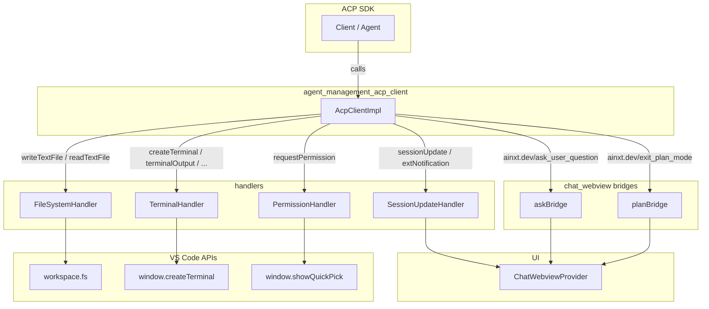
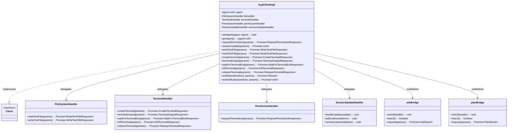
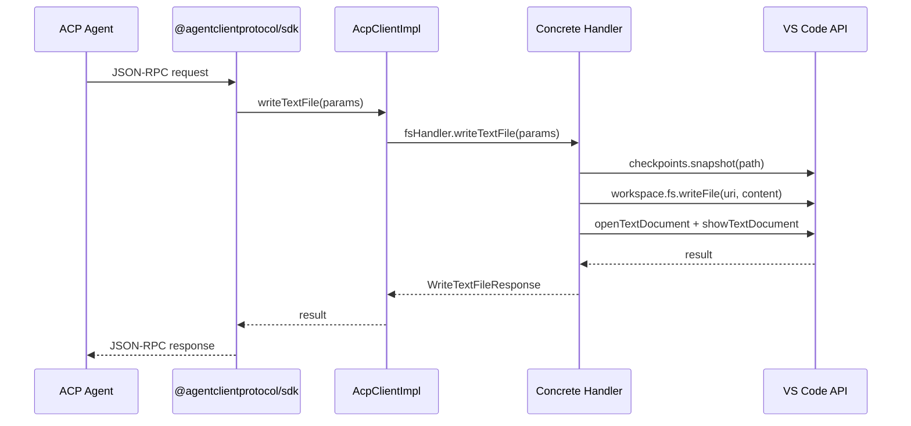
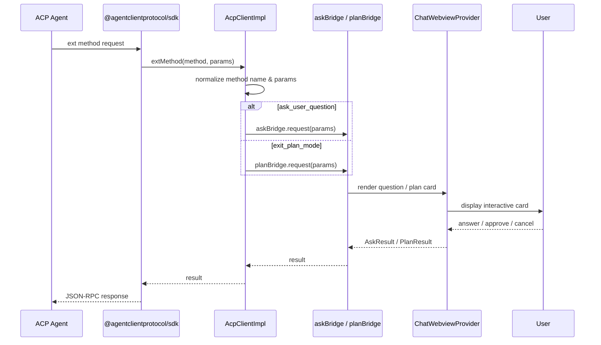
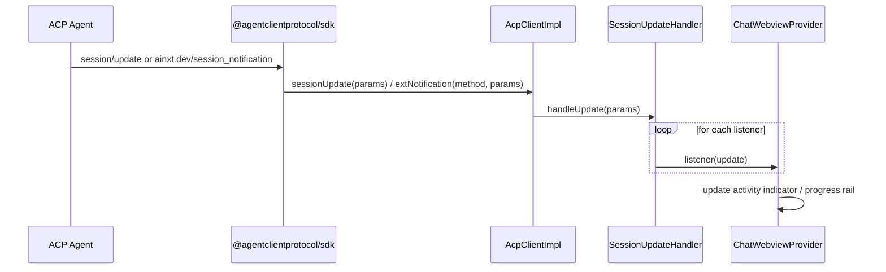
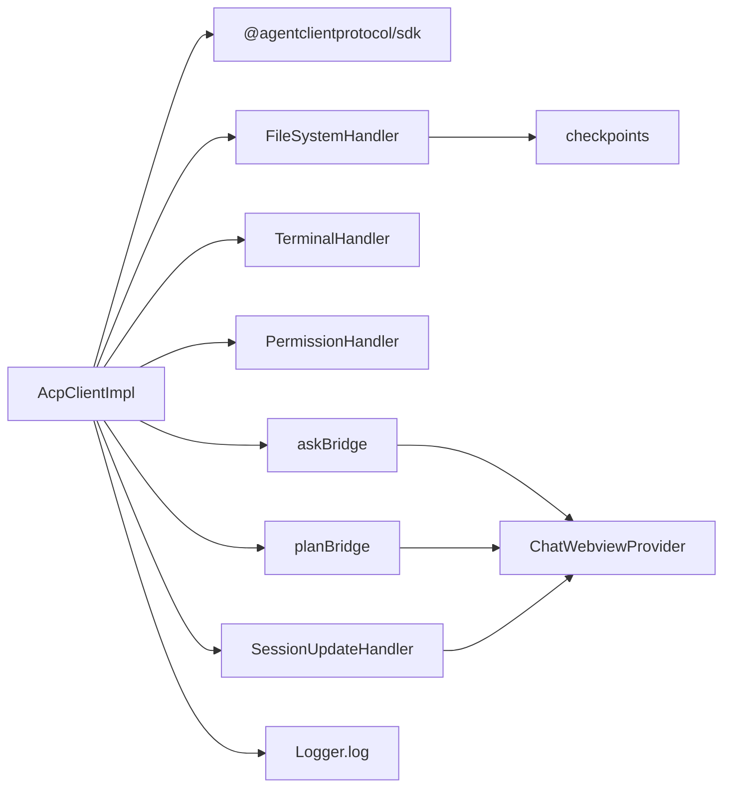

# `agent_management_acp_client`

## Brief Introduction

`agent_management_acp_client` is the VS Code–side implementation of the **Agent Client Protocol (ACP)** `Client` interface. It lives in `vscode-acp/src/core/AcpClientImpl.ts` and acts as the single entry point through which a running ACP agent invokes host capabilities exposed by the extension.

Rather than implementing every capability itself, `AcpClientImpl` is a thin orchestrator that:

* Receives typed ACP requests from the agent (file I/O, terminal control, permission prompts, session updates, and vendor-specific extension methods).
* Delegates each request to a focused handler class.
* Bridges two custom, AiNxt-specific interactions—`ask_user_question` and `exit_plan_mode`—to the chat webview.
* Propagates fine-grained session notifications back to the UI so the user can see live progress during long-running agent work.

This module is a child of [`agent_management`](agent_management.md); it works closely with [`agent_management_agent_lifecycle`](agent_management_agent_lifecycle.md) (which spawns and kills the agent process) and [`agent_management_checkpoints`](agent_management_checkpoints.md) (which snapshots files before writes). It also depends on the [`handlers`](handlers.md) module for concrete VS Code operations and on [`session_management`](session_management.md) for the connection that carries ACP messages.

---

## Responsibilities

| Responsibility | Description |
| -------------- | ----------- |
| **ACP Client contract** | Implements the `@agentclientprotocol/sdk` `Client` interface so the SDK can call back into VS Code. |
| **Capability routing** | Routes each ACP method to the appropriate handler (`FileSystemHandler`, `TerminalHandler`, `PermissionHandler`, `SessionUpdateHandler`). |
| **Agent reference** | Holds the `Agent` object supplied by the SDK after the connection is established. |
| **Extension methods** | Handles non-standard methods `ainxt.dev/ask_user_question` and `ainxt.dev/exit_plan_mode` via the [`chat_webview`](chat_webview.md) bridges. |
| **Extension notifications** | Listens for `ainxt.dev/session_notification` and forwards it as a normal session update so the UI stays in sync. |
| **Logging** | Emits a short log line for each file-system and terminal operation to aid debugging. |

---

## Architecture

### Component Overview

`AcpClientImpl` is instantiated by the connection layer (see [`session_management`](session_management.md)) and is passed a factory function to `ClientSideConnection`. The SDK calls the factory with the `Agent` instance once the connection is ready, and the implementation stores that agent reference via `setAgent`.

### Class Diagram

---

## Core Components

### `AcpClientImpl`

`AcpClientImpl` is the only public class in this module. Its constructor receives the four handler instances and the two UI bridges are imported as singletons.

#### Agent reference

* `setAgent(agent: Agent)` — stores the SDK-supplied `Agent`.
* `getAgent(): Agent | null` — returns the stored agent, or `null` before the connection is established.

#### Required ACP methods

| Method | Handler / Destination | Purpose |
| ------ | --------------------- | ------- |
| `requestPermission` | [`PermissionHandler`](handlers.md) | Shows a permission prompt in the chat webview or a native QuickPick. |
| `sessionUpdate` | [`SessionUpdateHandler`](handlers.md) | Broadcasts a session-level notification to all registered listeners (typically the chat webview). |

#### File-system methods

| Method | Handler | Purpose |
| ------ | ------- | ------- |
| `writeTextFile` | [`FileSystemHandler`](handlers.md) | Writes text to a file, snapshots the old content via [`checkpoints`](agent_management_checkpoints.md), and opens the file so the user sees the change. |
| `readTextFile` | [`FileSystemHandler`](handlers.md) | Reads a text file, preferring unsaved editor content over disk content, with optional line/limit slicing. |

#### Terminal methods

| Method | Handler | Purpose |
| ------ | ------- | ------- |
| `createTerminal` | [`TerminalHandler`](handlers.md) | Spawns a shell process and a VS Code pseudoterminal for visibility. |
| `terminalOutput` | [`TerminalHandler`](handlers.md) | Returns accumulated stdout/stderr output plus optional exit status. |
| `waitForTerminalExit` | [`TerminalHandler`](handlers.md) | Awaits process exit and returns the exit code / signal. |
| `killTerminal` | [`TerminalHandler`](handlers.md) | Sends `SIGTERM` to the process. |
| `releaseTerminal` | [`TerminalHandler`](handlers.md) | Kills the process if still running and removes internal tracking, leaving the VS Code terminal visible. |

#### Extension methods (`extMethod`)

`extMethod` handles agent-to-client extension requests that are not part of the base ACP spec. The implementation normalizes methods that may be prefixed with `_` or nested under `params`/`request` (a quirk of leader-mode routing).

* **`ainxt.dev/ask_user_question`** — forwards to `askBridge.request`, which renders an in-chat question card and returns the user’s answers. Without this route the agent’s clarifying-question tool fails with `-32601`.
* **`ainxt.dev/exit_plan_mode`** — forwards to `planBridge.request`, which renders the plan-approval card. A cancelled result tells the agent to keep planning.
* Any other method throws `unsupported ext method: ${method}`.

#### Extension notifications (`extNotification`)

`extNotification` handles agent-to-client extension notifications.

* **`ainxt.dev/session_notification`** — the payload is `{ sessionId, update }`, identical to a standard `session/update`. It is routed through `SessionUpdateHandler.handleUpdate` so the webview can drive the live activity indicator during subagent runs.
* Other notifications (for example MCP queue or session-list changes) are intentionally ignored.

---

## Data Flows

### Standard ACP capability request

The same pattern applies to terminal operations and permission requests: the SDK calls `AcpClientImpl`, which delegates to the focused handler, which interacts with VS Code and returns a typed response.

### Ask-user / plan-approval extension flow

### Session update propagation

---

## Dependencies

### External

* `@agentclientprotocol/sdk` — provides the `Client`, `Agent`, and request/response types.

### Internal modules

| Module | Why it is used |
| ------ | -------------- |
| [`handlers`](handlers.md) | Concrete VS Code operations for files, terminals, permissions, and session updates. |
| [`chat_webview`](chat_webview.md) | `askBridge` and `planBridge` route custom interactions to the chat UI. |
| [`utils`](utils.md) | `log` from `Logger.ts` is used for operational tracing. |
| [`agent_management_checkpoints`](agent_management_checkpoints.md) | Indirectly used when `FileSystemHandler.writeTextFile` snapshots prior content. |
| [`session_management`](session_management.md) | Creates the ACP connection and supplies the `Agent` instance to `AcpClientImpl.setAgent`. |
| [`agent_management_agent_lifecycle`](agent_management_agent_lifecycle.md) | Spawns the agent process that ultimately sends the requests handled here. |

### Dependency graph

---

## Error Handling

`AcpClientImpl` itself does not catch errors from handlers; it lets them propagate back to the SDK, which turns them into JSON-RPC errors for the agent. Each handler is responsible for its own error logging and recovery:

* [`FileSystemHandler`](handlers.md) logs failures via `logError` and re-throws the underlying exception.
* [`TerminalHandler`](handlers.md) throws `Terminal not found: ${id}` when an operation references an unknown terminal.
* [`PermissionHandler`](handlers.md) returns an `outcome: 'cancelled'` result when the user dismisses the prompt.

For extension methods, an unsupported method name results in a thrown `Error('unsupported ext method: ${method}')`.

---

## Lifecycle

1. **Construction** — `SessionManager` (or the connection layer) creates the four handlers and passes them to `new AcpClientImpl(...)`.
2. **Agent attachment** — once the ACP transport is ready, the SDK calls the factory and `setAgent(agent)` stores the agent reference.
3. **Operation phase** — the agent invokes methods on the `Client`; `AcpClientImpl` routes them.
4. **Disposal** — this class does not hold disposable resources itself. Cleanup is handled by the handlers (`TerminalHandler.dispose`, `SessionUpdateHandler.dispose`) and by [`agent_management_agent_lifecycle`](agent_management_agent_lifecycle.md) when the agent process is killed.

---

## Related Modules

* [`agent_management`](agent_management.md) — parent module that groups agent lifecycle, checkpoints, and the ACP client.
* [`agent_management_agent_lifecycle`](agent_management_agent_lifecycle.md) — spawns, tracks, and kills agent processes.
* [`agent_management_checkpoints`](agent_management_checkpoints.md) — snapshots file content before writes so turns can be reverted.
* [`session_management`](session_management.md) — manages ACP connections and sessions.
* [`handlers`](handlers.md) — concrete VS Code handlers delegated to by `AcpClientImpl`.
* [`chat_webview`](chat_webview.md) — provides the UI bridges used by `extMethod`.
* [`utils`](utils.md) — logging and telemetry utilities.
