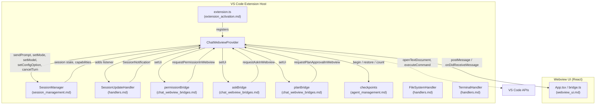
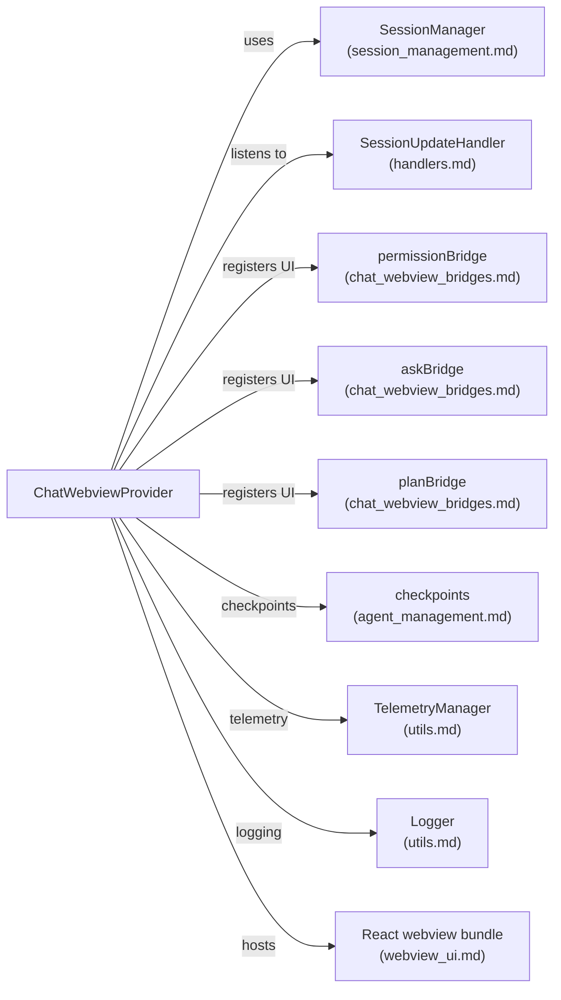
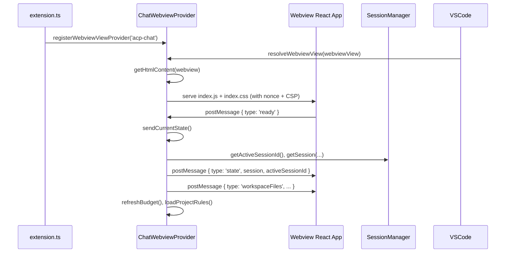
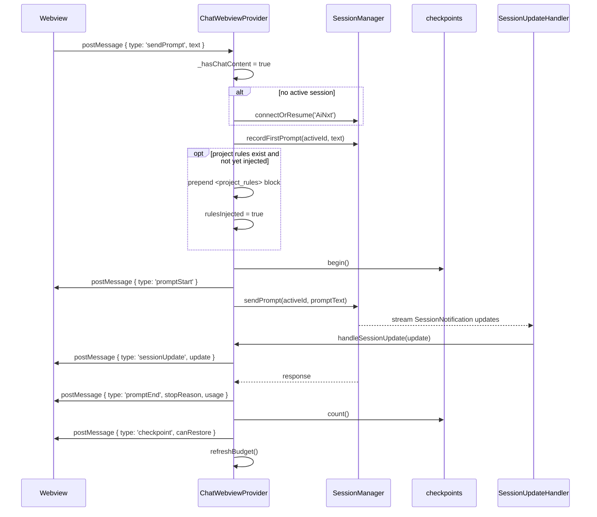
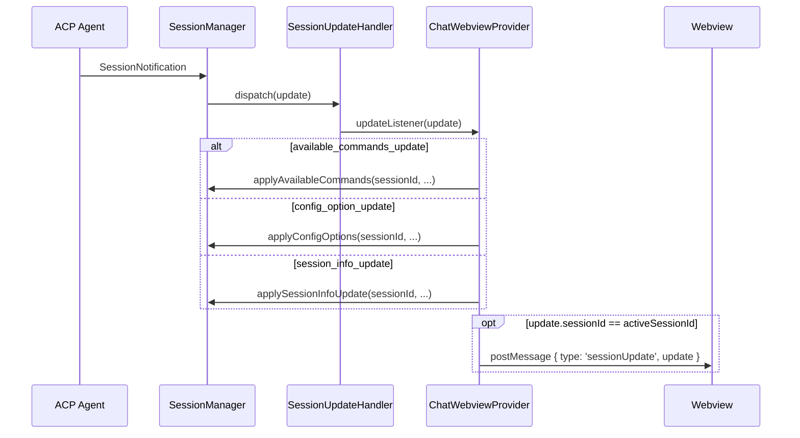
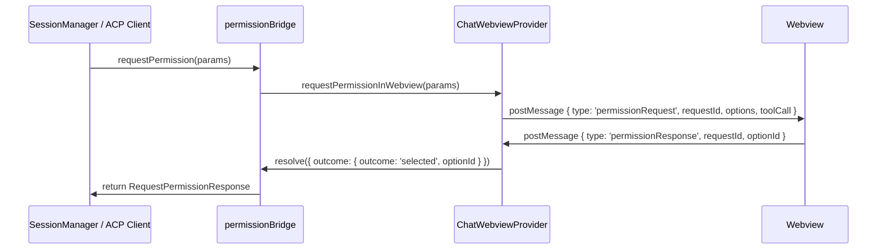
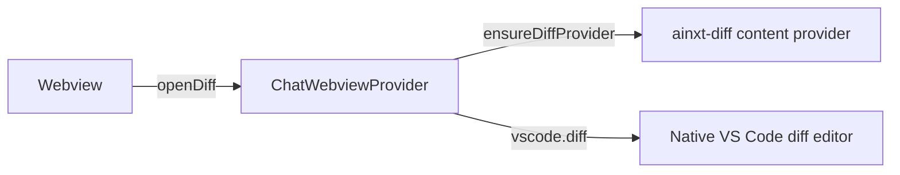

# chat_webview_provider

The `chat_webview_provider` module is the VS Code extension-side host for the AiNxt chat sidebar. It implements the `WebviewViewProvider` contract, bootstraps the React-based webview UI, and acts as the bidirectional message broker between the user-facing chat panel and the rest of the extension (session management, bridges, handlers, and workspace services).

---

## Purpose

`ChatWebviewProvider` owns the lifecycle of the `acp-chat` sidebar webview. Its responsibilities include:

- Rendering the chat webview by serving the bundled React application (`webview-ui/dist`) with a strict Content Security Policy.
- Receiving user actions from the webview (prompts, mode/model/config selection, file attachments, permission responses, etc.).
- Forwarding those actions to the appropriate backend modules, primarily [`SessionManager`](session_management.md).
- Listening to [`SessionUpdateHandler`](handlers.md) and translating ACP session notifications into webview messages.
- Hosting interactive UI flows for permission requests, ask-user questions, and plan approvals via the [`chat_webview_bridges`](chat_webview_bridges.md) modules.
- Providing workspace context to the chat composer: file attachments, diagnostics, git diff, folder contents, and project rules.
- Supporting native diff editors for agent-proposed file changes and budget/status reporting from the gateway.

---

## Architecture

### Component Breakdown

| Component | File | Role |
|-----------|------|------|
| `ChatWebviewProvider` | `vscode-acp/src/ui/ChatWebviewProvider.ts` | Core provider class that implements `vscode.WebviewViewProvider`. Manages the webview lifecycle, message routing, state synchronization, and interactive request cards. |
| `getNonce` | `vscode-acp/src/ui/ChatWebviewProvider.ts` | Helper that generates a CSP nonce for the webview script tag. |

---

## Dependencies

### External APIs and Services

- **VS Code API**: `vscode.WebviewView`, `vscode.workspace`, `vscode.window`, `vscode.commands`, `vscode.Uri`, `vscode.languages.getDiagnostics`.
- **Node.js APIs**: `fs`, `os`, `path`, `child_process` for reading project rules, workspace files, and git diffs.
- **Gateway API**: `GET /ainxt/v1/api/auth/me` and `GET /ainxt/v1/api/budget/me` for budget/status reporting.
- **`marked`**: Markdown-to-HTML rendering for assistant messages and history replay.

---

## Data Flow

### Webview Initialization

### Sending a Prompt

### Session Update Routing

---

## Component Interactions

### Interactive Request Bridges

When the webview is resolved, `ChatWebviewProvider` registers itself as the UI backend for three bridge modules:

- [`permissionBridge`](chat_webview_bridges.md): renders permission-request cards in the chat.
- [`askBridge`](chat_webview_bridges.md): renders ask-user-question forms.
- [`planBridge`](chat_webview_bridges.md): renders plan-approval cards.

The same pattern applies to `askBridge` (`askRequest` / `askResponse`) and `planBridge` (`planApprovalRequest` / `planApprovalResponse`). On webview disposal, all pending resolvers are cancelled and the bridges are unregistered.

### File Attachment and Context Helpers

`ChatWebviewProvider` exposes several helpers that gather workspace context and push it into the composer:

| Method | Trigger | Behavior |
|--------|---------|----------|
| `attachByPath(rel)` | `attachPath` message or command | Reads a single file (max 200 KB) and sends `filesAttached`. |
| `attachFolder(rel)` | `attachFolder` message | Recursively reads up to 40 small files (max 400 KB total) and sends `filesAttached`. |
| `attachProblems()` | `attachProblems` message | Serializes current VS Code diagnostics into a `diagnostics` attachment. |
| `attachGit()` | `attachGit` message | Runs `git diff` and `git diff --staged` and attaches the combined diff. |
| `sendWorkspaceFiles()` | `ready` / `listFiles` messages | Sends a sorted repo-relative file list for `@`-mention / picker use. |
| `loadProjectRules()` | `ready` | Loads `.ainxtrules` or `.ainxt/rules.md` and prepends them to the first prompt. |

### Diff Viewer

The provider registers a `TextDocumentContentProvider` for the `ainxt-diff` scheme. When the webview sends `openDiff` with `oldText` and `newText`, the provider creates two virtual documents and opens VS Code's native diff editor via `vscode.diff`.

---

## Key Processes

### 1. Webview HTML Generation

`getHtmlContent` builds a minimal HTML shell that loads the React bundle:

- Computes `jsUri` and `cssUri` from `webview-ui/dist/assets/` via `webview.asWebviewUri`.
- Appends a cache-busting query parameter based on the bundle file's `mtimeMs`.
- Injects a CSP nonce and a policy that only allows scripts from the same nonce, styles from the webview origin, and images from the webview origin or `data:` URIs.

> The legacy inline HTML/JS implementation is still present in the source but is unreachable; the React bundle path is always returned first.

### 2. Markdown Rendering

Assistant messages are rendered to HTML using `marked` on the extension host rather than in the webview. This keeps the webview bundle smaller and avoids bundling a full markdown parser. The webview can request batched rendering via `renderMarkdown`, and the provider replies with `markdownRendered` containing the HTML for each requested index.

### 3. Budget Refresh

`refreshBudget` is a best-effort, silent call to the gateway:

1. Reads `gatewayUrl` from VS Code settings.
2. Reads the user's access token from `~/.ainxt/credentials.json`.
3. Fetches `/auth/me` to resolve `budgetUserId`.
4. Fetches `/budget/me` and pushes `budgetState` to the webview.

Failures are intentionally swallowed so that budget reporting never blocks chat functionality.

### 4. Checkpoints and Undo

Before each prompt turn, `checkpoints.begin()` is called. After the turn completes, the provider checks `checkpoints.count()` and tells the webview whether a revert button should be shown. When the user confirms `restoreCheckpoint`, `checkpoints.restore()` reverts the accumulated file changes. See [`agent_management.md`](agent_management.md) for checkpoint internals.

---

## Message Reference

### From Webview to Extension

| Message | Handler | Description |
|---------|---------|-------------|
| `ready` | `resolveWebviewView` | Webview finished loading; triggers state sync. |
| `sendPrompt` | `handleSendPrompt` | User submitted a chat message. |
| `cancelTurn` | `handleCancelTurn` | User pressed Stop. |
| `setMode` | `handleSetMode` | Legacy mode picker changed. |
| `setModel` | `handleSetModel` | Legacy model picker changed. |
| `setConfigOption` | `handleSetConfigOption` | ACP config option changed. |
| `permissionResponse` | `resolveWebviewView` | User answered a permission card. |
| `askResponse` | `resolveWebviewView` | User submitted an ask form. |
| `planApprovalResponse` | `resolveWebviewView` | User approved/abandoned a plan. |
| `openFile`, `pickFiles`, `openDiff` | `resolveWebviewView` | Workspace navigation and attachment. |
| `attachPath`, `attachFolder`, `attachProblems`, `attachGit`, `listFiles` | `resolveWebviewView` | Context attachment helpers. |
| `newChat`, `listThreads`, `openThread` | `resolveWebviewView` | Conversation management. |
| `renderMarkdown` | `resolveWebviewView` | Batch markdown render request. |
| `saveConnection`, `signOut` | `resolveWebviewView` | Gateway auth actions. |

### From Extension to Webview

| Message | Source | Description |
|---------|--------|-------------|
| `state` | `sendCurrentState` | Full active session snapshot. |
| `sessionUpdate` | `handleSessionUpdate` | ACP notification for the active session. |
| `modesUpdate`, `modelsUpdate` | `notifyModesUpdate`, `notifyModelsUpdate` | Legacy picker state. |
| `configOptionsUpdate` | `notifyConfigOptionsUpdate` | ACP config option state. |
| `authState` | `notifyAuthState` | Sign-in identity and connection form state. |
| `budgetState` | `refreshBudget` | Gateway budget/usage status. |
| `workspaceFiles` | `sendWorkspaceFiles` | File list for the picker. |
| `filesAttached` | attachment helpers | File contents to include in composer. |
| `permissionRequest`, `askRequest`, `planApprovalRequest` | bridge flows | Interactive request cards. |
| `promptStart`, `promptEnd` | `handleSendPrompt` | Turn lifecycle. |
| `loadSessionStart`, `loadSessionEnd` | session load replay | History replay overlay. |
| `sessionInfoUpdate` | `notifySessionInfoUpdate` | Title/metadata change. |
| `checkpoint` | `handleSendPrompt` | Undo availability. |
| `clearChat` | `clearChat` | Reset to welcome state. |
| `error` | `postError` | Error banner. |
| `markdownRendered` | `renderMarkdown` | Rendered HTML for assistant messages. |

---

## Security Considerations

- **Content Security Policy**: The generated HTML uses a strict CSP with `default-src 'none'`, script nonce, and restricted style/image origins.
- **Nonce**: A 32-character random nonce is generated per webview resolution and applied to both the CSP header and the `<script>` tag.
- **HTML Escaping**: `escapeHtml` is used when rendering fails or when echoing raw text to prevent injection.
- **Local Resource Roots**: The webview is restricted to `this.extensionUri`, preventing access to arbitrary filesystem paths.

---

## Related Documentation

- [`session_management.md`](session_management.md) — Session lifecycle, connection, and prompt dispatch.
- [`chat_webview_bridges.md`](chat_webview_bridges.md) — Permission, ask, and plan bridge modules.
- [`handlers.md`](handlers.md) — Session update, file system, terminal, and permission handlers.
- [`agent_management.md`](agent_management.md) — Agent spawning, ACP client, and checkpoint system.
- [`webview_ui.md`](webview_ui.md) — React webview application (`App.tsx`, `bridge.ts`, `Markdown.tsx`).
- [`extension_activation.md`](extension_activation.md) — Extension entry point and command registration.
- [`utils.md`](utils.md) — Logging, telemetry, and stream utilities.
