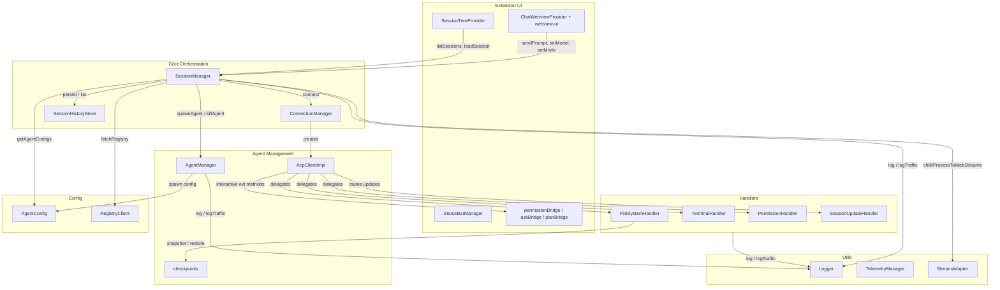
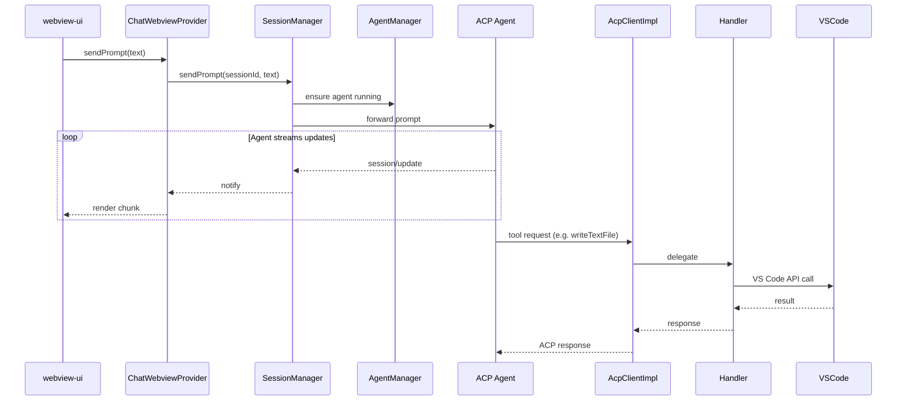

# `vscode_acp` Module Overview

## Purpose

`vscode_acp` is the **VS Code host implementation** of the AiNxt IDE extension. It embeds an Agent Client Protocol (ACP) client inside a VS Code extension, exposing a chat webview, an ACP Agents tree view, a status bar indicator, and the handlers that let ACP agents interact with the VS Code workspace.

The module is responsible for:

- Discovering and launching ACP agent processes from local configuration and a public registry.
- Establishing ACP sessions, resuming them across reloads, and managing active session state.
- Bridging ACP tool requests to VS Code APIs: file system, terminal, permissions, and session updates.
- Rendering the chat UI and routing interactive requests (permissions, questions, plan approvals) through the webview.
- Providing cross-cutting utilities for logging, telemetry, and stream adaptation.

---

## Architecture

The module is organized into layered subsystems. The UI layer drives the core orchestration layer, which in turn delegates protocol work to agent lifecycle management and concrete VS Code handlers.

### Request Flow

A typical user prompt flows from the webview through the session manager to the agent, and agent tool requests flow back through handlers to VS Code.

---

## Core Components

| Subsystem | Responsibility | Documentation |
|-----------|----------------|---------------|
| **Agent Management** | Spawns agent child processes, implements the ACP client protocol, and tracks per-turn file checkpoints. | [`agent_management.md`](agent-management/README.md) |
| **Session Management** | Orchestrates ACP connections, session creation/resume/load, active session state, auth flows, and client-side history. | [`session_management.md`](session-management/README.md) |
| **Handlers** | Bridges ACP tool requests to VS Code APIs: file system, terminal, permissions, and session updates. | [`handlers.md`](handlers/README.md) |
| **Extension UI** | Host-side UI: activation, chat webview provider, session tree, status bar, and interactive bridges. | [`extension_ui.md`](ui.md) |
| **Webview UI** | React front-end bundle rendered inside the chat webview. | [`webview_ui.md`](../webview/README.md) |
| **Config** | Reads `acp.agents` / `ainxt.*` settings, injects secrets, and fetches the public ACP registry. | [`config.md`](config.md) |
| **Utils** | Logging, telemetry, and Node.js-to-Web-Streams adapters. | [`utils.md`](utils/README.md) |

---

## Key Design Decisions

- **Host-agnostic webview bundle**: The same `webview-ui` React application is loaded by VS Code and by the JetBrains host via a thin bridge.
- **Session abstraction**: Users interact with agents and conversations; `SessionManager` hides the underlying ACP session lifecycle.
- **Single active session**: Only one agent/session is active at a time to keep resource usage predictable.
- **Synchronous config API**: `AgentConfig` pre-loads secrets so callers can read configuration synchronously at spawn time.
- **Layered handlers**: ACP requests are dispatched from `AcpClientImpl` to focused handlers that know only about VS Code APIs.

---

## References

- [`agent_management.md`](agent-management/README.md)
- [`session_management.md`](session-management/README.md)
- [`handlers.md`](handlers/README.md)
- [`extension_ui.md`](ui.md)
- [`webview_ui.md`](../webview/README.md)
- [`config.md`](config.md)
- [`utils.md`](utils/README.md)