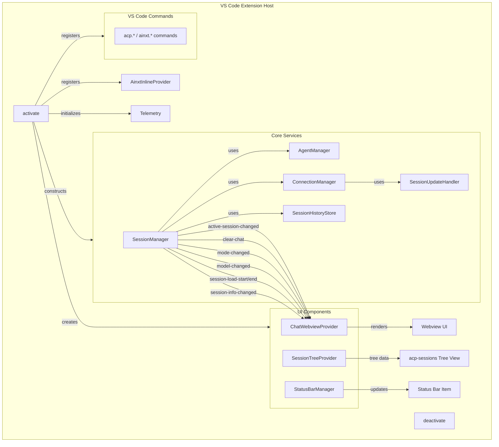
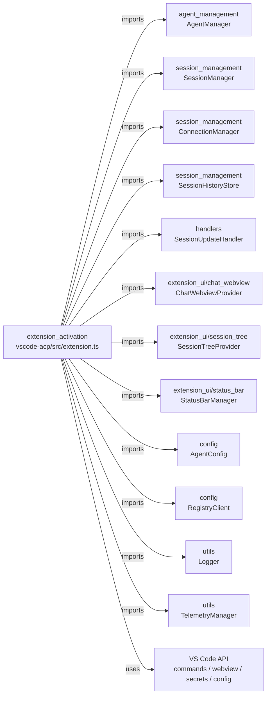
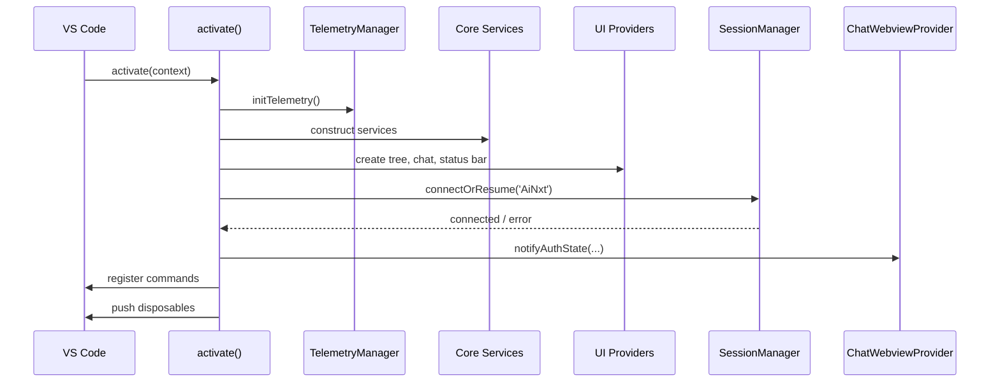
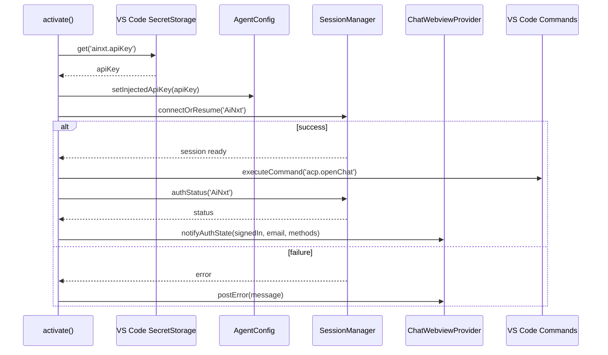
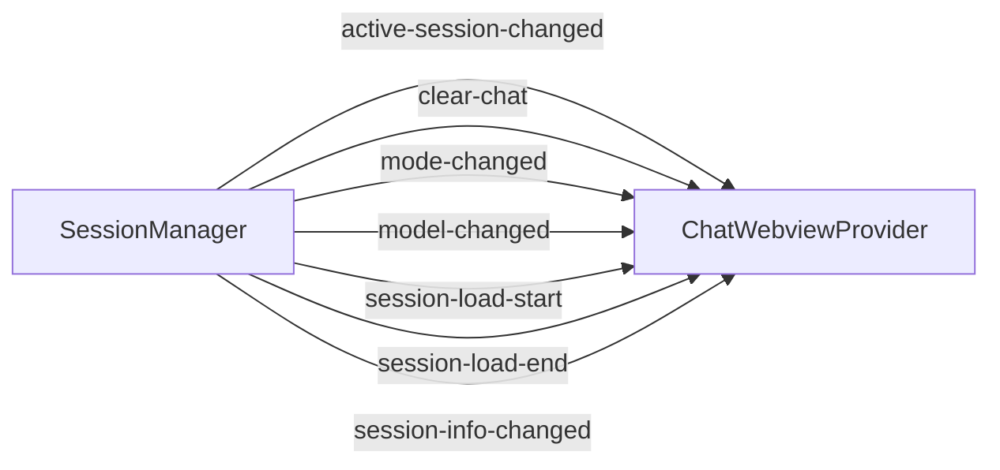
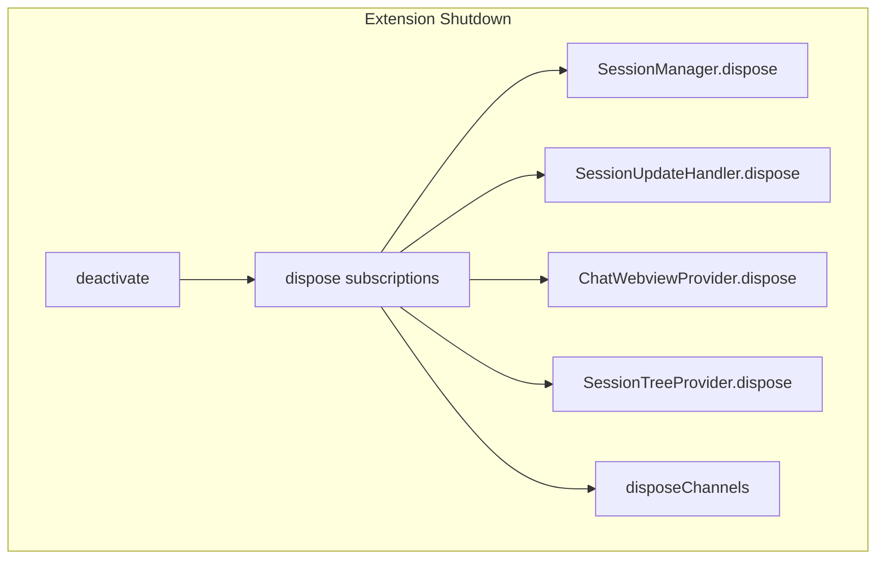

# Extension Activation

The `extension_activation` module is the entry point of the VS Code AiNxt extension. It is responsible for bootstrapping the entire extension lifecycle: registering core services, wiring up the user interface, exposing VS Code commands, and cleaning up resources on shutdown. The module is implemented in `vscode-acp/src/extension.ts` and exports the standard VS Code `activate` and `deactivate` functions.

---

## Overview

When the extension is activated by VS Code, `activate(context)` performs the following high-level steps:

1. Registers the optional ghost-text inline completion provider.
2. Initializes telemetry and logging infrastructure.
3. Constructs the core service graph: `SessionUpdateHandler`, `AgentManager`, `ConnectionManager`, `SessionManager`, and `SessionHistoryStore`.
4. Builds the UI layer: `SessionTreeProvider`, `ChatWebviewProvider`, and `StatusBarManager`.
5. Wires up event forwarding between sessions and the chat webview.
6. Auto-connects the governed `AiNxt` agent using a stored API key.
7. Registers all user-facing VS Code commands.
8. Ensures everything is disposed correctly when the extension shuts down.

`deactivate()` simply logs the shutdown event; most cleanup is handled through `context.subscriptions`.

---

## Architecture

---

## Component Responsibilities

### `activate`

The main entry point invoked by VS Code when the extension starts. It orchestrates service construction, UI registration, event binding, and command registration. All long-lived objects are pushed into `context.subscriptions` so VS Code can dispose of them on deactivation.

Key responsibilities:
- Register the `AinxtInlineProvider` for opt-in ghost-text completions.
- Initialize telemetry via [`initTelemetry`](utils/README.md).
- Create and connect core services.
- Create UI providers and bind session events to the chat webview.
- Auto-connect the `AiNxt` agent after loading the stored API key.
- Register connection, authentication, agent, session, and chat commands.
- Push a composite disposable that tears down the service graph on shutdown.

### `deactivate`

Called by VS Code when the extension is shut down. It logs the deactivation event. Actual resource cleanup is performed by the disposables registered in `context.subscriptions` during `activate`.

### `AinxtInlineProvider`

An opt-in [`vscode.InlineCompletionItemProvider`](https://code.visualstudio.com/api/references/vscode-api#InlineCompletionItemProvider) that provides ghost-text completions powered by the local AiNxt gateway `/complete` endpoint.

Behavior:
- Enabled only when `ainxt.autocomplete` is `true`.
- Sends up to 6,000 characters of prefix and 2,000 characters of suffix to the gateway.
- Debounces requests by 250 ms and respects cancellation tokens.
- Reads the access token from `~/.ainxt/credentials.json` for authenticated requests.
- Refuses to send over plain `http://` to a non-loopback host: the request carries a
  bearer token and up to 10 KB of the user's source (CWE-319).
- No cloud egress: the request goes only to the configured gateway, which is expected to
  front a local completion service (e.g. Ollama).
- **The AiNxt Platform does not implement `POST /ainxt/v1/api/complete`.** Against a stock
  deployment this feature therefore does nothing. It fails silently by design so a dead
  endpoint cannot disturb typing, but a `404`/`501` is logged once per gateway URL so the
  silence is diagnosable. See `warnMissingCompleteEndpointOnce` in `extension.ts`.

### `storedGatewayEmail`

A helper that reads `~/.ainxt/credentials.json` and returns the stored `email` field. It is used to label the identity chip in the chat webview with the real user account rather than a generic label. The read is best-effort and returns `undefined` if the file is missing or malformed.

---

## Dependencies

The activation module does not implement business logic itself; it delegates to the modules above. See the linked module documentation for details on each subsystem.

---

## Data Flow: Extension Activation

---

## Data Flow: Auto-Connect on Startup

---

## Command Registration

`activate` registers the following VS Code commands. Most commands delegate directly to [`SessionManager`](session-management/README.md) or [`ChatWebviewProvider`](chat-webview/README.md).

| Command | Handler | Description |
|---------|---------|-------------|
| `ainxt.applyConnection` | inline | Persist gateway URL, store API key, respawn agent, update auth state. |
| `ainxt.signIn` | inline | Run sign-in flow using advertised auth methods. |
| `ainxt.signOut` | inline | Sign out, delete stored key, respawn agent. |
| `acp.connectAgent` | inline | Connect to an agent by name or from a QuickPick list. |
| `acp.newConversation` | inline | Start a new conversation with the active agent. |
| `acp.disconnectAgent` | inline | Disconnect the active or selected agent. |
| `acp.openChat` | inline | Focus the chat webview view. |
| `acp.sendPrompt` | inline | Focus the chat webview view. |
| `acp.cancelTurn` | inline | Cancel the current turn for the active session. |
| `acp.restartAgent` | inline | Disconnect and reconnect the active agent. |
| `acp.showLog` | inline | Show the extension output channel. |
| `acp.showTraffic` | inline | Show the ACP traffic output channel. |
| `acp.setMode` | inline | Set the mode of the active session. |
| `acp.setModel` | inline | Set the model of the active session. |
| `acp.refreshAgents` | inline | Refresh the agents tree. |
| `acp.refreshSessions` | inline | Invalidate cached session list for an agent. |
| `acp.openSession` | inline | Load or resume a previous session. |
| `acp.loadMoreSessions` | inline | Load the next page of sessions for an agent. |
| `acp.copySessionId` | inline | Copy a session ID to the clipboard. |
| `acp.forgetSession` | inline | Remove a locally cached session entry. |
| `acp.addAgent` | inline | Add a new agent configuration. |
| `acp.removeAgent` | inline | Remove an agent configuration. |
| `acp.attachFile` | inline | Attach a file to the active chat. |
| `acp.browseRegistry` | inline | Browse the public ACP agent registry. |

---

## Event Wiring

`activate` binds several [`SessionManager`](session-management/README.md) events to the chat webview so the UI stays in sync with the underlying session state.

- `active-session-changed` → refreshes the chat view and re-sends current state.
- `clear-chat` → clears the chat webview content.
- `mode-changed` / `model-changed` → updates the mode/model pickers in the webview.
- `session-load-start` / `session-load-end` → drives the loading overlay; on success re-sends active session state.
- `session-info-changed` → updates the chat banner title.

---

## Lifecycle and Disposal

All disposable objects created during activation are pushed into `context.subscriptions`. On deactivation, VS Code disposes them in reverse order. The composite disposable at the end of `activate` explicitly tears down the heavy-weight services:

This ensures that agent processes, network connections, webview resources, and output channels are released cleanly.

---

## Configuration and Secrets

The activation module interacts with VS Code settings and secret storage:

- `ainxt.autocomplete` — enables the inline completion provider.
- `ainxt.gatewayUrl` / `ainxt.allowInsecure` — gateway connection settings.
- `ainxt.apiKey` — stored in VS Code `SecretStorage` and injected into the agent spawn environment.
- `acp.agents` — user-defined agent launch configurations.
- `~/.ainxt/credentials.json` — fallback source for access token and email.

---

## Related Modules

- [agent_management](agent-management/README.md) — spawning and managing agent processes.
- [session_management](session-management/README.md) — session lifecycle, connections, and history.
- [handlers](handlers/README.md) — ACP request handlers for files, terminals, permissions, and updates.
- [extension_ui/chat_webview](chat-webview/README.md) — chat webview provider and bridges.
- [extension_ui/session_tree](session-tree.md) — sessions tree view.
- [extension_ui/status_bar](status-bar.md) — status bar updates.
- [config](config.md) — agent configuration and registry client.
- [utils](utils/README.md) — logging, telemetry, and stream utilities.
