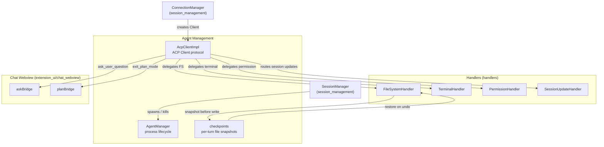
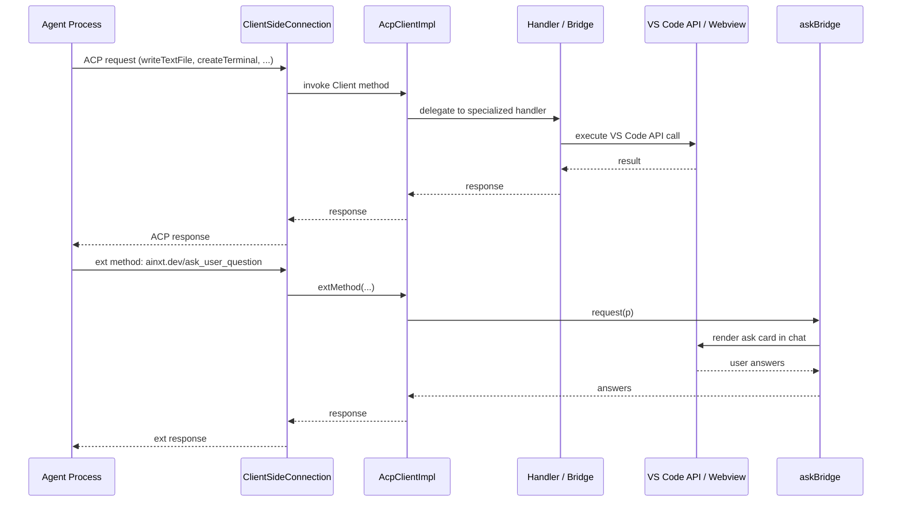

# Agent Management Module

The **agent_management** module is the execution backbone of the VS Code ACP extension. It is responsible for:

- **Spawning and killing ACP agent child processes** via `AgentManager`.
- **Implementing the ACP client protocol** via `AcpClientImpl`, bridging agent requests to VS Code capabilities (file system, terminal, permissions, UI cards).
- **Tracking per-turn file checkpoints** via `checkpoints`, allowing safe undo of agent file edits.

This module sits between the [session_management](../session-management/README.md) orchestrator and the concrete [handlers](../handlers/README.md) / [chat_webview](../chat-webview/README.md) UI bridges. It does not own session state, authentication, or long-term history — those concerns live in sibling modules.

---

## Architecture Overview

### Responsibilities

| Component | Responsibility |
|-----------|----------------|
| [`AgentManager`](agent-lifecycle.md) | Spawns agent processes as child processes, tracks running instances, kills agents on shutdown, and emits lifecycle events. |
| [`AcpClientImpl`](acp-client.md) | Implements the `@agentclientprotocol/sdk` `Client` interface. Receives agent requests/notifications and delegates to the appropriate VS Code handler or UI bridge. |
| [`checkpoints`](checkpoints.md) | Maintains a map of file paths to their pre-turn content. Supports bounded undo of agent writes by restoring only snapshotted files. |

---

## Sub-modules

The module is split into the following focused sub-modules:

- **[agent_management_acp_client](acp-client.md)** — `AcpClientImpl`: ACP client protocol implementation and request routing.
- **[agent_management_agent_lifecycle](agent-lifecycle.md)** — `AgentManager`: spawning, tracking, and terminating agent child processes.
- **[agent_management_checkpoints](checkpoints.md)** — `checkpoints`: per-turn file snapshots and restore.

---

## Data Flow: Agent Request Handling

---

## Integration with the Rest of the System

- **session_management**: `SessionManager` uses `AgentManager.spawnAgent` to start agents and `ConnectionManager` constructs an `AcpClientImpl` instance as the ACP client factory for each agent connection.
- **handlers**: `AcpClientImpl` depends on `FileSystemHandler`, `TerminalHandler`, `PermissionHandler`, and `SessionUpdateHandler` to perform VS Code-side work.
- **extension_ui / chat_webview**: `AcpClientImpl.extMethod` routes interactive extension methods (`ainxt.dev/ask_user_question`, `ainxt.dev/exit_plan_mode`) through `askBridge` and `planBridge` so the chat webview can render question cards and plan approval UI.
- **config**: `AgentManager` consumes `AgentConfigEntry` objects (from [config](../config.md)) to determine the command, arguments, and environment for each agent process.

---

## Lifecycle Notes

- `AgentManager.dispose()` is called on extension deactivation; it terminates all running agents and removes event listeners.
- `AcpClientImpl` is stateless except for the `Agent` reference set by the connection layer; all side effects are delegated.
- `checkpoints.begin()` should be called at the start of each agent turn, and `checkpoints.restore()` reverts only the files that were actually touched during that turn.
