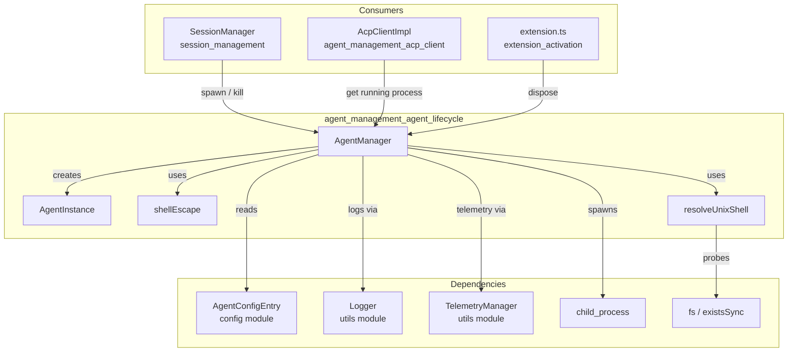
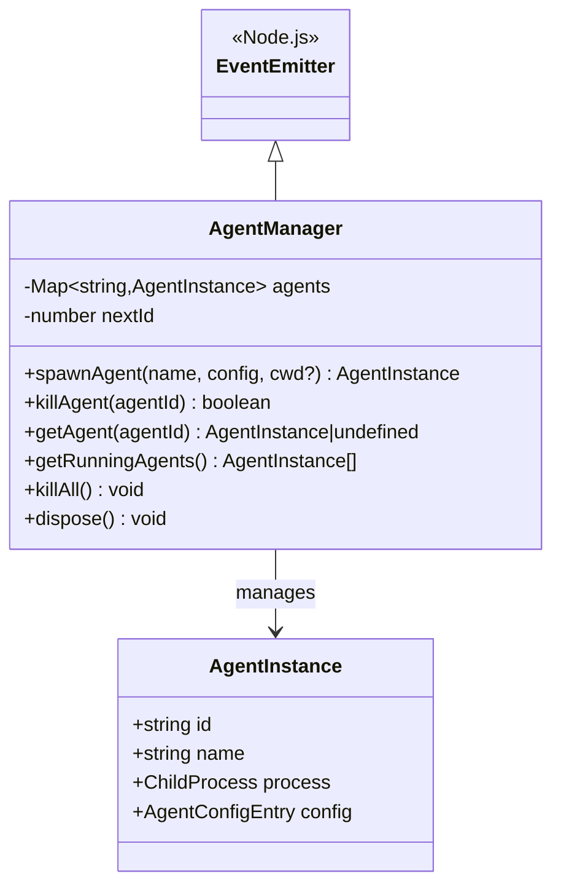
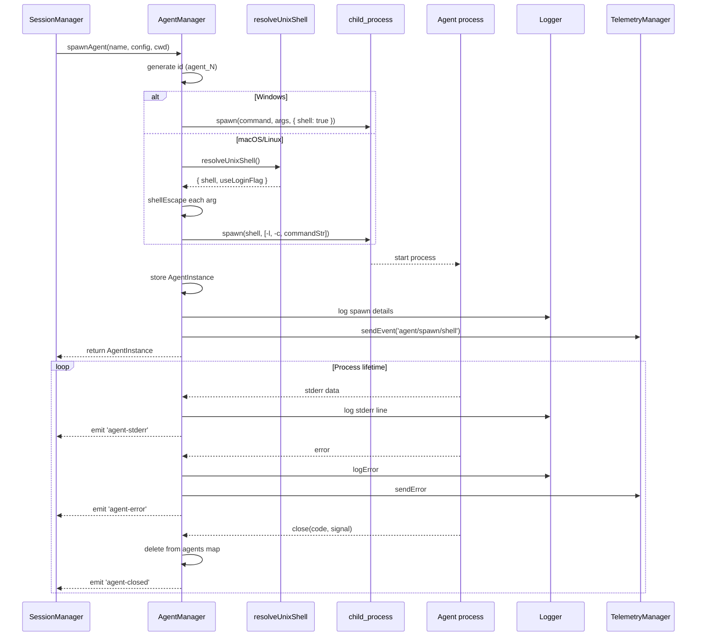
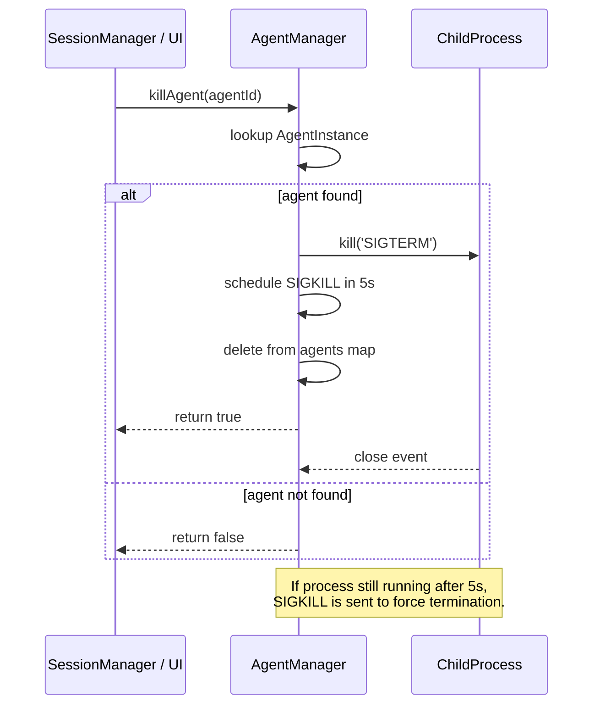
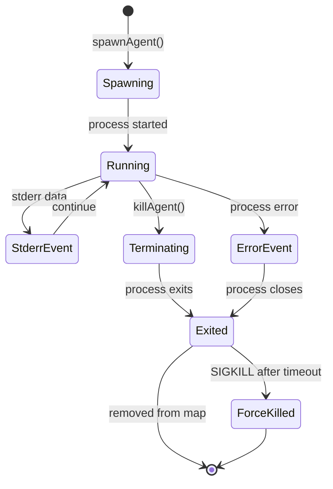
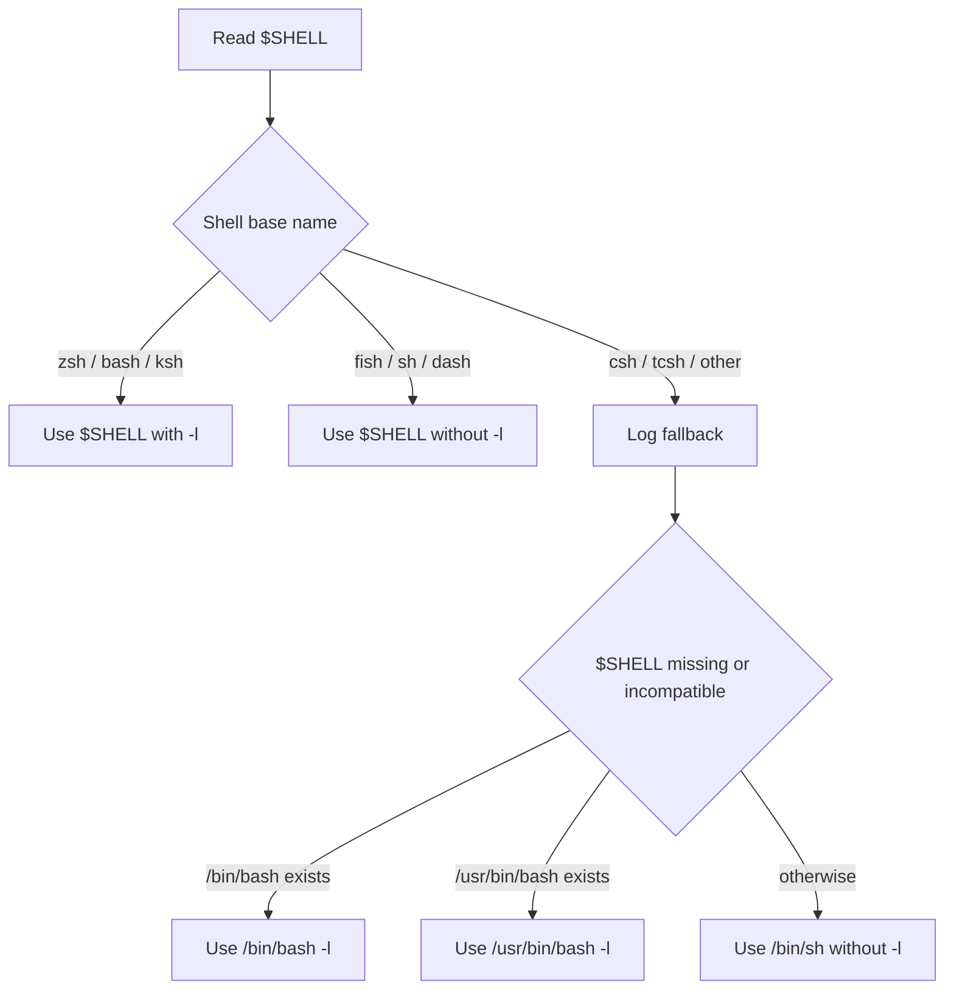

# Agent Management: Agent Lifecycle

## Introduction

The `agent_management_agent_lifecycle` module is responsible for managing the lifecycle of ACP (Agent Communication Protocol) agent child processes within the VS Code extension. It provides a centralized service for spawning, tracking, and terminating agent processes, ensuring that agents are launched with the correct shell environment, monitored for errors, and cleanly shut down when no longer needed.

This module is the execution foundation of the `agent_management` subsystem. While [agent_management_acp_client](acp-client.md) handles the protocol-level communication with a running agent, this module is concerned with the operating-system process that hosts the agent.

## Core Functionality

### Process Spawning

The `AgentManager.spawnAgent()` method launches an agent as a child process using Node.js `child_process.spawn()`. It supports platform-specific launching:

- **Windows**: Uses `shell: true` so that `.cmd` scripts (such as `npx`) are resolved correctly by `cmd.exe`.
- **macOS/Linux**: Uses the user's login shell (`$SHELL`) with the `-l` flag when supported, ensuring that user environment setup such as `nvm`, Homebrew, and other tool directories are loaded into `PATH`.

The helper `resolveUnixShell()` determines the appropriate shell and whether it supports the login flag. It falls back through `bash`, `/usr/bin/bash`, and finally `/bin/sh` if no compatible shell is detected.

### Process Tracking

Each spawned agent is wrapped in an `AgentInstance` object containing:

- `id`: A unique identifier such as `agent_1`.
- `name`: The human-readable agent name.
- `process`: The running `ChildProcess`.
- `config`: The `AgentConfigEntry` used to launch the agent.

Instances are stored in an internal `Map<string, AgentInstance>` so the manager can look up, list, and terminate running agents.

### Process Termination

`AgentManager.killAgent()` sends `SIGTERM` to a process and schedules a forced `SIGKILL` after 5 seconds if the process has not exited. `killAll()` iterates over all tracked agents and terminates them. `dispose()` performs `killAll()` and removes all event listeners, making it safe to call during extension deactivation.

### Event Forwarding

`AgentManager` extends `EventEmitter` and forwards process events:

- `agent-stderr`: Lines written to the agent's `stderr`.
- `agent-error`: Errors emitted by the `ChildProcess` itself.
- `agent-closed`: When the process exits, including exit code and signal.

These events allow upstream components such as [SessionManager](../session-management/README.md) and [ChatWebviewProvider](../chat-webview/README.md) to surface agent status to the user.

## Architecture

### Component Overview

### Class Structure

## Data Flow

### Spawning an Agent

### Terminating an Agent

## Process Lifecycle

## Cross-Platform Shell Handling

The `resolveUnixShell()` helper is critical for ensuring agents can find tools installed via package managers such as Homebrew or `nvm`. The decision logic is:

## Integration with the System

The `AgentManager` sits at the boundary between the VS Code extension's TypeScript code and the external ACP agent executable. Its consumers include:

- **[SessionManager](../session-management/README.md)**: Decides when to spawn or reconnect to an agent based on user session state. It calls `spawnAgent()` when a new local agent session is needed and `killAgent()` / `killAll()` during cleanup.
- **[AcpClientImpl](acp-client.md)**: After an agent is spawned, `AcpClientImpl` communicates with it over stdin/stdout. It may retrieve the `AgentInstance` from `AgentManager` to access the process streams.
- **[extension.ts](../activation.md)**: Registers the extension lifecycle and calls `AgentManager.dispose()` on deactivation to ensure no orphan processes remain.
- **[Logger](../utils/README.md)** and **[TelemetryManager](../utils/README.md)**: Used for operational logging and telemetry events.
- **[AgentConfig](../config.md)**: Supplies the `AgentConfigEntry` (command, args, environment) used to launch each agent.

## References

- [agent_management_acp_client](acp-client.md) — protocol client that communicates with spawned agents.
- [agent_management_checkpoints](checkpoints.md) — checkpointing support for agent sessions.
- [session_management](../session-management/README.md) — orchestrates sessions and drives agent spawning.
- [extension_activation](../activation.md) — extension entry point and deactivation cleanup.
- [chat_webview](../chat-webview/README.md) — UI surface that displays agent status and errors.
- [config](../config.md) — agent configuration definitions.
- [utils](../utils/README.md) — logging and telemetry utilities.
