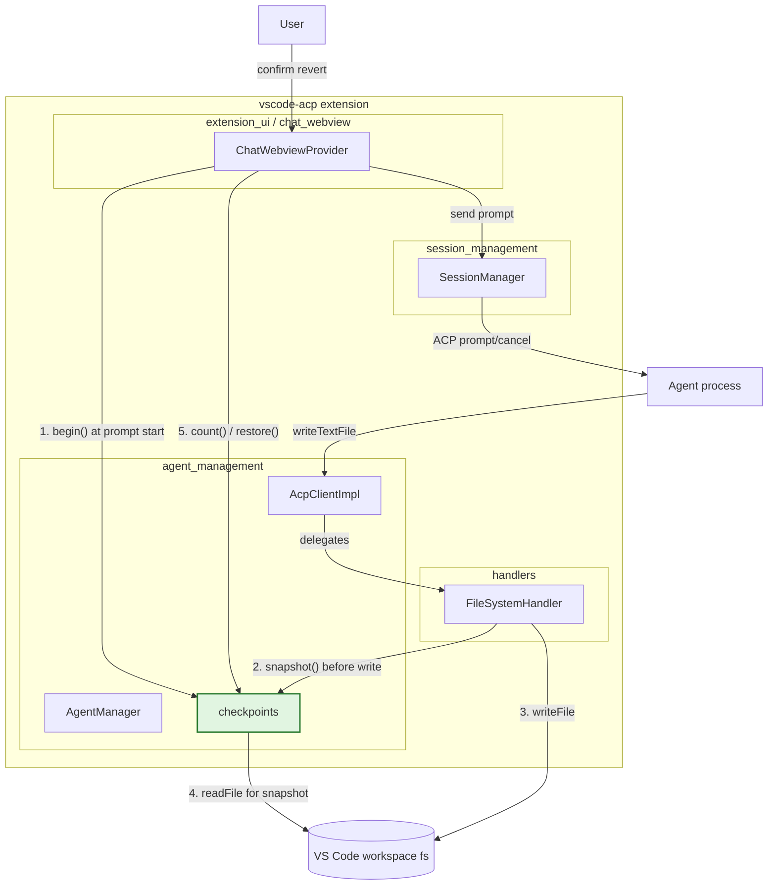
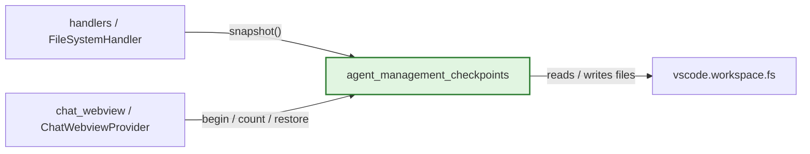
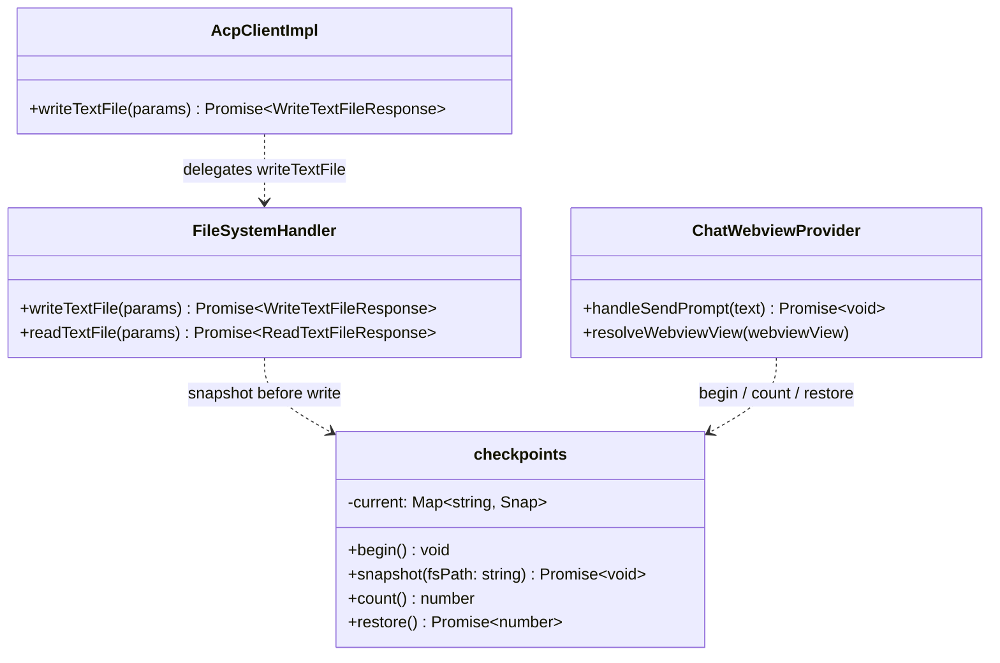
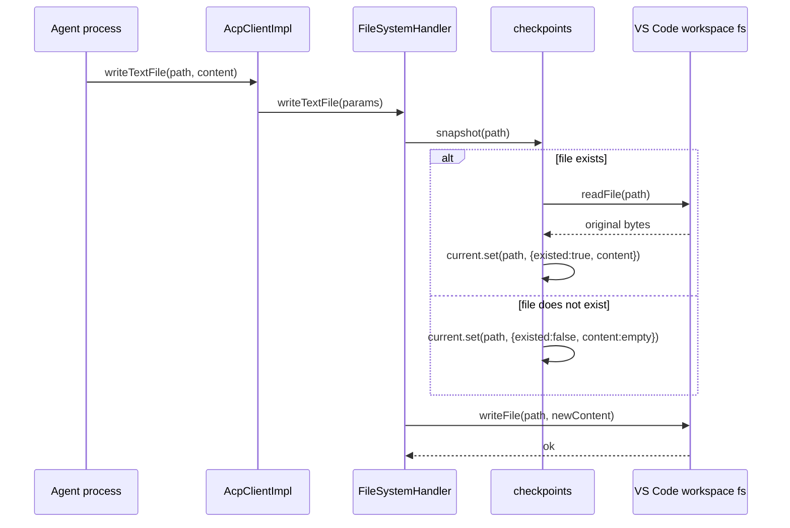
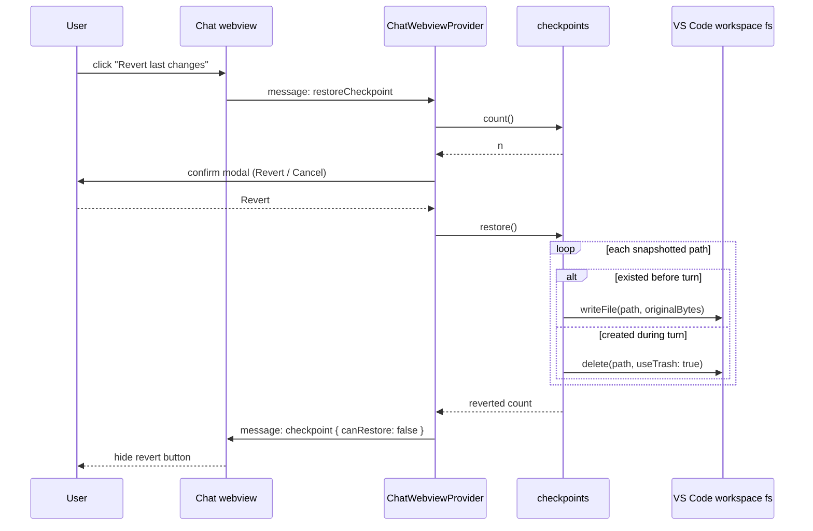
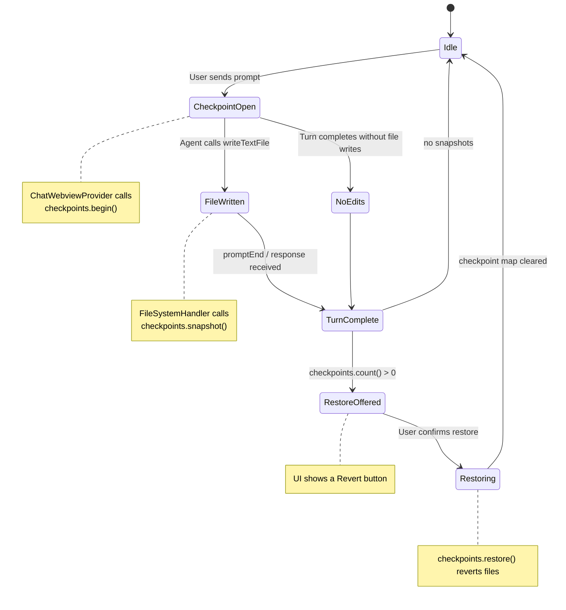

# agent_management_checkpoints

The `agent_management_checkpoints` module provides **per-turn file checkpointing** for agent edits inside the VS Code extension. Before the agent overwrites or creates a file during a chat turn, the module records the file's prior state (or marks it as newly created). At the end of the turn the user can choose to **revert every file change from that turn** — an undo operation that is bounded, safe, and only touches files that were actually modified.

This module is intentionally small and stateful: it keeps a single in-memory map of snapshots for the current turn and exposes a small imperative API (`begin`, `snapshot`, `count`, `restore`). It does not persist checkpoints across extension reloads, across sessions, or across turns; each new user prompt starts a fresh checkpoint.

---

## Core responsibilities

| Responsibility | Description |
| --- | --- |
| **Start a checkpoint** | Clear the snapshot map at the beginning of a user turn so only edits from the current turn are tracked. |
| **Snapshot before write** | Capture the current bytes of a file before it is overwritten, or record that the file did not exist. Idempotent: a path is snapshotted only once per turn. |
| **Count tracked files** | Report how many paths have been snapshotted so the UI can decide whether to offer a revert action. |
| **Restore changes** | Revert every snapshotted file to its pre-turn state: write back the original bytes for existing files, or move newly-created files to the VS Code trash. |

---

## File and component overview

The module is implemented in a single file:

- `vscode-acp/src/core/checkpoints.ts`

### Exported API

```typescript
type Snap = { existed: boolean; content: Uint8Array };

export const checkpoints = {
  begin(): void;
  snapshot(fsPath: string): Promise<void>;
  count(): number;
  restore(): Promise<number>;
};
```

- `checkpoints` — module-level singleton that holds the current turn's snapshot map.
- `Snap` — internal record for a single file snapshot. `existed: false` means the file was created during the turn and should be deleted on restore.
- `current` — private `Map<string, Snap>` storing snapshots for the active turn.

---

## Architecture

`agent_management_checkpoints` sits in the `agent_management` layer of `vscode-acp`. It is consumed by the file-system handler (to snapshot before writes) and by the chat webview provider (to manage the turn lifecycle and the revert UI).



The diagram above highlights the checkpoint module in green. For details on how the agent process is spawned and how the ACP client routes requests, see [agent_management_agent_lifecycle](agent-lifecycle.md) and [agent_management_acp_client](acp-client.md).

---

## Dependencies



- **VS Code API** — `checkpoints` uses `vscode.workspace.fs.readFile`, `writeFile`, and `delete` (with `useTrash: true`).
- **[handlers](../handlers/README.md)** — `FileSystemHandler.writeTextFile` calls `checkpoints.snapshot()` before persisting new content.
- **[chat_webview](../chat-webview/README.md)** — `ChatWebviewProvider` calls `checkpoints.begin()` when the user sends a prompt, reads `checkpoints.count()` to decide whether to show a revert action, and calls `checkpoints.restore()` when the user confirms a revert.
- **[session_management](../session-management/README.md)** — owns the prompt/cancel lifecycle that drives the turn during which checkpoints are collected.

---

## Component interaction



- `checkpoints` is a plain singleton object, not a class, so it is imported directly by callers.
- `AcpClientImpl` does not interact with checkpoints itself; it routes file requests to `FileSystemHandler`. See [agent_management_acp_client](acp-client.md) for the full routing table.
- `ChatWebviewProvider` is the orchestrator of the turn lifecycle from the UI side. See [chat_webview](../chat-webview/README.md) for webview message handling.

---

## Data flow

### Snapshot before a file write



Key behaviors:

- `snapshot` is idempotent. If the same path is written multiple times in one turn, only the first pre-write state is recorded.
- Snapshot failures are not fatal: if reading the existing file fails for any reason, the path is treated as newly created.
- After snapshotting, `FileSystemHandler` opens the file in the editor so the user sees the change immediately.

### Restore user-initiated revert



---

## Turn lifecycle and process flow



1. **Prompt start** — `ChatWebviewProvider.handleSendPrompt` calls `checkpoints.begin()` after injecting project rules and before calling `SessionManager.sendPrompt`.
2. **Agent edits** — Each `writeTextFile` request snapshots the file's prior state (if any) before writing.
3. **Turn end** — On `promptEnd`, `ChatWebviewProvider` posts a `checkpoint` message to the webview with `canRestore: checkpoints.count() > 0`.
4. **User revert** — If the user clicks the revert action, the webview sends `restoreCheckpoint`; the provider confirms, calls `checkpoints.restore()`, and hides the revert action.
5. **New conversation / reload** — Starting a new chat or reloading the extension clears the checkpoint map because it is stored only in memory.

---

## API reference

### `checkpoints.begin(): void`

Clears the internal `current` map. Called once at the start of each user turn so the checkpoint only contains edits made during that turn.

### `checkpoints.snapshot(fsPath: string): Promise<void>`

Records the pre-write state of a single file.

- If `fsPath` is already in the current checkpoint map, the call returns immediately (idempotent).
- If the file exists, its bytes are read with `vscode.workspace.fs.readFile` and stored.
- If the file does not exist (or cannot be read), it is recorded as newly-created with empty content.

### `checkpoints.count(): number`

Returns the number of paths currently tracked in the active checkpoint.

### `checkpoints.restore(): Promise<number>`

Reverts every tracked path to its pre-turn state and returns the number of files that were successfully reverted.

- Existing files are restored by writing back the original bytes.
- Newly-created files are deleted with `useTrash: true` so they can be recovered from the OS trash.
- Errors for individual files are swallowed; the method continues with the remaining snapshots.
- After restoring, the checkpoint map is cleared.

---

## Safety and edge cases

| Concern | Mitigation |
| --- | --- |
| **Unbounded revert** | Only paths that were actually snapshotted are touched. `restore` never scans the workspace or reverts unrelated changes. |
| **Multiple writes to the same file** | `snapshot` is idempotent; the first pre-write state is preserved. |
| **Newly created files** | Recorded with `existed: false` and moved to trash on restore, not permanently deleted. |
| **Partial failures** | Each revert operation is wrapped in `try/catch`; failures are skipped and the rest of the checkpoint is still processed. |
| **Cross-turn leaks** | `begin()` clears the map at the start of every prompt, and `restore()` clears it after use. |
| **Persistence** | Checkpoints live only in extension memory. They do not survive extension reloads or VS Code restarts. |
| **Cancel vs. restore** | Cancelling a turn (`cancelTurn`) stops the agent but does **not** automatically restore file changes. Revert is a separate, explicit user action. |

---

## Integration with the wider system

- **File writes** — The actual file I/O path is in [handlers](../handlers/README.md). `FileSystemHandler.writeTextFile` is the only production caller of `checkpoints.snapshot`.
- **ACP client** — [agent_management_acp_client](acp-client.md) routes `writeTextFile` from the agent to `FileSystemHandler`.
- **Agent lifecycle** — [agent_management_agent_lifecycle](agent-lifecycle.md) manages the agent process, but checkpoints are independent of process lifetime.
- **Session management** — [session_management](../session-management/README.md) owns `sendPrompt` and `cancelTurn`, which define the boundaries of a turn.
- **Chat webview** — [chat_webview](../chat-webview/README.md) renders the revert affordance and forwards the user's `restoreCheckpoint` message.
- **Extension activation** — The module is imported at runtime by `FileSystemHandler` and `ChatWebviewProvider`; it does not require explicit activation logic. See [extension_activation](../activation.md) for the extension entry point.

---

## Related documentation

- [agent_management](README.md)
- [agent_management_acp_client](acp-client.md)
- [agent_management_agent_lifecycle](agent-lifecycle.md)
- [handlers](../handlers/README.md)
- [chat_webview](../chat-webview/README.md)
- [session_management](../session-management/README.md)
- [extension_activation](../activation.md)
