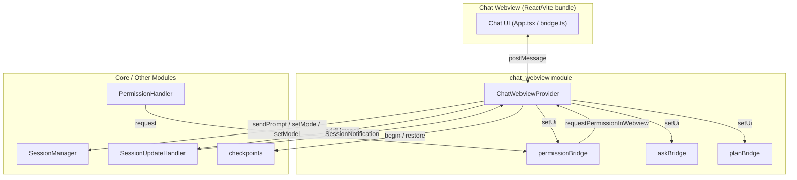
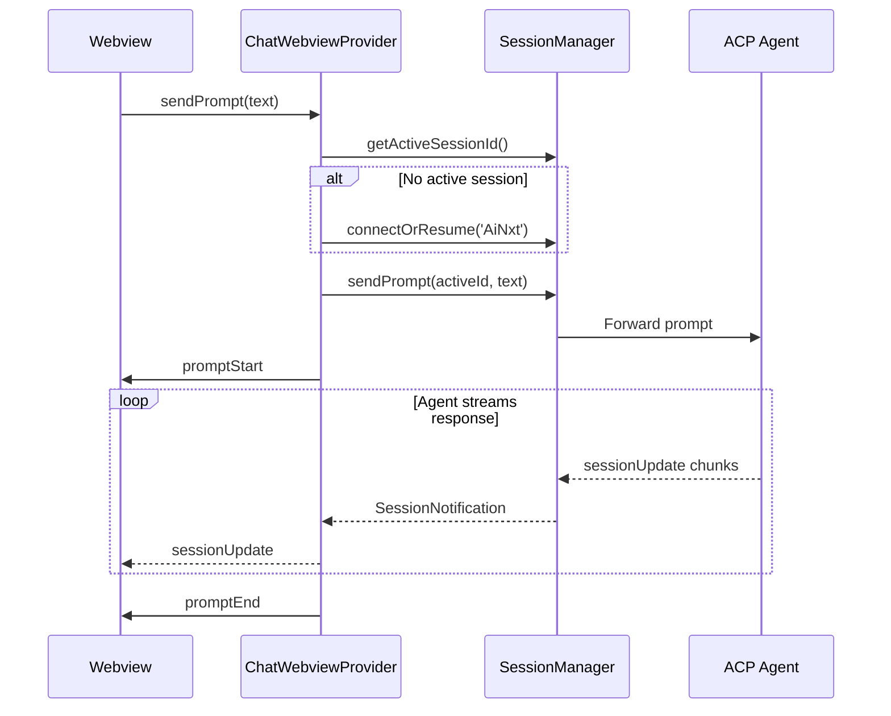
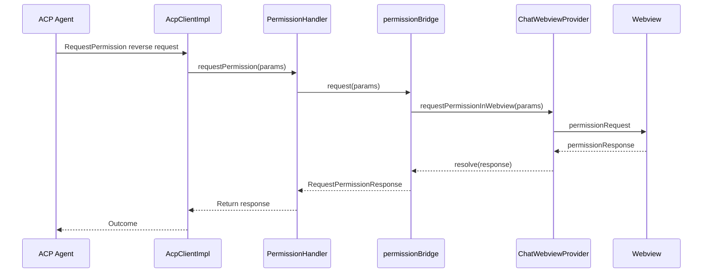

# chat_webview Module

## Overview

The `chat_webview` module implements the **in-IDE chat UI** for the AiNxt VS Code extension. It renders the chat sidebar, handles user input, displays agent messages/tool calls/plans, and mediates interactive requests (permissions, questions, plan approvals) between the user and the active ACP agent session.

The module is built around a single VS Code `WebviewViewProvider` — `ChatWebviewProvider` — and three lightweight bridge objects that decouple deep connection-layer code from the webview UI.

## Architecture

## Responsibilities

| Area | Responsibility |
|------|----------------|
| **Webview lifecycle** | Create the sidebar webview, generate HTML, load the React bundle, and clean up on dispose. |
| **Message routing** | Handle messages from the webview (prompts, cancellations, mode/model/config changes, file attachments, etc.). |
| **Session state sync** | Forward `SessionNotification` updates to the webview for the active session only. |
| **Interactive cards** | Render permission, ask-user-question, and plan-approval requests as in-chat cards. |
| **Context attachments** | Attach files, folders, workspace diagnostics, git diffs, and project rules to prompts. |
| **Budget / auth UI** | Fetch and display gateway budget usage; reflect sign-in state in the webview. |
| **Diff / checkpoints** | Open native diff editors for agent changes and offer checkpoint restore. |

## Sub-modules

The module is split into two sub-modules:

- **[chat_webview_provider](provider.md)** — The main `ChatWebviewProvider` class that owns the webview lifecycle, message handling, session update forwarding, and all UI notifications.
- **[chat_webview_bridges](bridges.md)** — The `permissionBridge`, `askBridge`, and `planBridge` singletons that decouple connection-layer reverse requests from the webview UI.

See [chat_webview_provider.md](provider.md) and [chat_webview_bridges.md](bridges.md) for component-level details, message types, and implementation notes.

## Data Flow

### Sending a Prompt

### Permission Request Flow

## Integration with Other Modules

| Module | Relationship |
|--------|--------------|
| [session_management](../session-management/README.md) | `ChatWebviewProvider` calls `SessionManager` to send prompts, change modes/models/config options, list/load sessions, and query active session state. |
| [handlers](../handlers/README.md) | Registers as a listener on `SessionUpdateHandler` to receive `SessionNotification` updates. |
| [agent_management](../agent-management/README.md) | Uses `checkpoints` to begin/restore file-edit snapshots and `AcpClientImpl` indirectly receives reverse requests that are routed through bridges. |
| [extension_ui](../ui.md) | `ChatWebviewProvider` is instantiated and registered by the extension activation logic in `extension.ts`. |
| [webview_ui](../../webview/README.md) | The webview HTML loads the React bundle from `webview-ui`; messages are exchanged via `postMessage`. |
| [utils](../utils/README.md) | Uses `Logger` for errors and `TelemetryManager` to record chat message events. |

## Key Design Patterns

1. **Bridge pattern** — `permissionBridge`, `askBridge`, and `planBridge` decouple producers deep in the connection layer from the webview consumer, with a fallback when the webview is not yet loaded.
2. **Active-session gating** — `handleSessionUpdate` only forwards updates whose `sessionId` matches the active session, because the webview displays a single conversation at a time.
3. **Optimistic UI + authoritative replay** — Config-option changes are updated optimistically in the webview and then replaced by the authoritative state returned from the agent.
4. **Best-effort operations** — Budget fetching, workspace file listing, and project-rules loading fail silently rather than breaking the chat experience.
