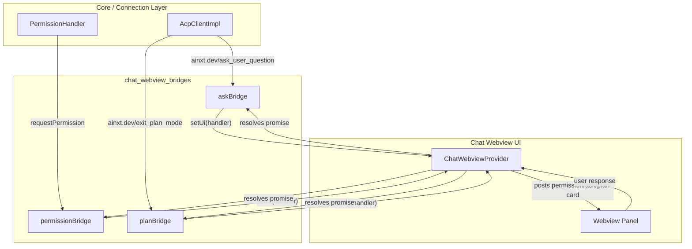
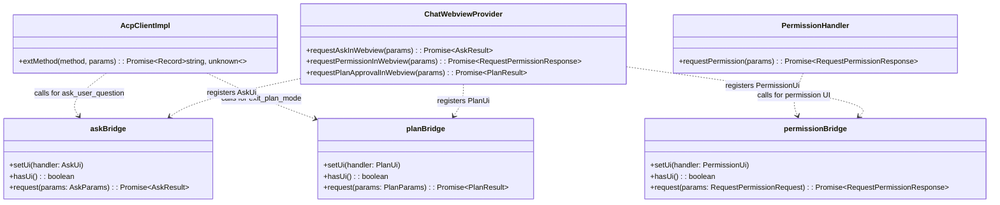
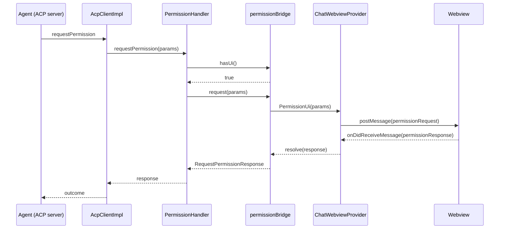
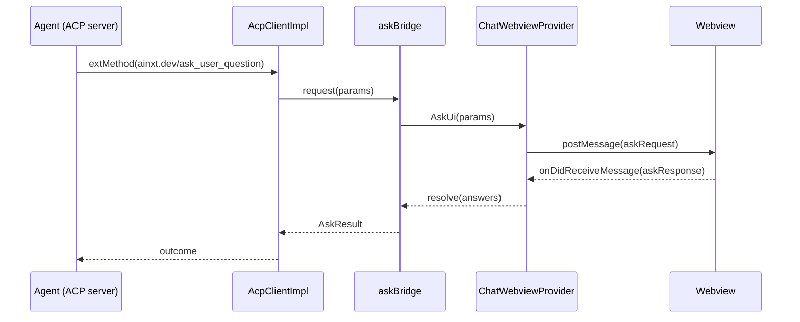
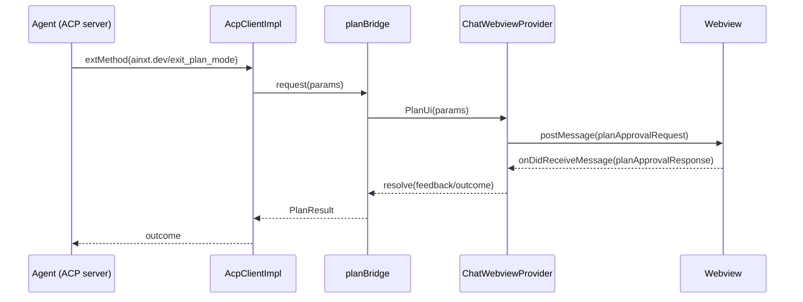
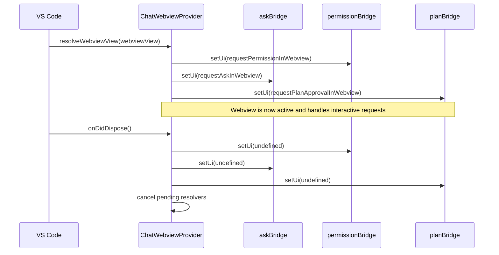

# Chat Webview Bridges

The **chat_webview_bridges** module provides lightweight, stateless bridges that decouple agent-initiated interactive requests from the VS Code chat webview UI. It enables the connection and handler layers deep in the extension core to request in-chat user interactions—permissions, clarifying questions, and plan approvals—without taking a direct dependency on the webview implementation.

---

## Overview

Agent sessions frequently need to pause and ask the user a question, request permission for a tool call, or present a plan for approval before continuing. These interactions originate in the ACP connection layer (as reverse requests or notifications) but must be rendered inside the chat webview so the user can respond without leaving the conversation context.

The bridges solve two problems:

1. **Decoupling** – The connection layer (`AcpClientImpl`) and handlers (`PermissionHandler`) do not know about `ChatWebviewProvider` or VS Code webview APIs.
2. **Lifecycle safety** – The webview may not exist when a request arrives (e.g., during startup or after the panel is closed). Each bridge detects this and returns a safe fallback outcome.

The module contains three tiny, identical-pattern bridge objects:

| Bridge | Source request | UI rendered | Fallback when no UI |
|--------|----------------|-------------|---------------------|
| `askBridge` | `ainxt.dev/ask_user_question` (via `AcpClientImpl.extMethod`) | In-chat "ask" card | `{ outcome: 'cancelled' }` |
| `permissionBridge` | ACP `requestPermission` (via `PermissionHandler`) | In-chat permission card | Throws `Error('no permission UI registered')` |
| `planBridge` | `ainxt.dev/exit_plan_mode` (via `AcpClientImpl.extMethod`) | In-chat plan-approval card | `{ outcome: 'cancelled' }` |

For the webview implementation that consumes these bridges, see [chat_webview_provider.md](provider.md). For the connection layer that originates the requests, see [agent_management.md](../agent-management/README.md) and [session_management.md](../session-management/README.md).

---

## Architecture

The bridges sit between the **core connection/handlers** and the **chat webview UI**. They expose a minimal registration API: the webview provider registers an async handler when the webview becomes available, and the core layers call `bridge.request(...)` whenever the agent needs user input.

### Component relationships

---

## Core Components

### `askBridge`

Bridges the agent's `ainxt.dev/ask_user_question` extension method to the in-chat ask card.

- **`setUi(handler)`** – Registers (or unregisters) the UI callback.
- **`hasUi()`** – Returns `true` when a handler is registered.
- **`request(params)`** – Forwards `AskParams` to the UI. If no UI is registered, returns `{ outcome: 'cancelled' }` so the agent can continue gracefully.

`AskParams` carries a list of questions, each with options, optional multi-select support, and an optional mode. `AskResult` is a generic record accepted by the agent.

### `permissionBridge`

Decouples `PermissionHandler` from the permission UI.

- **`setUi(handler)`** – Registers the UI callback.
- **`hasUi()`** – Returns `true` when a handler is registered.
- **`request(params)`** – Forwards the ACP `RequestPermissionRequest` to the UI. If no UI is registered, it throws an error so `PermissionHandler` can fall back to the native VS Code `QuickPick`.

This is the only bridge whose fallback is an error rather than a cancellation outcome, because `PermissionHandler` already owns a native QuickPick fallback path.

### `planBridge`

Bridges the agent's `ainxt.dev/exit_plan_mode` reverse request to the in-chat plan-approval card.

- **`setUi(handler)`** – Registers the UI callback.
- **`hasUi()`** – Returns `true` when a handler is registered.
- **`request(params)`** – Forwards `PlanParams` to the UI. If no UI is registered, returns `{ outcome: 'cancelled' }`, which tells the agent to remain in plan mode.

---

## Data Flow

### Permission request flow

### Ask-user question flow

### Plan approval flow

---

## Lifecycle and Registration

`ChatWebviewProvider` registers the three bridges when the webview view is resolved, and clears them when the view is disposed. This ensures that:

- Requests arriving before the webview loads use the bridge fallback (`PermissionHandler` falls back to QuickPick; ask/plan return cancelled).
- Requests arriving after the webview closes are cancelled cleanly, and any pending resolvers are resolved with a cancellation outcome.

---

## How It Fits into the System

The bridges are a thin glue layer inside the VS Code host's chat webview subsystem. They connect:

- **Agent management / ACP client** – `AcpClientImpl.extMethod` dispatches `ainxt.dev/ask_user_question` and `ainxt.dev/exit_plan_mode` through `askBridge` and `planBridge`. See [agent_management.md](../agent-management/README.md).
- **Permission handling** – `PermissionHandler` prefers `permissionBridge` and falls back to a native QuickPick. See [handlers.md](../handlers/README.md).
- **Chat webview provider** – `ChatWebviewProvider` registers the UI callbacks and renders the interactive cards. See [chat_webview_provider.md](provider.md).
- **Session management** – Session updates and agent capabilities flow through separate channels (`SessionUpdateHandler`), but the interactive requests handled by the bridges are scoped to the active session managed by `SessionManager`. See [session_management.md](../session-management/README.md).

Because the bridges are pure TypeScript modules with no VS Code API dependencies, they are easy to unit test and could be reused by other host implementations (for example, a future JetBrains bridge) as long as the same registration/request contract is honored.

---

## Design Notes

- **No state** – The bridges do not queue requests or maintain history. If no UI is registered, the request is resolved immediately with the fallback outcome.
- **Single handler** – Only one UI handler can be registered at a time. In practice this is the active `ChatWebviewProvider` instance.
- **Type safety** – Each bridge exports its parameter and result types (`AskParams`, `AskResult`, `PlanParams`, `PlanResult`, `PermissionUi`, etc.) so consumers can type-check the contract.
- **Consistent pattern** – All three bridges share the same `setUi` / `hasUi` / `request` shape, making the module predictable to extend.
