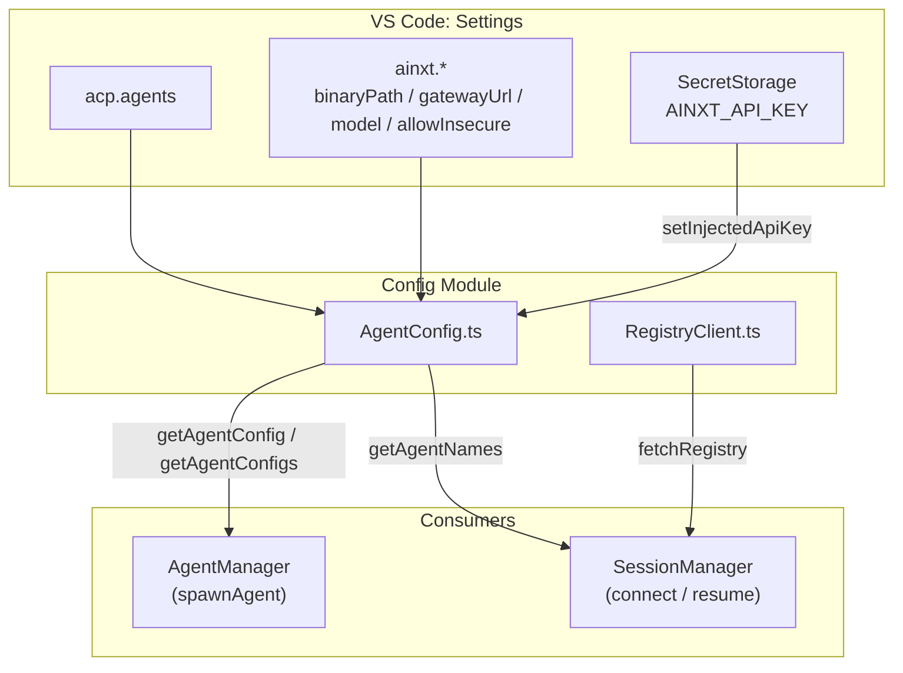
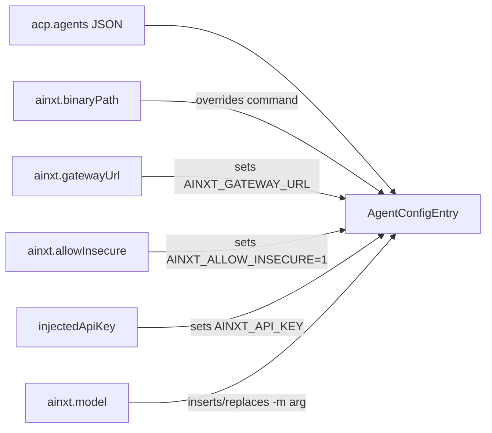
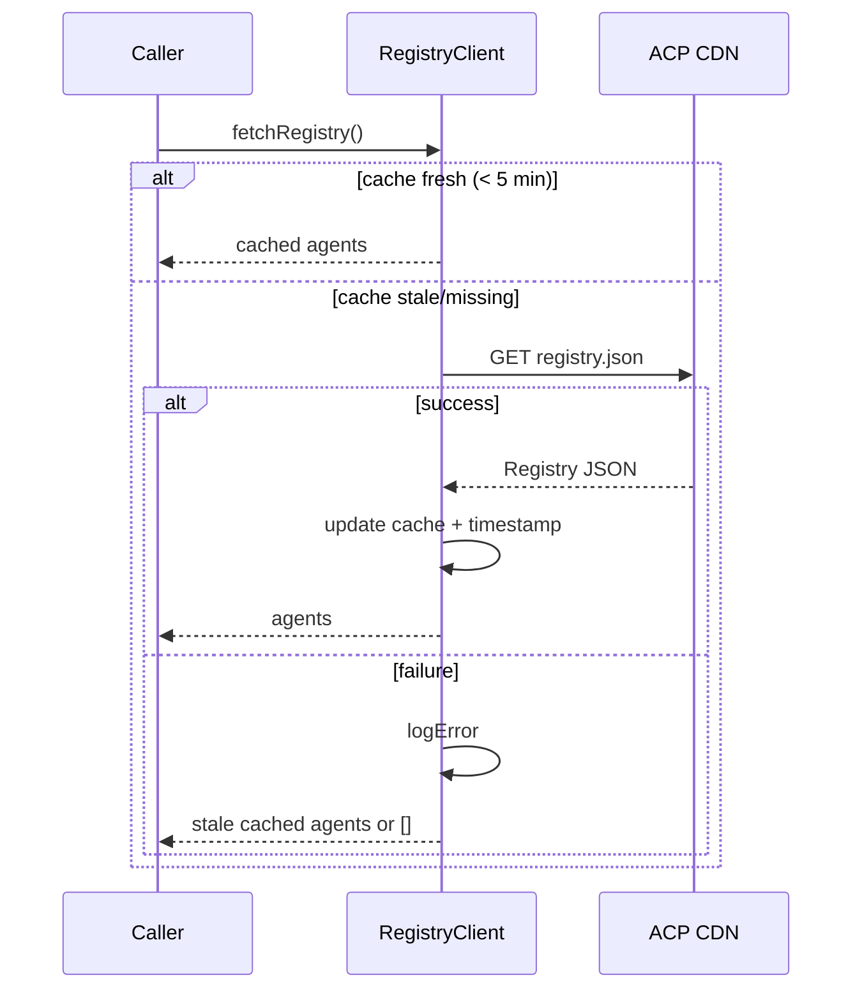
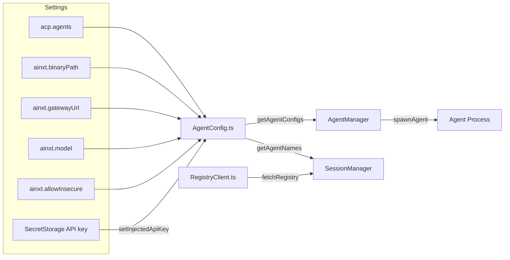

# Config Module

The **Config** module is responsible for sourcing, normalizing, and caching the configuration that drives which ACP (Agent Client Protocol) agents the VS Code: extension can spawn and connect to. It bridges user-facing VS Code: settings, IT-managed overrides, injected runtime secrets, and a public registry of community agents.

## Purpose

- Read agent definitions from the `acp.agents` VS Code: setting.
- Apply first-class `ainxt.*` settings (binary path, gateway URL, model, insecure transport opt-in) over the raw agent JSON so IT administrators can configure deployments without editing low-level agent objects.
- Inject the in-memory API key (`AINXT_API_KEY`) into the agent spawn environment at configuration time.
- Fetch and cache the public ACP agent registry from a CDN so users can discover additional agents.

## Architecture Overview

## Core Components

### `AgentConfig.ts`

Central source of truth for local agent configuration.

| Export | Type | Responsibility |
|--------|------|----------------|
| `AgentConfigEntry` | `interface` | Shape of a single agent definition: `command`, `args`, `env`, `displayName`. |
| `getAgentConfigs()` | `function` | Reads `acp.agents`, overlays `ainxt.*` settings, injects `AINXT_API_KEY`, and returns a name-to-config map. |
| `getAgentNames()` | `function` | Returns the list of configured agent names. |
| `getAgentConfig(name)` | `function` | Returns the config for a specific agent. |
| `setInjectedApiKey(key)` | `function` | Stores the gateway API key in memory so the synchronous `getAgentConfigs` can inject it into the agent environment. |
| `withModelArg(args, model)` | `function` | Ensures the `-m <model>` CLI argument is present in the agent args. |

#### Configuration Precedence

The `AiNxt` agent entry receives special treatment:

1. `ainxt.binaryPath` replaces `entry.command`.
2. `ainxt.gatewayUrl` is written to `env.AINXT_GATEWAY_URL`.
3. If `ainxt.allowInsecure` is explicitly `true`, `env.AINXT_ALLOW_INSECURE` is set to `'1'`.
4. If `setInjectedApiKey` has been called, `env.AINXT_API_KEY` is set.
5. If `ainxt.model` is set, the `-m <model>` argument is inserted or updated in `entry.args`.

> **Security note:** `allowInsecure` is only honored when the user or IT explicitly opts in. This supports internal HTTP gateways with self-signed certificates and is never enabled automatically.

### `RegistryClient.ts`

Fetches the public ACP agent registry from `https://cdn.agentclientprotocol.com/registry/v1/latest/registry.json` and caches it for five minutes.

This is the one place the extension reaches the network on its own account, outside the
gateway. `ainxt.registryUrl` overrides the URL so an organisation can point at an
internal mirror and keep the lookup inside its perimeter; a configured value must be
`https://` or loopback, and a plain `http://` remote is refused with the default used
instead (`isSecureGateway`, CWE-319).

| Export | Type | Responsibility |
|--------|------|----------------|
| `RegistryAgent` | `interface` | Shape of a registry entry: `name`, `description`, `command`, `args`, `homepage`. |
| `Registry` | `interface` | Wrapper containing the `agents` array. |
| `fetchRegistry()` | `function` | Returns the cached registry if fresh; otherwise fetches, caches, and returns the agent list. On failure it falls back to the stale cache. |
| `clearRegistryCache()` | `function` | Invalidates the in-memory registry cache. |

## Data Flow

## Relationship to Other Modules

- **[agent_management](agent-management/README.md)** — `AgentManager.spawnAgent` consumes `getAgentConfig` to determine the command, arguments, and environment for launching an agent process.
- **[session_management](session-management/README.md)** — `SessionManager` uses `getAgentNames` to enumerate available agents and `fetchRegistry` to discover registry agents when listing or connecting to sessions.
- **[utils](utils/README.md)** — `RegistryClient` uses the `log` / `logError` helpers from the Logger utility for observability.

## Key Design Decisions

1. **Synchronous config API.** `getAgentConfigs` is synchronous because callers such as `AgentManager` need configuration immediately at spawn time. Secrets are pre-loaded into memory via `setInjectedApiKey` during activation or connection.
2. **First-class `ainxt` overrides.** Rather than forcing users to edit raw `acp.agents` JSON, common AiNxt deployment parameters have dedicated settings that overlay the base config.
3. **Registry caching.** A 5-minute TTL reduces CDN load and keeps session/agent listing responsive.
4. **Graceful degradation.** If the registry fetch fails, `fetchRegistry` returns the previously cached data (if any) instead of throwing.
