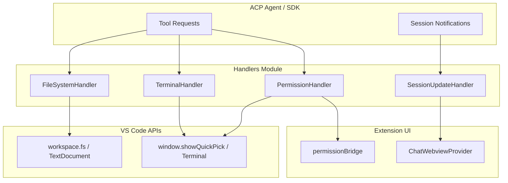
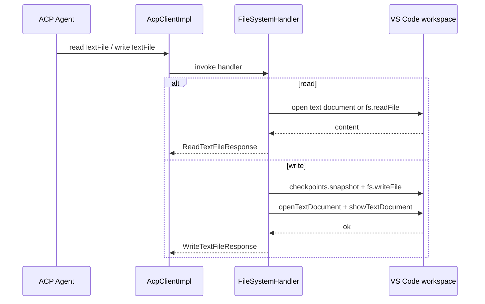
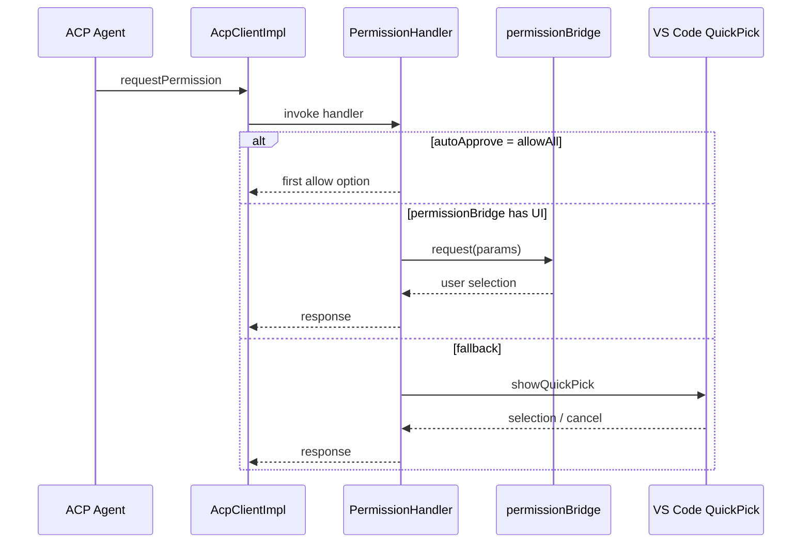
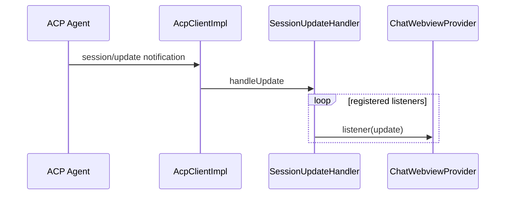
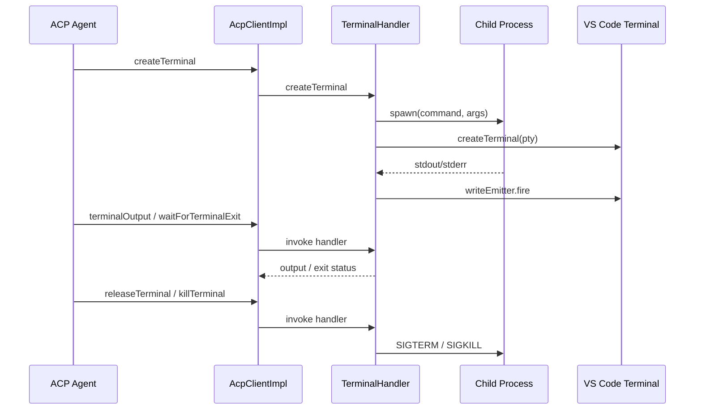

# Handlers Module

The **Handlers** module implements the host-side adapters for the Agent Client Protocol (ACP) in the VS Code extension. Each handler translates an ACP request into the corresponding VS Code API call, captures the result, and returns an ACP response. The module is intentionally thin: it contains no business logic about sessions, agents, or authentication; it only bridges ACP messages to VS Code capabilities.

## Purpose

- Provide concrete implementations for ACP tool requests that agents can invoke.
- Keep VS Code API interactions isolated so the rest of the extension can remain platform-agnostic.
- Surface agent actions to the user through native VS Code UX (editors, terminals, QuickPick, webview cards).

## Scope

This module covers four ACP request categories:

| Category | Handler | ACP Operations |
|---|---|---|
| File system | `FileSystemHandler` | `readTextFile`, `writeTextFile` |
| Permissions | `PermissionHandler` | `requestPermission` |
| Session updates | `SessionUpdateHandler` | `session/update` notifications |
| Terminals | `TerminalHandler` | `createTerminal`, `terminalOutput`, `waitForTerminalExit`, `killTerminal`, `releaseTerminal` |

## Architecture

### Component Relationships

- `AcpClientImpl` (in [agent_management](../agent-management/README.md)) receives ACP requests from the agent process and dispatches them to the appropriate handler.
- `SessionManager` (in [session_management](../session-management/README.md)) wires `SessionUpdateHandler` listeners so that session notifications reach the UI.
- `FileSystemHandler` uses VS Code's `workspace.fs` and open text documents to read and write files, including unsaved editor buffers.
- `PermissionHandler` prefers the in-chat permission card via [permissionBridge](../ui.md) and falls back to a native VS Code QuickPick.
- `TerminalHandler` spawns real child processes, captures output, and mirrors the output to a VS Code pseudoterminal for visibility.

## Sub-modules

The handlers module is divided into four focused sub-modules, one per ACP request category:

- [handlers_file_system](file-system.md) — reading and writing workspace text files.
- [handlers_permission](permission.md) — requesting and recording user permissions.
- [handlers_session_update](session-update.md) — routing session update notifications to UI listeners.
- [handlers_terminal](terminal.md) — creating, monitoring, and releasing terminals for agents.

Each sub-module above links to its generated documentation file (`handlers_file_system.md`, `handlers_permission.md`, `handlers_session_update.md`, and `handlers_terminal.md`) for implementation details, API references, and sequence diagrams.

## Data Flow

### File Read / Write

### Permission Request

### Session Update

### Terminal Lifecycle

## Dependencies

| Dependency | Module | Purpose |
|---|---|---|
 `@agentclientprotocol/sdk` | External | ACP request/response types. |
| `Logger` | [utils](../utils/README.md) | Structured logging and error reporting. |
| `checkpoints` | [agent_management](../agent-management/README.md) | Snapshot file content before writes for revert support. |
| `permissionBridge` | [extension_ui](../ui.md) | In-chat permission card UI. |
| `ChatWebviewProvider` | [extension_ui](../ui.md) | Receives session update notifications. |
| `AcpClientImpl` | [agent_management](../agent-management/README.md) | Dispatches ACP requests to handlers. |
| `SessionManager` | [session_management](../session-management/README.md) | Registers session update listeners. |

## Error Handling

All handlers catch errors at the operation boundary, log them through `Logger`, and re-throw so that `AcpClientImpl` can return an ACP error to the agent. `SessionUpdateHandler` additionally isolates listener errors so that one faulty listener does not break others.

## Lifecycle

- Handlers are instantiated once during extension activation and reused across sessions.
- `TerminalHandler.dispose()` and `SessionUpdateHandler.dispose()` clean up resources when the extension deactivates.
- `releaseTerminal` keeps the VS Code terminal visible per ACP spec but removes the handler's internal reference.
