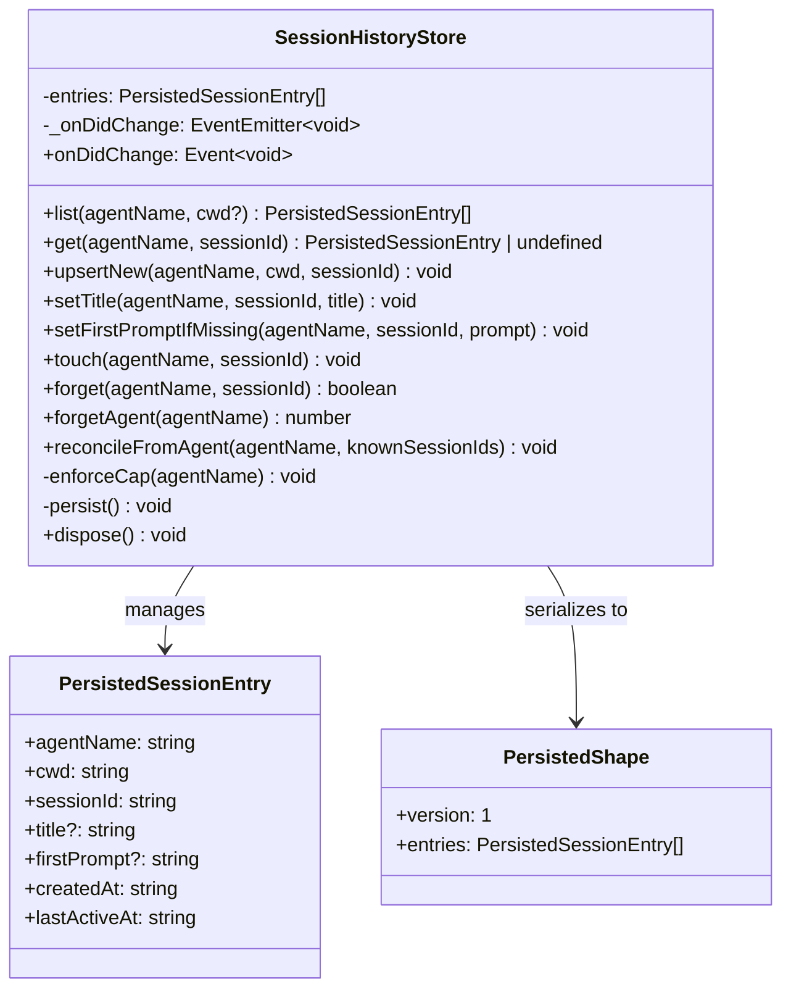
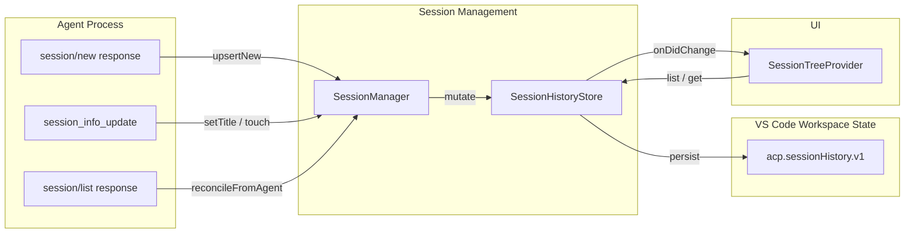
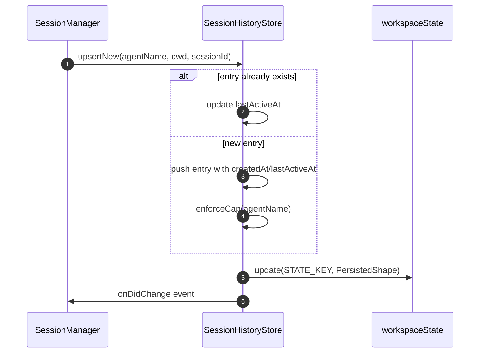
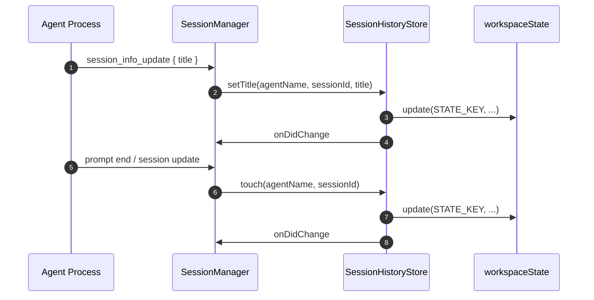
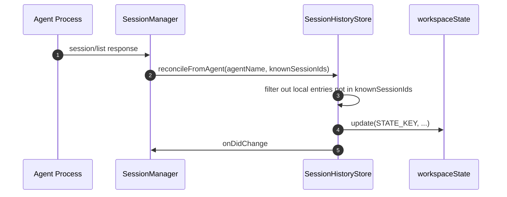

# Session Management History

The **session management history** module provides a persistent, workspace-scoped cache of known ACP sessions on the client side. It is responsible for remembering which sessions have been created or resumed, storing lightweight metadata about them (title, first prompt, timestamps), and exposing that metadata to the rest of the extension — primarily the session tree view — when an agent does not advertise the experimental `session/list` capability.

This module is intentionally a **fallback cache**, not a source of truth. When an agent supports `session/list`, the live agent list takes precedence and the local cache is only reconciled to stay consistent for future offline use.

---

## Responsibilities

- Persist session metadata across VS Code restarts using `vscode.ExtensionContext.workspaceState`.
- Cache sessions per agent and per workspace `cwd`.
- Maintain `createdAt` and `lastActiveAt` timestamps for sorting and recency (both are needed: `lastActiveAt` alone ties at millisecond resolution).
- Store optional human-readable labels: `title` (from `session_info_update`) and `firstPrompt` (first user message).
- Enforce a per-agent cap to prevent unbounded storage growth.
- Emit change events so UI components can refresh.
- Reconcile local entries against an authoritative `session/list` response when available.

---

## Architecture



The store is a thin wrapper around `vscode.Memento` (workspace state). It keeps an in-memory copy of entries for fast reads and writes the versioned `PersistedShape` back to workspace state on every mutation.

---

## Component Overview

### `SessionHistoryStore`

The main class. It is instantiated once per extension activation with the workspace state object and an optional per-agent cap (default `50`). On construction it loads any previously persisted entries.

Key design decisions:

- **Workspace-scoped**: Sessions are filtered by `cwd` because the tree view only shows sessions relevant to the current workspace.
- **Per-agent cap**: Prevents a single agent from flooding workspace state. The stalest
  entries are dropped, where staleness is `lastActiveAt` descending, tie-broken by
  `createdAt` descending and then by insertion order (latest first). The tie-break is
  not decorative: `lastActiveAt` is `Date.toISOString()`, so its resolution is one
  millisecond, and sorting on it alone left same-millisecond entries in insertion order
  — oldest first — which inverted the list and could evict the *newest* session instead
  of the stalest. See `list()` in `SessionHistoryStore.ts`.
- **Event-driven**: `onDidChange` fires after every mutation so subscribers (e.g. the session tree) can refresh.
- **Versioned persistence**: `PersistedShape.version` allows future migrations if the schema changes.

### `PersistedSessionEntry`

A lightweight record for a single cached session. It intentionally does **not** store full conversation history — only enough metadata to render a session item in the tree and to resume the session later.

### `PersistedShape`

The on-disk schema. Currently at version `1`. Stored under the key `acp.sessionHistory.v1`.

---

## Data Flow



1. **Session creation**: `SessionManager` calls `upsertNew` after a successful `session/new`.
2. **Session updates**: `SessionManager` calls `setTitle` on `session_info_update` and `touch` on prompt end or session update.
3. **First prompt**: `SessionManager` calls `setFirstPromptIfMissing` to capture a fallback label.
4. **Reconciliation**: When an agent supports `session/list`, `SessionManager` calls `reconcileFromAgent` to prune stale local entries.
5. **Persistence**: Every mutation writes the versioned shape to workspace state and fires `onDidChange`.
6. **Rendering**: `SessionTreeProvider` listens to `onDidChange` and calls `list`/`get` to build tree nodes.

For details on how sessions are created and updated, see [session_management_orchestration.md](orchestration.md). For the connection layer that carries these messages, see [session_management_connections.md](connections.md).

---

## Lifecycle and Mutation Flows

### Creating a New Session Entry



### Updating Title or Activity



### Reconciling with Agent-Provided List



---

## Relationship to Other Modules

| Module | Relationship |
|--------|--------------|
| [session_management_orchestration.md](orchestration.md) | `SessionManager` owns the store instance and calls it during session create, update, load, and list operations. |
| [session_management_connections.md](connections.md) | `ConnectionManager` delivers the ACP messages (`session/new`, `session/list`, `session_info_update`) that trigger store mutations. |
| [session_tree.md](../session-tree.md) | `SessionTreeProvider` subscribes to `onDidChange` and reads entries via `list`/`get` to render the sessions under each agent. |
| [agent_management.md](../agent-management/README.md) | Agent capabilities determine whether `session/list` is available; when it is, the store is reconciled but not used as the primary source. |

---

## Storage Schema

The store writes a single key to workspace state:

```json
{
  "version": 1,
  "entries": [
    {
      "agentName": "my-agent",
      "cwd": "/home/user/project",
      "sessionId": "sess_abc123",
      "title": "Refactor auth module",
      "firstPrompt": "How do I refactor the auth module?",
      "createdAt": "2024-01-01T00:00:00.000Z",
      "lastActiveAt": "2024-01-01T01:00:00.000Z"
    }
  ]
}
```

- `version` is fixed at `1` for now.
- Entries are not encrypted and are scoped to the current workspace state.
- The cap is applied per agent after every insert.

---

## Error Handling and Edge Cases

- **Missing entry**: Mutations such as `setTitle`, `touch`, and `setFirstPromptIfMissing` are no-ops if the entry does not exist.
- **Corrupted state**: On load, the store validates `version === 1` and that `entries` is an array. Invalid data is ignored.
- **Concurrent writes**: Because the store keeps entries in memory and writes asynchronously via `void workspaceState.update(...)`, rapid successive mutations may overwrite each other in theory; in practice the in-memory array is the source of truth until the next persistence tick.
- **Cross-workspace sessions**: Entries from other `cwd` values are filtered out by `list` and do not appear in the current workspace tree.

---

## Future Considerations

- Schema migrations can be implemented by checking `PersistedShape.version` on load.
- If full conversation history is ever needed, it should be stored by a separate module; this store is intentionally metadata-only.
- The per-agent cap could be made user-configurable through VS Code settings.
