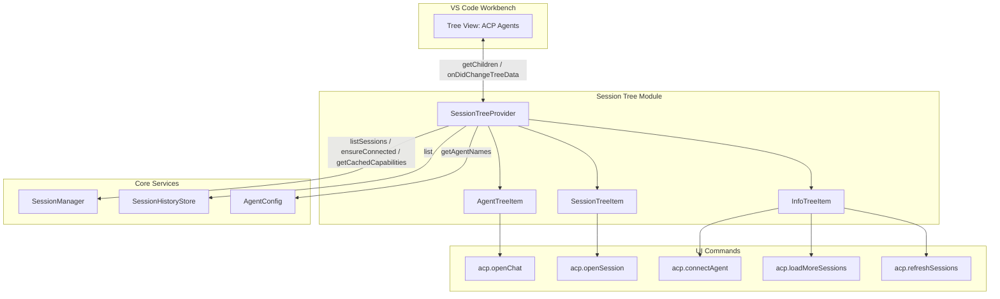
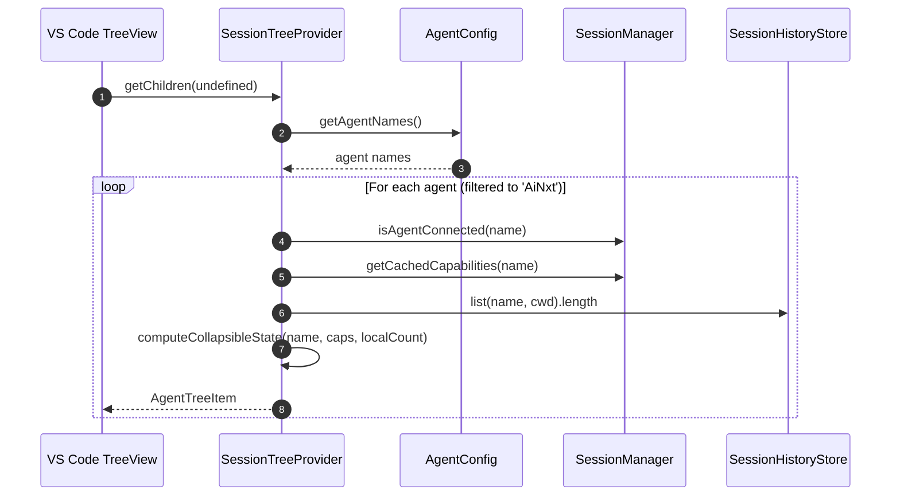
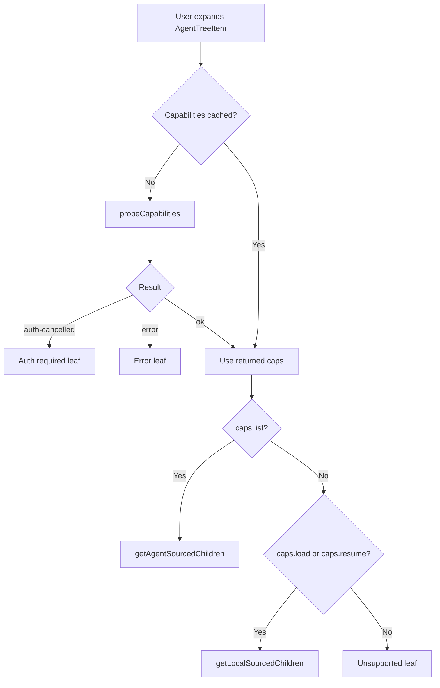
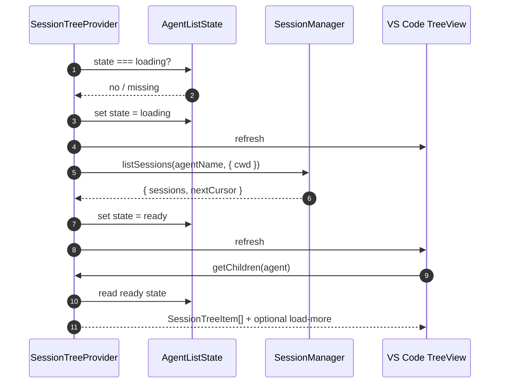
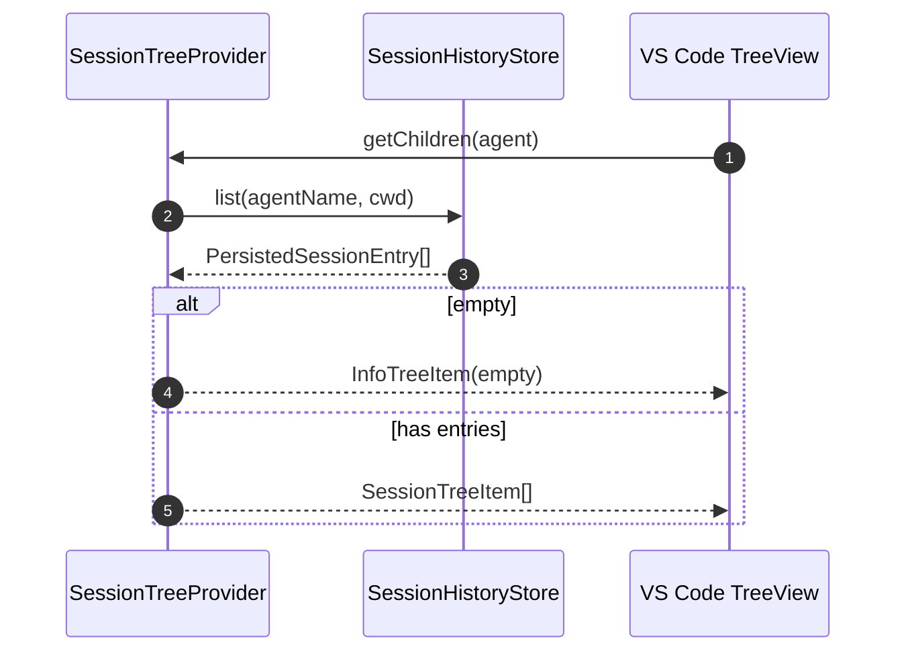

# Session Tree Module

The **Session Tree** module renders the **ACP Agents** sidebar view in the VS Code extension. It implements a two-tier tree: the first tier shows configured agents, and the second tier shows the sessions available for each agent. The module decides whether to list sessions from the agent itself (via the ACP `session/list` capability) or from the local [`SessionHistoryStore`](session-management/history.md#sessionhistorystore), and it surfaces status, errors, authentication requirements, and pagination affordances to the user.

This module is intentionally focused on **presentation and view state**. The actual lifecycle of sessions, connections, and capability discovery is delegated to the [`SessionManager`](session-management/orchestration.md) and related core services.

---

## Architecture

### Key Design Decisions

- **Tiered model**: Tier 1 is the configured agent; Tier 2 is its sessions or status leaves.
- **Source-of-truth selection**: The provider chooses between agent-sourced lists and local-history-store lists based on advertised capabilities.
- **Fork behavior**: The provider only surfaces the single governed `AiNxt` agent, regardless of other agents defined in user settings.
- **Lazy loading**: Capabilities are probed and session lists are fetched only when the user expands an agent node.
- **Pagination**: Agent-sourced lists support cursor-based pagination via a **Load more…** leaf.

---

## Core Components

### `SessionTreeProvider`

The main `TreeDataProvider` for the ACP Agents view. It implements `vscode.TreeDataProvider<AgentNode | ChildNode>` and exposes the standard `onDidChangeTreeData` event.

#### Responsibilities

- Render the root list of agents.
- Probe agent capabilities on demand.
- Resolve children for an expanded agent.
- Cache per-agent list state (`AgentListState`) including loading status, sessions, and pagination cursor.
- React to session-manager and history-store change events.
- Expose helper factories for status/error/info leaves.

#### Constructor Dependencies

| Dependency | Purpose |
|------------|---------|
| `sessionManager: SessionManager` | Provides connectivity, capability summaries, and `session/list` calls. See [`SessionManager`](session-management/orchestration.md). |
| `historyStore: SessionHistoryStore \| null` | Local fallback for agents that support `session/load` or `session/resume` but not `session/list`. See [`SessionHistoryStore`](session-management/history.md#sessionhistorystore). |
| `workspaceCwd: () => string \| undefined` | Returns the current workspace directory to scope session lists. |

#### Event Subscriptions

The provider refreshes the tree when any of the following occur:

- `agent-connected`
- `agent-disconnected`
- `active-session-changed`
- `session-info-changed`
- `historyStore.onDidChange`

### Tree Item Classes

#### `AgentTreeItem`

Represents a configured agent in Tier 1.

- **Connected**: green filled circle, description `connected`, command `acp.openChat`.
- **Disconnected**: outlined circle, no description, tooltip instructs the user to connect via the plug icon.

#### `SessionTreeItem`

Represents a session in Tier 2.

- Active sessions show a green filled circle.
- Inactive sessions show a comment-discussion icon.
- Clicking fires `acp.openSession` with `{ agentName, sessionId }`, which is handled by the chat webview module. See [`ChatWebviewProvider`](chat-webview/provider.md).

#### `InfoTreeItem`

A status or action leaf under an agent. Kinds include:

| Kind | Icon | Context | Typical Use |
|------|------|---------|-------------|
| `loading` | spinning loading icon | `session-info-loading` | Fetching sessions or probing capabilities. |
| `empty` | inbox | `session-info-empty` | No sessions found. |
| `unsupported` | info | `session-info-unsupported` | Agent does not support list/load/resume. |
| `error` | warning | `session-info-error` | Failed to load sessions with retry command. |
| `auth-required` | key | `session-info-auth` | Authentication required with retry command. |
| `load-more` | chevron-down | `session-info-load-more` | Pagination affordance. |

### `AgentListState`

Internal per-agent cache that tracks:

- `state`: `idle | loading | ready | error | unsupported | auth-required`
- `agentSessions`: sessions returned by the agent (only when `caps.list` is true)
- `nextCursor`: cursor for the next page of results
- `error`: error message when state is `error`

---

## Data Flow

### Resolving the Root Agent List

### Expanding an Agent Node

### Agent-Sourced Session List

### Local-History-Store-Sourced Session List

---

## Capability-Driven Source Selection

The provider uses the agent's advertised capabilities to decide how to populate Tier 2:

| Capability | Behavior |
|------------|----------|
| `session/list` | Agent is the source of truth. The provider calls `SessionManager.listSessions` and reconciles local history. |
| `session/load` or `session/resume` (but not `list`) | Local [`SessionHistoryStore`](session-management/history.md#sessionhistorystore) is the source of truth. |
| None of the above | Shows an `unsupported` info leaf explaining that sessions cannot be listed, but new chats can still be started. |

This logic is implemented in `getAgentChildren` and `computeCollapsibleState`.

---

## Pagination

When an agent supports `session/list` and returns a `nextCursor`, the provider appends an `InfoTreeItem` of kind `load-more`. Selecting it invokes the command `acp.loadMoreSessions`, which the extension wires to `SessionTreeProvider.loadMore`. That method:

1. Reads the current cursor from `AgentListState`.
2. Calls `SessionManager.listSessions(agentName, { cwd, cursor })`.
3. Appends new sessions to the existing list.
4. Updates or clears `nextCursor`.
5. Refreshes the tree.

If the fetch fails, the provider rolls back to the previous ready state so the user can retry.

---

## Commands and Interactions

The tree items reference the following VS Code commands. These commands are registered by the extension activation module; see [`extension.ts`](activation.md).

| Command | Triggered By | Purpose |
|---------|--------------|---------|
| `acp.openChat` | Connected `AgentTreeItem` | Opens the chat webview for the agent. See [`ChatWebviewProvider`](chat-webview/provider.md). |
| `acp.openSession` | `SessionTreeItem` | Loads or resumes the selected session. |
| `acp.connectAgent` | `auth-required` info leaf | Retries authentication / connection. |
| `acp.loadMoreSessions` | `load-more` info leaf | Fetches the next page of sessions. |
| `acp.refreshSessions` | `error` info leaf | Retries loading the session list. |

---

## Helper Functions

| Function | Purpose |
|----------|---------|
| `shortSessionId(id)` | Truncates a long session ID to `prefix…suffix` form. |
| `truncate(s, max)` | Truncates a string with an ellipsis. |
| `relativeTime(iso)` | Renders an ISO timestamp as a human-readable relative string (e.g., `3m ago`). |
| `buildSessionTooltip(...)` | Builds a multi-line tooltip showing agent, session ID, cwd, last-active time, and source. |

---

## Module Boundaries

This module does **not**:

- Manage agent processes or connections directly (see [`agent_management.md`](agent-management/README.md)).
- Persist session history (see [`session_management.md`](session-management/README.md)).
- Render the chat webview (see [`chat_webview.md`](chat-webview/README.md)).
- Define agent configuration schemas (see [`config.md`](config.md)).

It **does**:

- Own the visual tree model for the ACP Agents sidebar.
- Cache transient list state for each agent.
- Map core service events into tree refreshes.
- Surface user actions via VS Code commands registered elsewhere.

---

## Related Documentation

- [`session_management.md`](session-management/README.md) — `SessionManager`, `SessionHistoryStore`, and session lifecycle.
- [`agent_management.md`](agent-management/README.md) — `AgentManager`, `AcpClientImpl`, and process management.
- [`chat_webview.md`](chat-webview/README.md) — `ChatWebviewProvider` and the chat UI that sessions open into.
- [`extension_activation.md`](activation.md) — Command registration and extension lifecycle.
- [`config.md`](config.md) — `AgentConfig` and `getAgentNames`.
- [`utils.md`](utils/README.md) — `Logger` utilities used for diagnostics.
