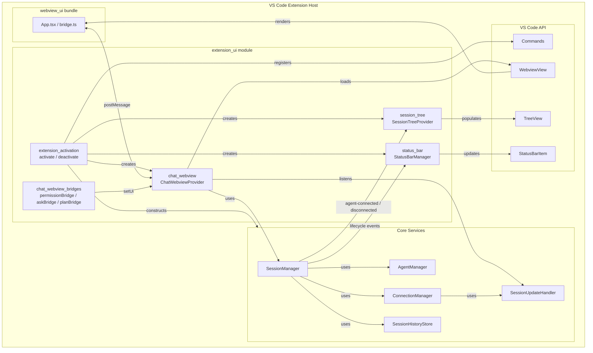
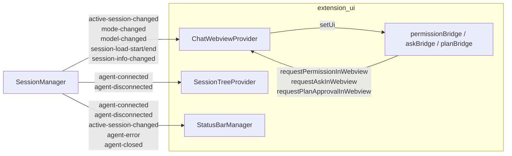
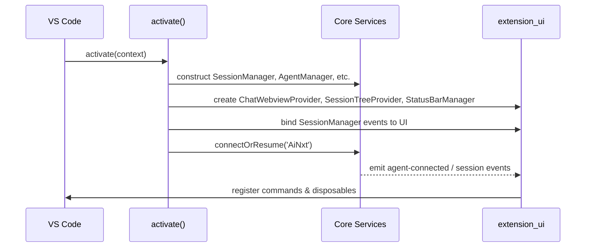
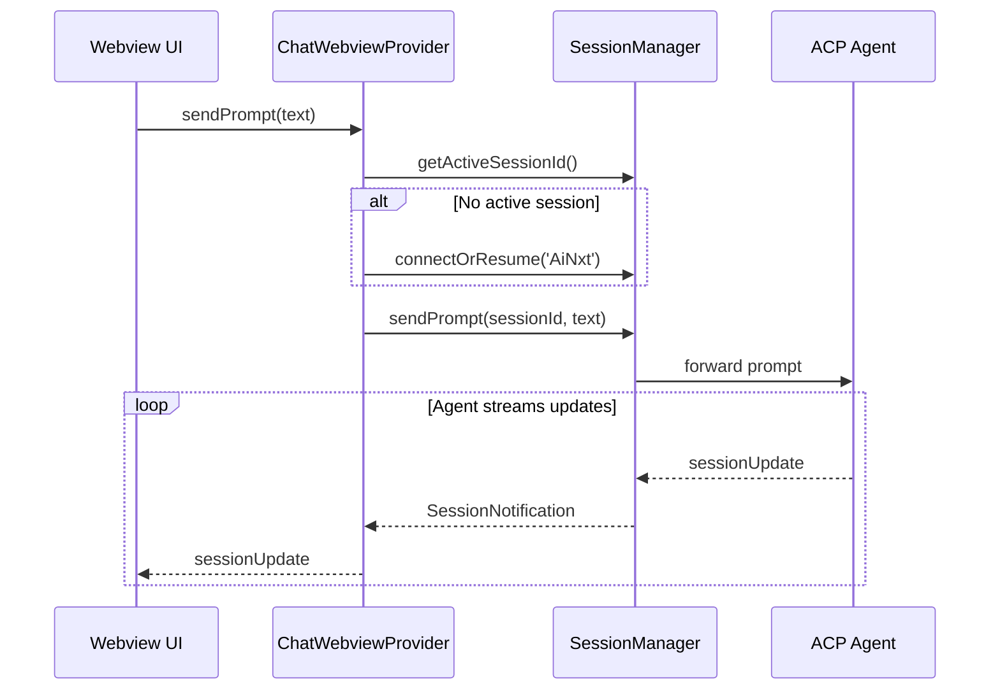

# `extension_ui` Module Overview

## Purpose

The `extension_ui` module is the **user-facing presentation layer** of the AiNxt VS Code extension. It owns every IDE surface the user interacts with: the extension activation entry point, the chat sidebar webview, the ACP Agents session tree, the status bar indicator, and the small bridge objects that route interactive requests (permissions, questions, plan approvals) into the chat UI.

This module does **not** implement agent process management, connection logic, or session persistence. Instead, it consumes the core services from [`agent_management`](agent-management/README.md) and [`session_management`](session-management/README.md) and renders them through the VS Code API and the React-based webview bundle.

---

## Module Structure

```
extension_ui/
├── extension_activation/     # vscode-acp/src/extension.ts
│   └── activate / deactivate / AinxtInlineProvider
├── chat_webview/             # vscode-acp/src/ui/ChatWebviewProvider.ts + bridges
│   ├── chat_webview_provider/
│   └── chat_webview_bridges/
├── session_tree/             # vscode-acp/src/ui/SessionTreeProvider.ts
└── status_bar/               # vscode-acp/src/ui/StatusBarManager.ts
```

The module also collaborates closely with the [`webview_ui`](../webview/README.md) React application that is loaded inside the chat webview.

---

## Architecture



### UI Subsystem Detail



---

## Core Components

| Component | File | Responsibility | Documentation |
|-----------|------|----------------|---------------|
| `activate` / `deactivate` | `vscode-acp/src/extension.ts` | Bootstraps the extension, wires services to UI, registers commands, and cleans up on shutdown. | [`extension_activation.md`](activation.md) |
| `AinxtInlineProvider` | `vscode-acp/src/extension.ts` | Optional ghost-text inline completion provider powered by the local gateway. | [`extension_activation.md`](activation.md) |
| `ChatWebviewProvider` | `vscode-acp/src/ui/ChatWebviewProvider.ts` | Owns the chat sidebar webview lifecycle, message routing, session update forwarding, and interactive cards. | [`chat_webview.md`](chat-webview/README.md) / [`chat_webview_provider.md`](chat-webview/provider.md) |
| `permissionBridge` / `askBridge` / `planBridge` | `vscode-acp/src/ui/askBridge.ts`<br>`vscode-acp/src/ui/permissionBridge.ts`<br>`vscode-acp/src/ui/planBridge.ts` | Decouple deep connection-layer reverse requests from the webview UI. | [`chat_webview.md`](chat-webview/README.md) / [`chat_webview_bridges.md`](chat-webview/bridges.md) |
| `SessionTreeProvider` | `vscode-acp/src/ui/SessionTreeProvider.ts` | Renders the **ACP Agents** sidebar tree with agents and their sessions. | [`session_tree.md`](session-tree.md) |
| `StatusBarManager` | `vscode-acp/src/ui/StatusBarManager.ts` | Displays a persistent status bar indicator of the AiNxt connection state. | [`status_bar.md`](status-bar.md) |

---

## Typical Data Flow

### Starting the Extension



### Sending a Chat Prompt



---

## References

- [`extension_activation.md`](activation.md) — Extension lifecycle, command registration, inline completions, and service wiring.
- [`chat_webview.md`](chat-webview/README.md) — Chat webview architecture and integration.
  - [`chat_webview_provider.md`](chat-webview/provider.md) — `ChatWebviewProvider` details.
  - [`chat_webview_bridges.md`](chat-webview/bridges.md) — `permissionBridge`, `askBridge`, `planBridge`.
- [`session_tree.md`](session-tree.md) — ACP Agents tree view and session listing.
- [`status_bar.md`](status-bar.md) — Status bar connection indicator.
- Related core modules: [`agent_management.md`](agent-management/README.md), [`session_management.md`](session-management/README.md), [`handlers.md`](handlers/README.md), [`config.md`](config.md), [`utils.md`](utils/README.md).
- Related frontend bundle: [`webview_ui.md`](../webview/README.md).