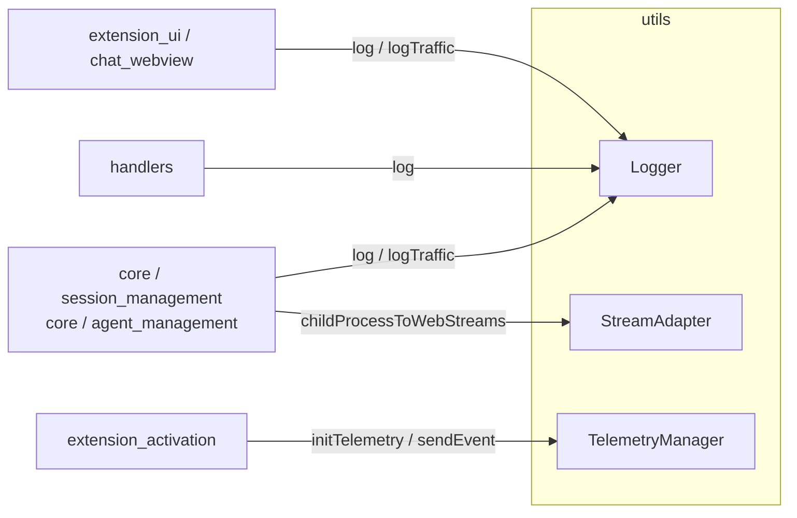

# Utils Module

The `utils` module provides cross-cutting, low-level helpers used throughout the VS Code ACP extension. It is intentionally small and dependency-light: every utility here is generic enough to be consumed by multiple higher-level modules without introducing business logic of its own.

## Purpose

- Centralise IDE-facing diagnostics (logging and traffic inspection).
- Bridge Node.js runtime primitives to the Web Streams API used by the ACP SDK.
- Collect anonymised usage and error telemetry through the standard VS Code telemetry pipeline.

## Architecture Overview

The module exposes three independent subsystems:

| Sub-module | Responsibility | Main Consumers |
|------------|----------------|----------------|
| [Logging](logging.md) | Timestamped output to VS Code output channels, including optional ACP traffic tracing | `agent_management`, `session_management`, `handlers`, `chat_webview` |
| [Stream Adapter](streaming.md) | Converts a Node.js `ChildProcess` into a Web-Streams-compatible `AcpStream` | `session_management` / `ConnectionManager` |
| [Telemetry](telemetry.md) | Initialises a `TelemetryReporter`, attaches IDE context, and sends events/errors | `extension_activation` |

Each subsystem is implemented as a thin wrapper around a VS Code or Node.js API, keeping the extension's higher-level code free from direct platform dependencies.

## Sub-modules

- [Logging](logging.md) — `Logger.ts`
- [Stream Adapter](streaming.md) — `StreamAdapter.ts`
- [Telemetry](telemetry.md) — `TelemetryManager.ts`

## Module Boundaries

- `utils` does **not** depend on any ACP business logic. It only imports `vscode`, `@vscode/extension-telemetry`, and Node.js built-ins.
- Higher-level modules call into `utils`; `utils` never calls back into them.
- State is kept minimal (singleton output channels, singleton telemetry reporter, pure adapter functions) and is disposed through explicit `dispose*` helpers.

## Disposal & Lifecycle

All utilities are created lazily and must be cleaned up when the extension deactivates:

- `Logger.disposeChannels()` clears the `AiNxt` and `ACP Traffic` output channels.
- `TelemetryManager.initTelemetry()` returns a `TelemetryReporter` that should be pushed into the extension's `context.subscriptions`.
- `StreamAdapter` is stateless and has no disposal requirements.
