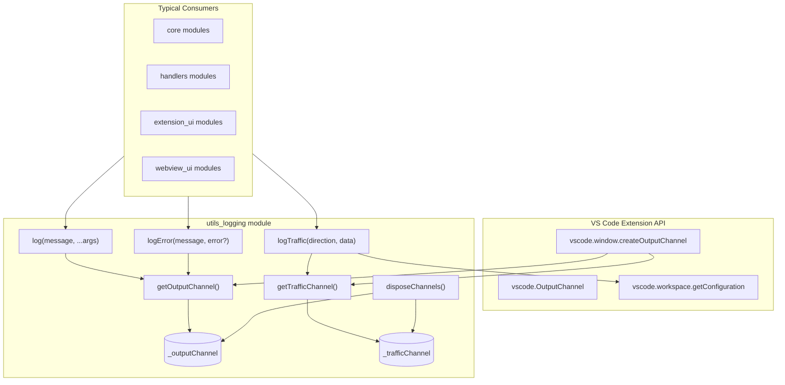
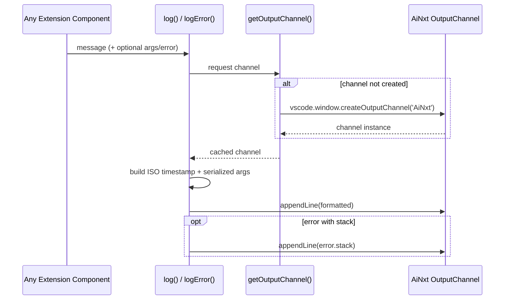
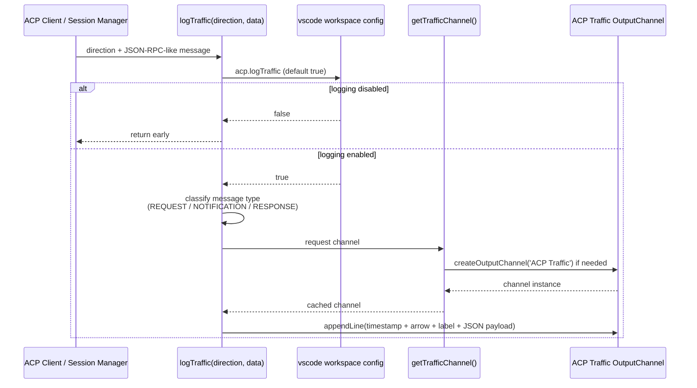
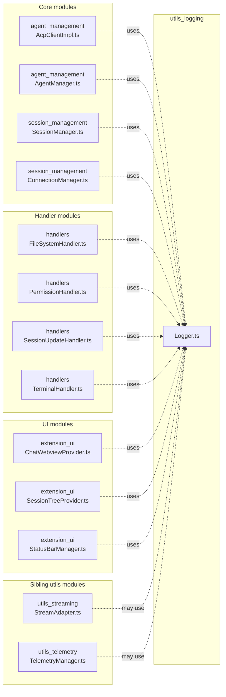
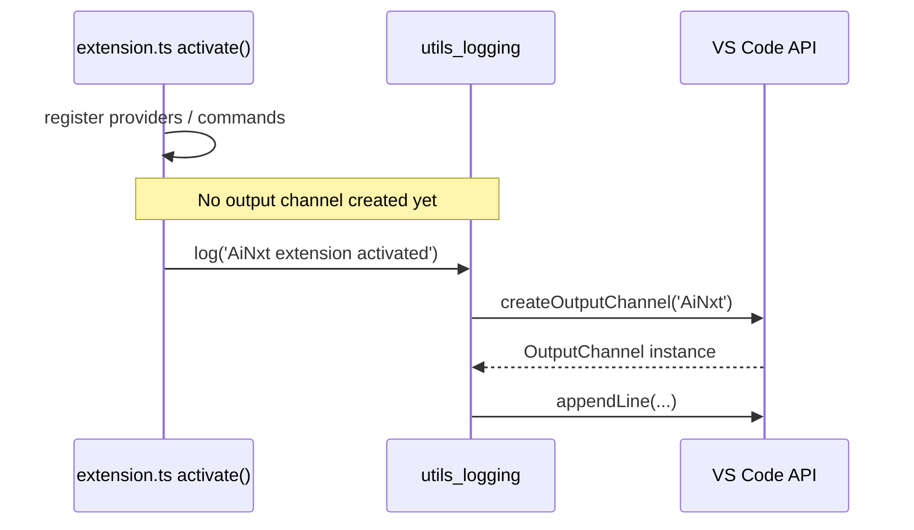
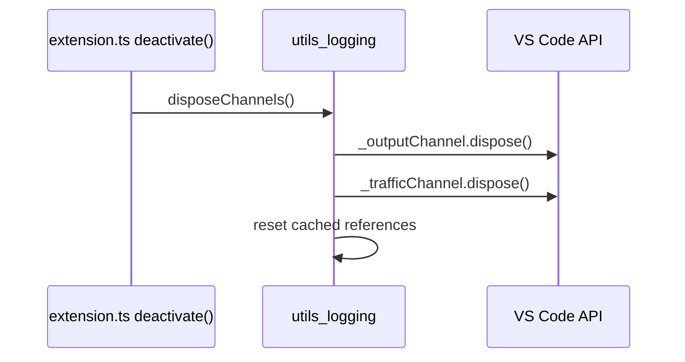

# utils_logging Module

## Brief Introduction

The `utils_logging` module provides centralized logging infrastructure for the VS Code ACP extension. It manages VS Code output channels, writes timestamped diagnostic messages, and optionally logs ACP protocol traffic between the extension and running agents. The module is intentionally lightweight and stateful, lazily creating output channels on first use and exposing simple functions that can be called from anywhere in the extension.

---

## Core Responsibilities

| Responsibility | Description |
| -------------- | ----------- |
| Output channel management | Lazily creates and disposes VS Code `OutputChannel` instances for general logs and ACP traffic. |
| General logging | Writes timestamped messages and serialized arguments to the **AiNxt** output channel. |
| Error logging | Writes error messages with stack traces to the **AiNxt** output channel. |
| Traffic logging | Writes classified ACP request/notification/response messages to the **ACP Traffic** output channel, gated by the `acp.logTraffic` setting. |
| Resource cleanup | Disposes both output channels during extension deactivation. |

---

## Architecture

The module is implemented as a small set of module-level functions in `vscode-acp/src/utils/Logger.ts`. Two private module variables cache the VS Code output channels so that repeated calls reuse the same channel instances.

### Component Overview

| Component | Type | Purpose |
| --------- | ---- | ------- |
| `getOutputChannel` | Function | Returns the shared **AiNxt** output channel, creating it on first call. |
| `getTrafficChannel` | Function | Returns the shared **ACP Traffic** output channel, creating it on first call. |
| `log` | Function | Appends a timestamped message with optional serialized arguments. |
| `logError` | Function | Appends a timestamped error message and optional stack trace. |
| `logTraffic` | Function | Appends classified ACP traffic when `acp.logTraffic` is enabled. |
| `disposeChannels` | Function | Disposes both cached channels and resets the module state. |

---

## Data Flow

### General Log Flow

### ACP Traffic Log Flow

---

## Component Interactions

`utils_logging` is a leaf utility module with no internal dependencies on other application modules. It depends only on the VS Code extension API and is consumed by many other modules.

> **Note:** The diagram above illustrates typical consumers. For details on how those modules operate, refer to their respective documentation pages: [agent_management](../agent-management/README.md), [session_management](../session-management/README.md), [handlers](../handlers/README.md), [extension_ui](../ui.md), [utils_streaming](streaming.md), and [utils_telemetry](telemetry.md).

---

## Process Flows

### Extension Activation

During `extension.ts` activation, output channels are not created immediately. They are created lazily the first time a log function is called.

### Extension Deactivation

`disposeChannels()` should be invoked from the extension's `deactivate()` lifecycle hook to release output channel resources.

---

## Configuration

Traffic logging is controlled by the VS Code setting `acp.logTraffic`.

| Setting | Type | Default | Description |
| ------- | ---- | ------- | ----------- |
| `acp.logTraffic` | `boolean` | `true` | Enables or disables logging of ACP request/notification/response traffic. |

When disabled, `logTraffic()` returns immediately without writing to the **ACP Traffic** channel.

---

## Message Classification

`logTraffic` inspects the shape of the payload and labels it accordingly:

| Shape | Label | Example |
| ----- | ----- | ------- |
| Has `method` and `id` | `[REQUEST] <method>` | JSON-RPC request |
| Has `method` but no `id` | `[NOTIFICATION] <method>` | JSON-RPC notification |
| Has `result` or `error` | `[RESPONSE] id=<id>` | JSON-RPC response |
| Other | *(no label)* | Raw traffic data |

The direction is rendered as:

- `send` → `>>> CLIENT → AGENT`
- `recv` → `<<< AGENT → CLIENT`

---

## API Reference

### `getOutputChannel(): vscode.OutputChannel`

Returns the shared **AiNxt** output channel, creating it if necessary.

### `getTrafficChannel(): vscode.OutputChannel`

Returns the shared **ACP Traffic** output channel, creating it if necessary.

### `log(message: string, ...args: unknown[]): void`

Appends a timestamped line to the **AiNxt** channel. Additional arguments are serialized with `JSON.stringify` and appended to the message.

### `logError(message: string, error?: unknown): void`

Appends a timestamped error line to the **AiNxt** channel. If `error` is an `Error` instance, its message and stack trace are also appended.

### `logTraffic(direction: 'send' | 'recv', data: unknown): void`

Appends classified ACP traffic to the **ACP Traffic** channel when `acp.logTraffic` is enabled. The payload is pretty-printed with `JSON.stringify(data, null, 2)`.

### `disposeChannels(): void`

Disposes both cached output channels and resets the internal references so that subsequent calls recreate them.

---

## Design Notes

- **Lazy initialization:** Output channels are created only when first requested, keeping activation overhead minimal.
- **Module-level state:** The cached channel references are private to the module. This avoids passing a logger instance through every constructor while still ensuring a single channel per log type.
- **No log levels:** The module does not implement traditional log levels (debug, info, warn, error). Callers use `log` for general diagnostics and `logError` for errors.
- **Traffic opt-out:** Traffic logging can be noisy, so it is gated by a user-configurable setting.
- **JSON serialization:** Arguments and traffic payloads are serialized to JSON for consistent, inspectable output in the VS Code output panel.

---

## Related Modules

- [utils_streaming](streaming.md) — Adapts child process streams to web streams for ACP communication.
- [utils_telemetry](telemetry.md) — Sends telemetry events; may use logging for local diagnostics.
- [agent_management](../agent-management/README.md) — Spawns and communicates with agents; produces traffic logs.
- [session_management](../session-management/README.md) — Manages sessions and connections; produces traffic logs.
- [handlers](../handlers/README.md) — Implements ACP handlers; consumes logging for file, terminal, and permission operations.
- [extension_ui](../ui.md) — Provides chat webview, session tree, and status bar UI; uses logging for diagnostics.
