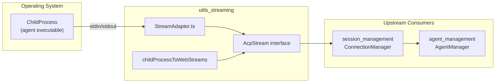
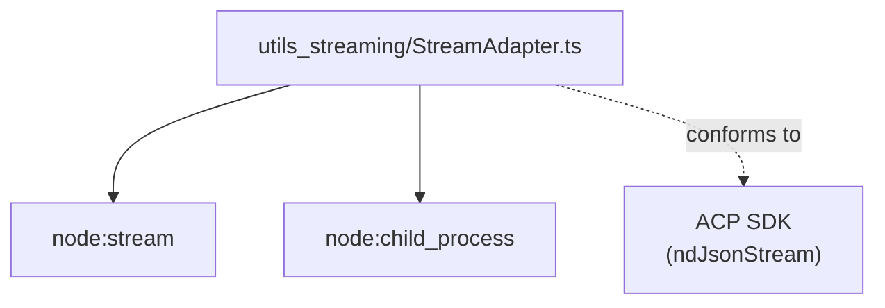
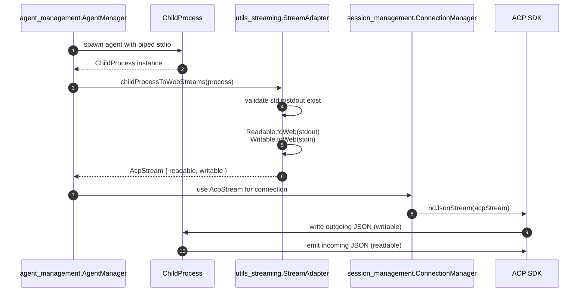
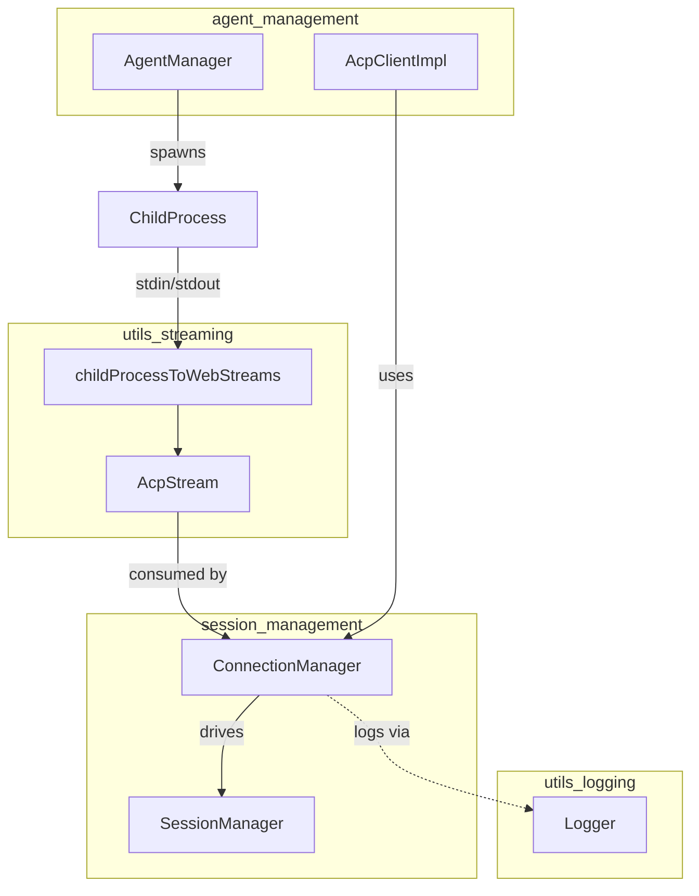
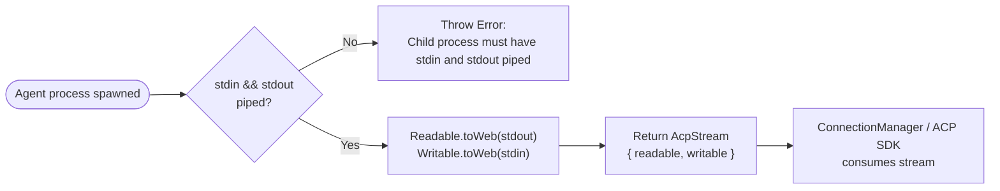

# utils_streaming Module

## Brief Introduction

The `utils_streaming` module provides a lightweight adapter that bridges Node.js legacy streams with the modern [Web Streams API](https://developer.mozilla.org/en-US/docs/Web/API/Streams_API). It exposes a single, focused capability: converting the `stdin`/`stdout` of a spawned Node.js `ChildProcess` into a bidirectional `AcpStream` that the ACP SDK can consume via `ndJsonStream()`.

This module sits at the boundary between the operating system (agent child processes) and the rest of the VS Code ACP extension. By centralizing stream adaptation here, higher-level modules such as connection and session management can remain agnostic to the underlying Node.js stream implementation.

---

## Core Components

| Component | File | Responsibility |
|-----------|------|----------------|
| `AcpStream` | `vscode-acp/src/utils/StreamAdapter.ts` | Type definition for a bidirectional byte stream used by the ACP SDK. |
| `childProcessToWebStreams` | `vscode-acp/src/utils/StreamAdapter.ts` | Adapts a `ChildProcess`'s `stdin` and `stdout` into Web Streams. |

---

## Architecture

The module is intentionally minimal. It has no internal state, no classes, and no business logic beyond type casting and stream conversion. Its only dependency is the Node.js standard library (`node:stream` and `node:child_process`).



### Component Breakdown

#### `AcpStream`

```typescript
export interface AcpStream {
  readable: ReadableStream<Uint8Array>;
  writable: WritableStream<Uint8Array>;
}
```

`AcpStream` is a thin, domain-specific wrapper around the Web Streams API. It represents a bidirectional byte channel:

- **`readable`**: A `ReadableStream<Uint8Array>` from which incoming agent messages can be pulled.
- **`writable`**: A `WritableStream<Uint8Array>` to which outgoing messages can be pushed.

This interface is re-exported from the ACP SDK type for convenience and is the canonical shape expected by `ndJsonStream()`.

#### `childProcessToWebStreams`

```typescript
export function childProcessToWebStreams(process: ChildProcess): AcpStream
```

This function performs the actual adaptation:

1. Validates that the supplied `ChildProcess` has both `stdin` and `stdout` piped.
2. Converts `process.stdin` (a Node.js `Writable`) to a Web `WritableStream<Uint8Array>` using `Writable.toWeb()`.
3. Converts `process.stdout` (a Node.js `Readable`) to a Web `ReadableStream<Uint8Array>` using `Readable.toWeb()`.
4. Returns both streams wrapped in an `AcpStream` object.

If the child process was not spawned with piped stdio, the function throws an explicit error to fail fast.

---

## Dependencies

### Internal Dependencies

The `utils_streaming` module is a leaf utility and does not depend on any other extension modules. It is, however, consumed by higher-level modules.

### External Dependencies

| Package / Module | Usage |
|------------------|-------|
| `node:stream` | `Readable.toWeb()` and `Writable.toWeb()` for stream conversion. |
| `node:child_process` | `ChildProcess` type for the function signature. |
| ACP SDK | `AcpStream` shape is aligned with the SDK's `ndJsonStream()` expectations. |



---

## Data Flow

When an agent process is spawned, its raw byte streams must be converted before the ACP SDK can parse newline-delimited JSON messages.



1. **Agent spawn**: [`agent_management`](../agent-management/README.md) creates a child process for the agent.
2. **Stream adaptation**: The raw `ChildProcess` is passed to `childProcessToWebStreams`.
3. **Connection setup**: The resulting `AcpStream` is handed to [`session_management`](../session-management/README.md) for connection lifecycle management.
4. **SDK consumption**: The ACP SDK reads and writes newline-delimited JSON over the Web Streams.

---

## Component Interaction

`utils_streaming` is a pure utility with no side effects. It does not manage state, register event listeners, or perform I/O beyond the stream conversion itself. The diagram below shows how it fits into the broader extension architecture.



For details on how connections are established and torn down, see [session_management](../session-management/README.md). For agent lifecycle management, see [agent_management](../agent-management/README.md). For logging of traffic that flows through these streams, see [utils_logging](logging.md).

---

## Error Handling

The module has a single explicit failure mode:

- **Missing stdio pipes**: If `process.stdin` or `process.stdout` is `null`, `childProcessToWebStreams` throws:
  ```
  Error: Child process must have stdin and stdout piped
  ```

This is a fail-fast guard. Callers (typically `AgentManager`) are responsible for spawning the child process with the correct `stdio` configuration before invoking this adapter.

---

## Process Flow: Adapting a New Agent Connection



---

## Design Rationale

- **Single Responsibility**: The module does one thing and one thing only — bridge Node.js streams to Web Streams. This keeps it easy to test and replace.
- **Fail Fast**: Explicit validation prevents subtle runtime errors when a process is spawned with the wrong stdio configuration.
- **Zero State**: No singletons, caches, or mutable state. The function is deterministic and side-effect free aside from wrapping existing streams.
- **SDK Alignment**: The `AcpStream` interface mirrors the shape expected by the ACP SDK, ensuring type compatibility across the extension.

---

## Related Modules

- [agent_management](../agent-management/README.md) — Spawns and manages agent child processes whose streams are adapted here.
- [session_management](../session-management/README.md) — Consumes `AcpStream` instances to establish and manage ACP sessions.
- [utils_logging](logging.md) — Logs traffic that flows through the adapted streams.
- [utils_telemetry](telemetry.md) — Records extension-level events, including connection outcomes.
