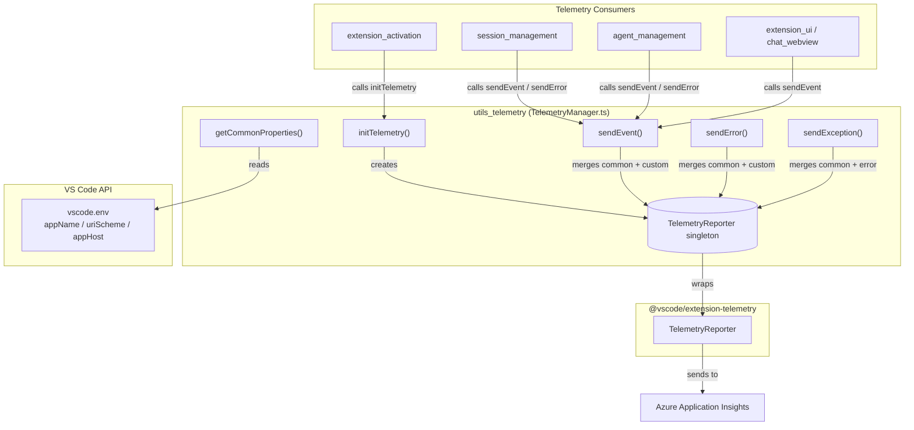
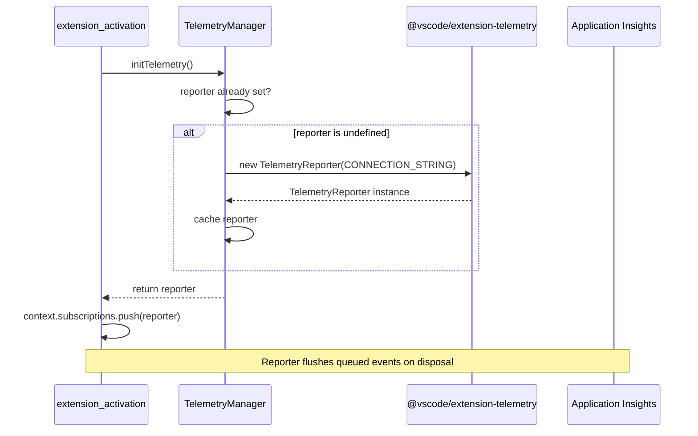
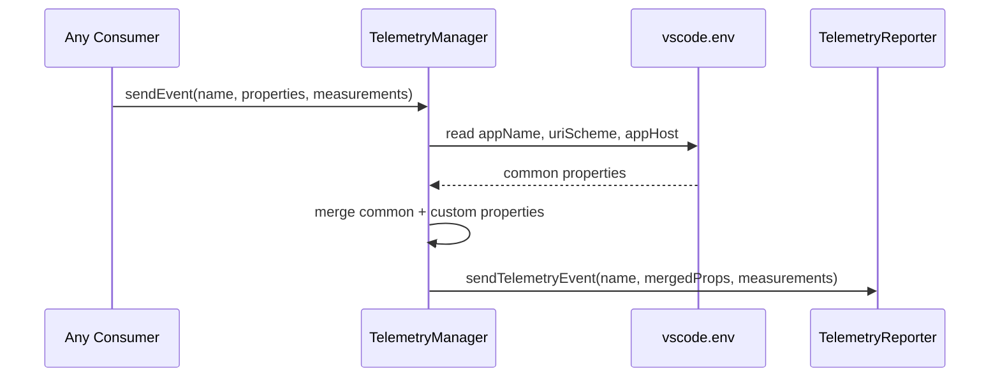
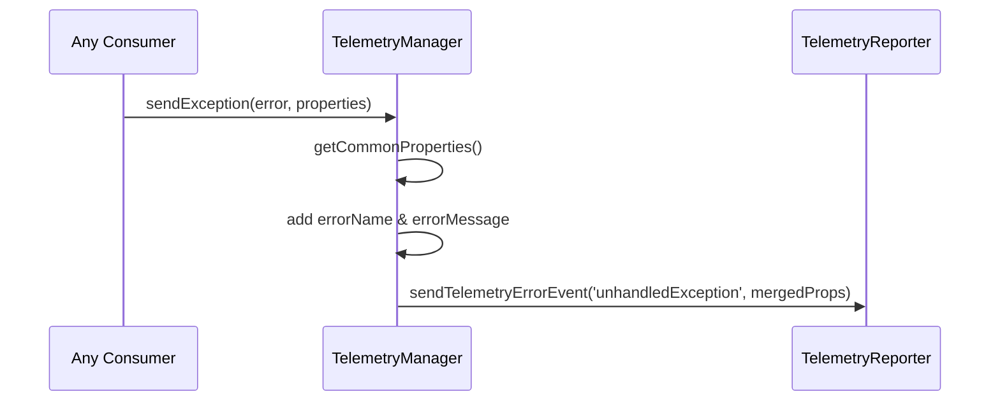
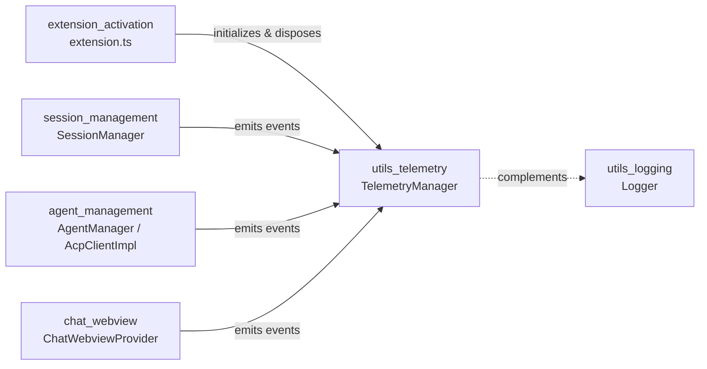
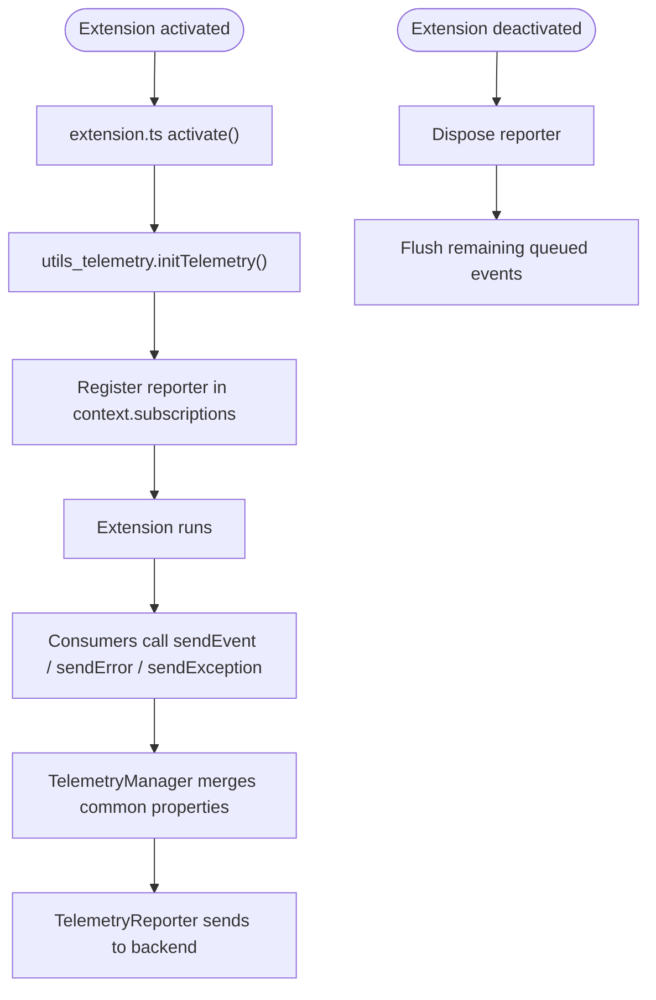

# utils_telemetry Module

## Brief Introduction

The `utils_telemetry` module provides a thin, centralized wrapper around the Visual Studio Code extension telemetry SDK (`@vscode/extension-telemetry`). It is responsible for initializing a single shared `TelemetryReporter`, attaching common IDE context properties to every event, and exposing helper functions used by the rest of the VS Code ACP extension to send usage events, error events, and caught exceptions.

This module is intentionally small and stateless: it owns the telemetry reporter singleton, ensures it is initialized exactly once during extension activation, and guarantees that every emitted event carries consistent environment metadata (IDE name, URI scheme, and app host).

---

## Core Responsibilities

| Responsibility | Description |
|----------------|-------------|
| **Reporter lifecycle** | Create and cache a single `TelemetryReporter` instance; expose it for disposal via `context.subscriptions`. |
| **Common context** | Attach IDE environment properties to every telemetry payload. |
| **Event emission** | Provide typed helpers for normal events, error events, and exception reporting. |
| **Privacy-safe abstraction** | Keep the instrumentation key and telemetry SDK details encapsulated so callers only supply event names and properties. |

---

## Architecture



### Component Overview

| Component | Type | Purpose |
|-----------|------|---------|
| `initTelemetry` | Exported function | Initializes the singleton `TelemetryReporter` and returns it so the caller can register it for disposal. |
| `getCommonProperties` | Internal function | Builds a record of IDE environment metadata attached to every event. |
| `sendEvent` | Exported function | Sends a named telemetry event with optional string properties and numeric measurements. |
| `sendError` | Exported function | Sends a non-exception error event through the normal telemetry pipeline. |
| `sendException` | Exported function | Reports a caught `Error` object as an error event, including the error name and message. |
| `reporter` | Module-level variable | Cached `TelemetryReporter` instance; initialized lazily by `initTelemetry`. |

---

## Data Flow

### Initializing Telemetry



### Sending a Telemetry Event



### Reporting an Exception



---

## Component Details

### `initTelemetry()`

```typescript
export function initTelemetry(): TelemetryReporter
```

- Creates the module-level `TelemetryReporter` if it does not already exist.
- Returns the existing reporter on subsequent calls to avoid duplicate initialization.
- The returned reporter should be pushed into the extension's `context.subscriptions` so that it is automatically disposed when the extension deactivates.

### `getCommonProperties()`

```typescript
function getCommonProperties(): Record<string, string>
```

- Returns an object containing:
  - `ideName`: `vscode.env.appName`
  - `ideUriScheme`: `vscode.env.uriScheme`
  - `ideAppHost`: `vscode.env.appHost`
- These properties are merged into every event payload automatically.

### `sendEvent()`

```typescript
export function sendEvent(
  eventName: string,
  properties?: Record<string, string>,
  measurements?: Record<string, number>,
): void
```

- Sends a standard telemetry event.
- Merges caller-supplied `properties` with the common IDE properties.
- Optional `measurements` can be used for numeric metrics (e.g., latency, counts).

### `sendError()`

```typescript
export function sendError(
  eventName: string,
  properties?: Record<string, string>,
  measurements?: Record<string, number>,
): void
```

- Sends an error event that is **not** derived from a thrown exception.
- Useful for reporting business-logic failures or handled error states.

### `sendException()`

```typescript
export function sendException(error: Error, properties?: Record<string, string>): void
```

- Sends a telemetry error event for a caught `Error`.
- Always uses the event name `unhandledException`.
- Adds `errorName` and `errorMessage` to the property payload.

---

## Module Relationships



### Upstream Dependencies

- **`@vscode/extension-telemetry`** — Provides the `TelemetryReporter` class that handles batching, flushing, and transmission to Azure Application Insights.
- **`vscode`** — Used to read environment metadata (`vscode.env`) for common properties.

### Downstream Consumers

- **[extension_activation](../activation.md)** — Calls `initTelemetry()` during `activate()` and registers the returned reporter in `context.subscriptions`.
- **[session_management](../session-management/README.md)** — May emit telemetry for session lifecycle actions, auth flows, and connection outcomes.
- **[agent_management](../agent-management/README.md)** — May emit telemetry for agent spawn/kill events and tool invocations.
- **[chat_webview](../chat-webview/README.md)** — May emit telemetry for UI interactions such as prompt submission, mode changes, and attachment usage.

> **Note:** The telemetry module does **not** depend on `utils_logging`, but the two utilities are typically used together: `Logger` writes human-readable diagnostics to the Output channel, while `TelemetryManager` sends anonymized, aggregated events to the telemetry backend. See [utils_logging](logging.md) for details.

---

## Privacy & Configuration Considerations

- The instrumentation key is hard-coded in `TelemetryManager.ts` and is not user-configurable.
- The module only collects VS Code environment metadata that is already exposed by the `vscode.env` API.
- Callers are responsible for ensuring that no personally identifiable information (PII), file contents, or secrets are included in telemetry `properties`.
- The `TelemetryReporter` from `@vscode/extension-telemetry` respects VS Code's global telemetry setting; events are not sent when telemetry is disabled by the user.

---

## Process Flow: Extension Activation



---

## References

- [extension_activation](../activation.md) — Where the telemetry reporter is initialized and disposed.
- [utils_logging](logging.md) — Complementary local diagnostic logging utility.
- [session_management](../session-management/README.md) — Consumer of telemetry for session lifecycle events.
- [agent_management](../agent-management/README.md) — Consumer of telemetry for agent operations.
- [chat_webview](../chat-webview/README.md) — Consumer of telemetry for UI interaction events.
