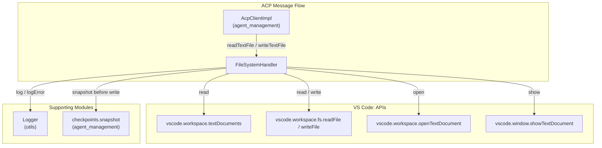
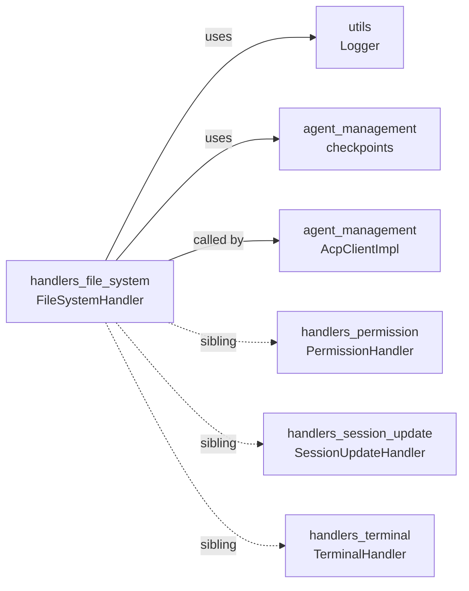
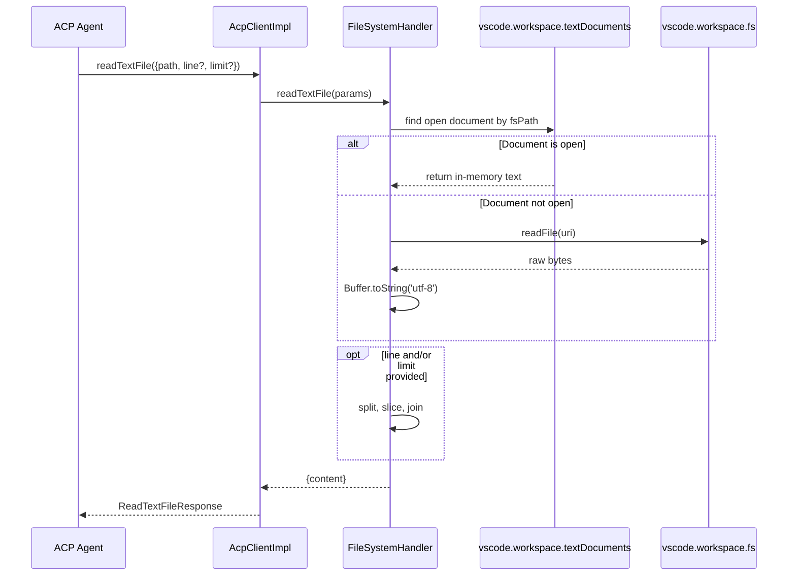
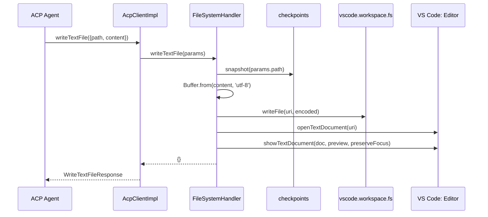
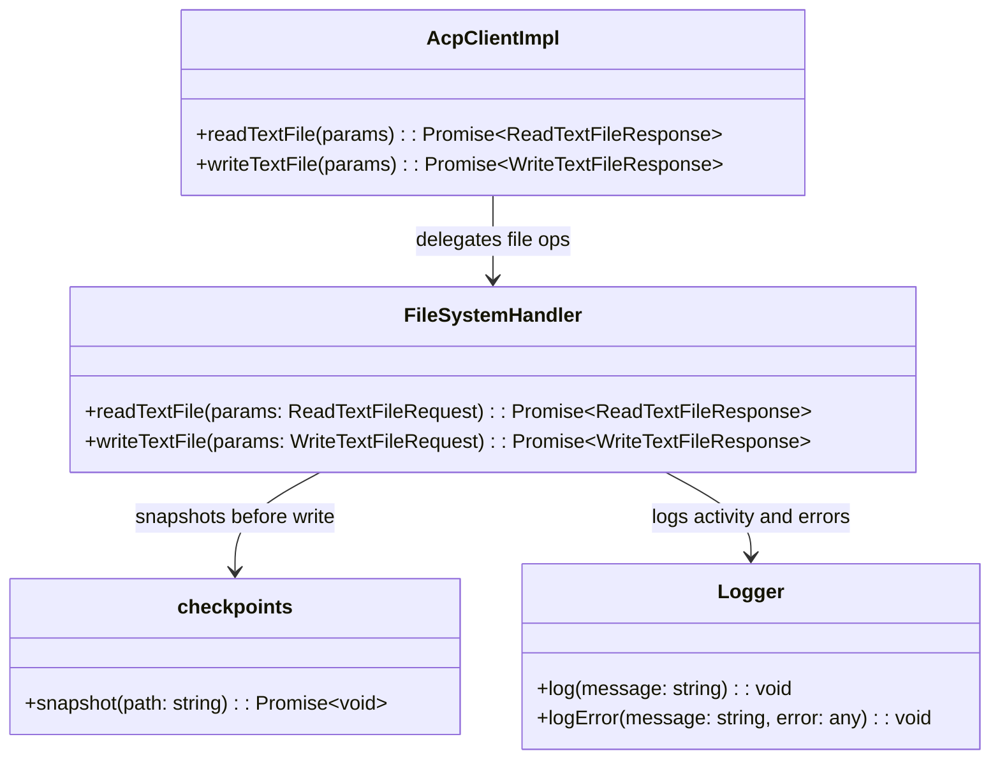

# handlers_file_system

The `handlers_file_system` module provides the VS Code: extension's bridge between ACP (Agent Client Protocol) file-system operations and the VS Code: workspace. It is implemented by a single handler class, `FileSystemHandler`, which exposes two ACP operations: reading a text file and writing a text file. The handler is intentionally thin: it translates ACP request payloads into VS Code:'s native `workspace.fs` and `window` APIs, giving agents access to the same files the user sees in the editor—including unsaved buffer content.

---

## Overview

`FileSystemHandler` lives in `vscode-acp/src/handlers/FileSystemHandler.ts` and is part of the broader [handlers](handlers.md) layer. Its responsibilities are:

1. **Read text files** on behalf of an ACP agent, returning file content as UTF-8 text.
2. **Honor line/limit slicing** so agents can request a specific window of lines rather than the whole file.
3. **Surface unsaved editor changes** by checking open text documents before falling back to disk.
4. **Write text files** and create parent directories automatically via VS Code:'s filesystem API.
5. **Preserve undoability** by snapshotting the previous file content through the [checkpoints](agent_management.md) subsystem before overwriting.
6. **Make edits visible** by opening the modified file in the active editor.

The handler does not manage connections, sessions, or permissions. Those concerns are delegated to sibling handlers and to [agent_management](agent_management.md) / [session_management](session_management.md).

---

## Architecture

### Component Breakdown

| Component | File | Role |
|-----------|------|------|
| `FileSystemHandler` | `vscode-acp/src/handlers/FileSystemHandler.ts` | Entry point for ACP file-system requests. |
| `FileSystemHandler.readTextFile` | same | Reads a file, preferring the in-memory editor buffer when available. |
| `FileSystemHandler.writeTextFile` | same | Writes a file, snapshots old content, and opens the file for the user. |

---

## Dependencies

### Direct Dependencies

- **`vscode`** — The VS Code: extension API. Used for `Uri`, `workspace.textDocuments`, `workspace.fs`, `workspace.openTextDocument`, and `window.showTextDocument`.
- **[utils / Logger](utils.md)** — Provides `log` and `logError` for observability.
- **[agent_management / checkpoints](agent_management.md)** — Provides `checkpoints.snapshot(path)` to capture pre-write file state so the user (or agent) can revert the change later.
- **`@agentclientprotocol/sdk`** — Type definitions for `ReadTextFileRequest`, `ReadTextFileResponse`, `WriteTextFileRequest`, and `WriteTextFileResponse`.

### Relationship to Sibling Handlers

`FileSystemHandler` is one of four concrete handlers in the [handlers](handlers.md) group:

- [handlers_permission](handlers_permission.md) — User consent before sensitive operations.
- [handlers_session_update](handlers_session_update.md) — Broadcasts session state changes.
- [handlers_terminal](handlers_terminal.md) — Terminal lifecycle and output streaming.
- **handlers_file_system** — File read/write operations (this document).

`AcpClientImpl` (see [agent_management](agent_management.md)) typically dispatches incoming ACP requests to the appropriate handler. File-system requests are routed to `FileSystemHandler`.

---

## Data Flow

### Reading a File

### Writing a File

---

## Component Interaction

---

## Process Flows

### Read with Unsaved Buffer Awareness

1. Convert `params.path` to a `vscode.Uri`.
2. Search `vscode.workspace.textDocuments` for a document whose `uri.fsPath` matches.
3. If found, use `doc.getText()` so the agent sees the user's latest (unsaved) edits.
4. Otherwise, read bytes from disk with `vscode.workspace.fs.readFile(uri)` and decode as UTF-8.
5. If `params.line` or `params.limit` is provided, split the content by newline, convert the 1-based start line to 0-based, compute the end line, slice, and rejoin.
6. Return `{ content }`.
7. On any error, log via `logError` and re-throw so the caller receives the failure.

### Write with Checkpoint and Visibility

1. Convert `params.path` to a `vscode.Uri`.
2. Encode `params.content` to a UTF-8 `Buffer`.
3. Call `checkpoints.snapshot(params.path)` to record the pre-write state.
4. Write the encoded buffer with `vscode.workspace.fs.writeFile(uri, encoded)`.
5. Open the file with `vscode.workspace.openTextDocument(uri)`.
6. Show the document with `vscode.window.showTextDocument(doc, { preview: true, preserveFocus: true })` so the user can inspect the change without stealing focus.
7. Return an empty object `{}`.
8. On any error, log via `logError` and re-throw.

---

## Error Handling

Both `readTextFile` and `writeTextFile` wrap their work in `try/catch` blocks. Errors are:

- Logged through `logError` with the target path for diagnostics.
- Re-thrown so that `AcpClientImpl` and higher-level callers can surface the failure to the agent or UI.

No retry logic, permission prompts, or user-facing notifications are implemented inside this handler. Permission gating is handled by [handlers_permission](handlers_permission.md) before the request reaches `FileSystemHandler`.

---

## Integration with the Larger System

`FileSystemHandler` is a concrete implementation of an ACP capability handler. It is instantiated and invoked from the [agent_management](agent_management.md) layer (specifically `AcpClientImpl`), which manages the agent connection and routes ACP messages. The handler relies on:

- [utils](utils.md) for logging.
- [agent_management](agent_management.md) for checkpoint snapshots.
- VS Code:'s workspace APIs for actual file I/O.

By keeping file I/O in this dedicated handler, the system keeps [session_management](session_management.md) focused on session lifecycle, [handlers_terminal](handlers_terminal.md) focused on shell interaction, and [handlers_permission](handlers_permission.md) focused on user consent.

---

## See Also

- [handlers](handlers.md) — Parent module grouping all ACP capability handlers.
- [handlers_permission](handlers_permission.md) — User permission requests.
- [handlers_session_update](handlers_session_update.md) — Session update broadcasting.
- [handlers_terminal](handlers_terminal.md) — Terminal creation and output.
- [agent_management](agent_management.md) — Agent process and ACP client management.
- [session_management](session_management.md) — Session lifecycle and state.
- [utils](utils.md) — Logging and other shared utilities.
