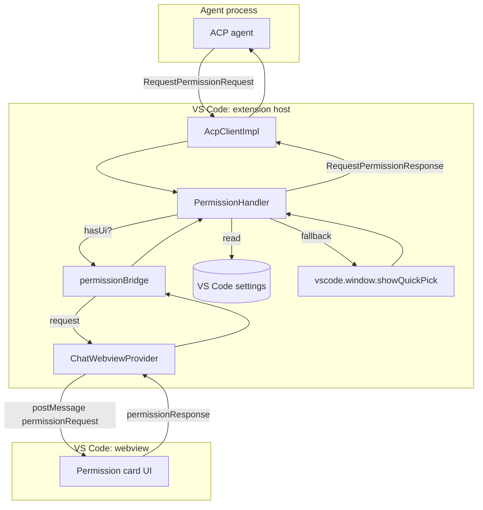
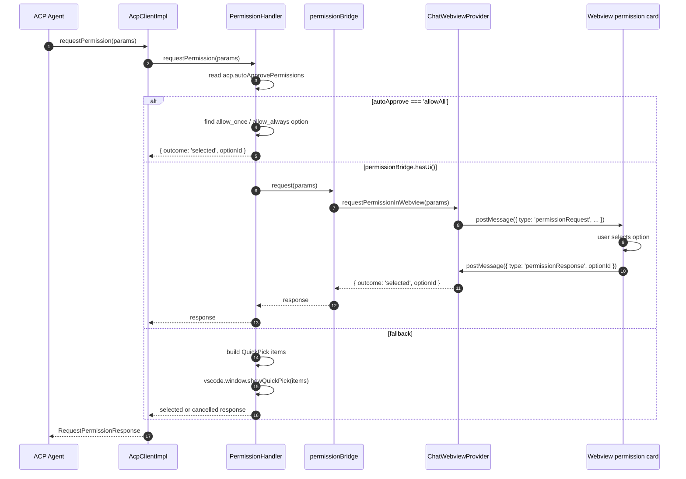
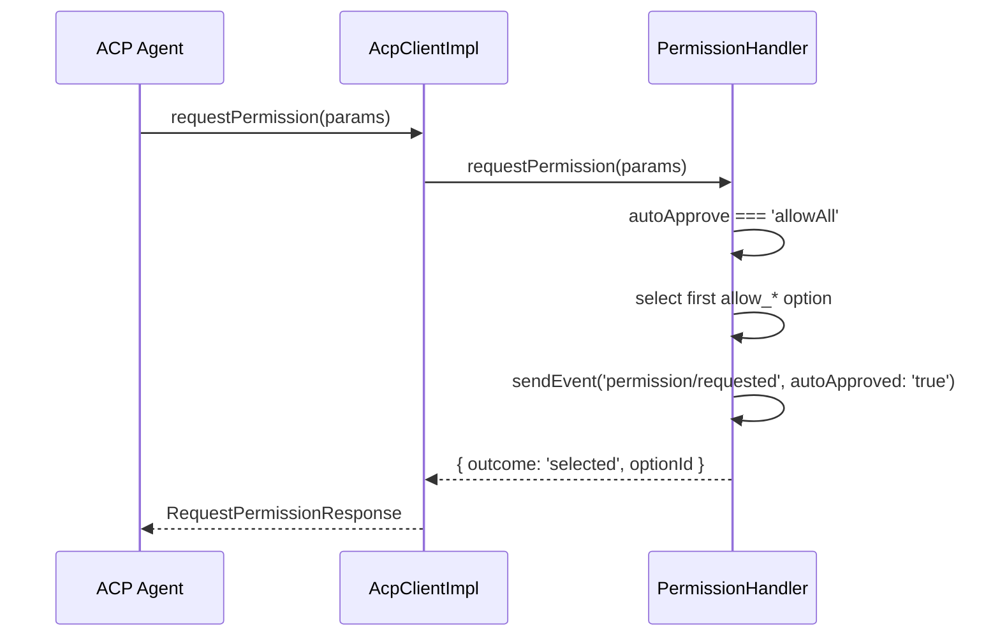
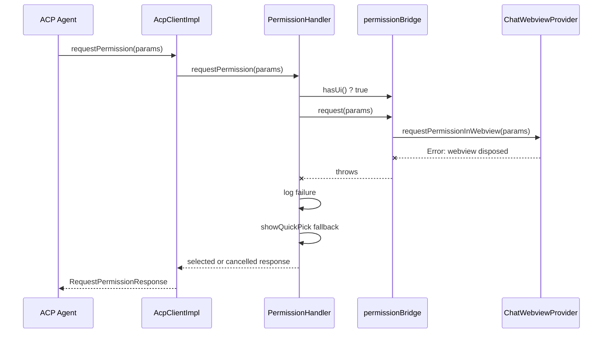
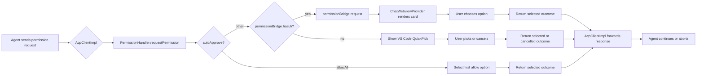

# handlers_permission

The `handlers_permission` module is responsible for surfacing and resolving permission requests that originate from ACP (Agent Client Protocol) agents running inside the VS Code extension. When an agent wants to perform a sensitive action, it sends a `RequestPermissionRequest` through the ACP client; this module renders the request to the user, collects a decision, and returns a `RequestPermissionResponse` so the agent can proceed or abort.

The module is intentionally small and focused: it contains a single `PermissionHandler` class that mediates between the ACP client layer and the user interface. It supports an automatic approval mode for headless or trusted workflows, an in-chat permission card when the AiNxt webview is available, and a fallback native VS Code `QuickPick` when the webview is not ready.

---

## Core Components

### `PermissionHandler`

`PermissionHandler` is a stateless handler class that implements the client-side permission request contract. It is instantiated once by `AcpClientImpl` and invoked every time the connected agent calls the ACP `requestPermission` method.

The handler performs three steps for each request:

1. **Read user configuration** — checks the `acp.autoApprovePermissions` setting.
2. **Resolve the request** — either auto-approves, asks the in-chat UI, or shows a native QuickPick.
3. **Return the outcome** — maps the user's choice (or cancellation) back to the ACP response shape.

```typescript
export class PermissionHandler {
  async requestPermission(
    params: RequestPermissionRequest,
  ): Promise<RequestPermissionResponse>;
}
```

### `PermissionHandler.requestPermission`

The single public method. It accepts an ACP `RequestPermissionRequest` and returns a `RequestPermissionResponse`.

Key behaviors:

- **Auto-approve (`allowAll`)**: If `acp.autoApprovePermissions` is set to `'allowAll'`, the handler searches `params.options` for the first option whose `kind` is `allow_once` or `allow_always`. If found, it immediately returns that `optionId` as a `selected` outcome. This is useful for fully automated sessions but bypasses user review.
- **In-chat permission card**: If `permissionBridge.hasUi()` is `true`, the handler forwards the request to the AiNxt chat webview via `permissionBridge.request(params)`. The webview renders a permission card inline and resolves the promise when the user clicks an option. If the bridge throws (for example, because the webview was disposed between the check and the call), the handler logs the failure and falls back to the QuickPick.
- **Native QuickPick fallback**: When no UI bridge is registered, the handler builds `vscode.QuickPickItem` entries from the agent-provided options, prefixes allow options with `$(check)` and deny options with `$(x)`, and shows `vscode.window.showQuickPick`. If the user dismisses the picker, the outcome is `cancelled`; otherwise it is `selected` with the chosen `optionId`.

Telemetry events are emitted for every request (`permission/requested`) and every response (`permission/responded`), including whether the request was auto-approved.

---

## Architecture

### Module Position

`handlers_permission` sits in the middle of the ACP client stack. It receives requests from the ACP client implementation and delegates user interaction to either the chat webview (via `permissionBridge`) or the VS Code window API.



### Component Relationships

| Component | Role | Relation to PermissionHandler |
|---|---|---|
| `AcpClientImpl` | ACP client implementation | Creates `PermissionHandler` and forwards every `requestPermission` call to it. See [agent_management.md](agent_management.md). |
| `permissionBridge` | UI abstraction | Decouples the handler from the webview. Registers/unregisters the in-chat permission UI. See [extension_ui.md](extension_ui.md). |
| `ChatWebviewProvider` | Webview controller | Implements the actual in-chat permission card by posting `permissionRequest` messages and resolving `permissionResponse` messages. See [extension_ui.md](extension_ui.md). |
| `Logger` | Logging utility | Used for diagnostic messages. See [utils.md](utils.md). |
| `TelemetryManager` | Telemetry utility | Emits `permission/requested` and `permission/responded` events. See [utils.md](utils.md). |
| `FileSystemHandler` | File system ACP handler | Sibling handler in the same `handlers` family. See [handlers_file_system.md](handlers_file_system.md). |
| `TerminalHandler` | Terminal ACP handler | Sibling handler in the same `handlers` family. See [handlers_terminal.md](handlers_terminal.md). |
| `SessionUpdateHandler` | Session update ACP handler | Sibling handler in the same `handlers` family. See [handlers_session_update.md](handlers_session_update.md). |

---

## Data Flow

### Normal Permission Request Flow



### Auto-Approve Flow



### Webview Disposal / Fallback Flow



---

## Configuration

The handler reads one VS Code setting:

| Setting | Type | Default | Description |
|---|---|---|---|
| `acp.autoApprovePermissions` | `string` | `'none'` | Controls automatic approval. Set to `'allowAll'` to auto-select the first allow-type option for every permission request. Any other value requires user interaction. |

---

## Message Protocol (Webview)

When the in-chat UI is available, `PermissionHandler` does not talk to the webview directly. Instead it uses `permissionBridge`, which is wired to `ChatWebviewProvider.requestPermissionInWebview`.

### Host → Webview

```typescript
{
  type: 'permissionRequest';
  requestId: string;
  options: PermissionOption[];
  toolCall?: ToolCallInfo;
}
```

### Webview → Host

```typescript
{
  type: 'permissionResponse';
  requestId: string;
  optionId?: string; // absent means cancelled
}
```

For full details on how the webview provider registers and unregisters this bridge, see [extension_ui.md](extension_ui.md).

---

## Error Handling and Edge Cases

- **No options**: If `params.options` is empty and `allowAll` is enabled, the handler falls through to the QuickPick path and the picker will be empty. In practice agents should always supply at least one option.
- **Webview race**: The handler checks `permissionBridge.hasUi()` before calling `permissionBridge.request()`, but the webview can be disposed between the check and the call. The `try/catch` around the bridge call ensures the user still sees the native QuickPick.
- **Cancellation**: Dismissing the QuickPick or closing the permission card without choosing an option returns `{ outcome: { outcome: 'cancelled' } }`, which the agent should treat as a denied permission.
- **Disposal cleanup**: When `ChatWebviewProvider` is disposed, it calls `permissionBridge.setUi(undefined)` and resolves all pending permission resolvers with a cancelled outcome, preventing dangling promises.

---

## Dependencies

### Runtime Dependencies

- `vscode` — VS Code extension API for settings and `showQuickPick`.
- `@agentclientprotocol/sdk` — ACP request/response types.

### Internal Dependencies

- `../utils/Logger` — diagnostic logging.
- `../utils/TelemetryManager` — telemetry events.
- `../ui/permissionBridge` — abstraction over the in-chat permission UI.

### Related Modules

- [agent_management.md](agent_management.md) — `AcpClientImpl` wires the handler into the ACP client.
- [extension_ui.md](extension_ui.md) — `ChatWebviewProvider` and `permissionBridge` implement the in-chat permission card.
- [handlers_file_system.md](handlers_file_system.md), [handlers_terminal.md](handlers_terminal.md), [handlers_session_update.md](handlers_session_update.md) — sibling ACP handlers.
- [utils.md](utils.md) — logging and telemetry utilities.

---

## Process Flow Summary


