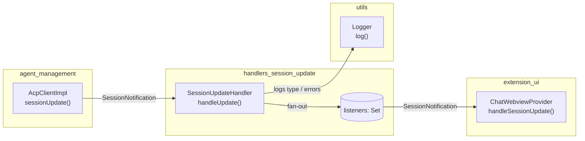
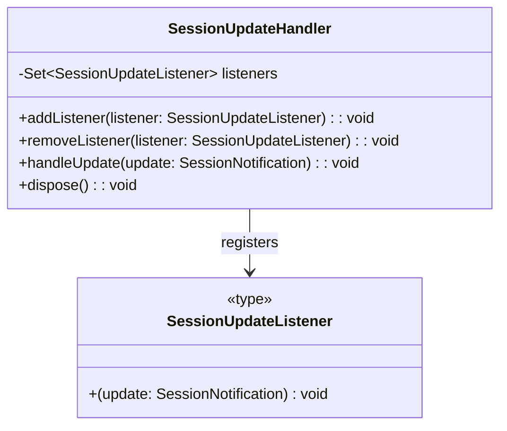
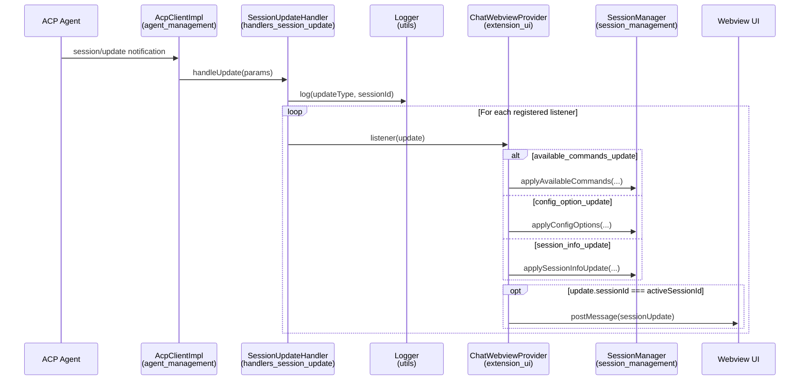
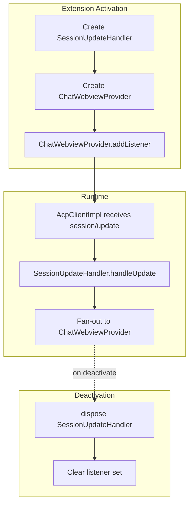

# handlers_session_update

## Brief Introduction

The `handlers_session_update` module is a lightweight publish/subscribe router for `session/update` notifications received from an ACP (Agent Client Protocol) agent. It decouples the low-level ACP client from UI components by accepting `SessionNotification` objects and fanning them out to registered listeners. The primary consumer is the chat webview, which uses these updates to refresh session metadata, available slash commands, configuration options, and other dynamic session state.

This module is intentionally focused on a single responsibility: reliable, observable delivery of session update events. It does not interpret update payloads beyond logging the update type; interpretation is left to the listeners.

---

## Core Components

### `SessionUpdateHandler`

Located in `vscode-acp/src/handlers/SessionUpdateHandler.ts`.

| Member | Purpose |
|--------|---------|
| `addListener(listener)` | Registers a callback to receive every `SessionNotification`. |
| `removeListener(listener)` | Unregisters a previously added callback. |
| `handleUpdate(update)` | Receives a `SessionNotification`, logs its type and session id, and invokes all registered listeners. Listener errors are caught and logged so that one failing listener does not break others. |
| `dispose()` | Clears the listener set, typically called during extension deactivation. |

The handler uses a `Set<SessionUpdateListener>` to store callbacks, ensuring the same listener is registered only once and providing O(1) add/remove operations.

---

## Architecture

### Module Position

`handlers_session_update` sits between the ACP transport layer and the UI layer:

- **Upstream producer**: [`agent_management`](agent_management.md) — specifically `AcpClientImpl.sessionUpdate`, which is invoked by the ACP SDK when the agent emits a `session/update` notification.
- **Downstream consumer**: [`extension_ui`](extension_ui.md) — specifically `ChatWebviewProvider`, which registers `handleSessionUpdate` as a listener to update both session state and the webview UI.
- **Utility dependency**: [`utils`](utils.md) — uses the `log` function for traffic and error logging.

### High-Level Component Diagram

### Class Structure

---

## Data Flow

When the agent emits a `session/update` notification, the following flow occurs:

### Update Types Handled by the Consumer

The handler itself is type-agnostic. The current consumer (`ChatWebviewProvider`) interprets these `sessionUpdate` subtypes:

| Update Type | Action |
|-------------|--------|
| `available_commands_update` | Persists the new command list via `SessionManager.applyAvailableCommands` so the slash-command popup stays current. |
| `config_option_update` | Persists configuration options via `SessionManager.applyConfigOptions`. |
| `session_info_update` | Updates session title/timestamp via `SessionManager.applySessionInfoUpdate`. |
| *(other)* | Forwarded to the webview as a `sessionUpdate` message if the session is active. |

> **Note:** The consumer persists `available_commands_update`, `config_option_update`, and `session_info_update` **before** checking whether the session is active. This ensures that early agent notifications emitted during session creation are not dropped. See [`extension_ui`](extension_ui.md) for details.

---

## Error Handling & Resilience

- **Listener isolation**: Each listener is invoked inside a `try/catch`. If one listener throws, the remaining listeners still receive the update and the error is logged.
- **No payload validation**: The handler trusts the ACP SDK's `SessionNotification` type. Validation and interpretation are delegated to listeners.
- **Clean shutdown**: `dispose()` clears the listener set, preventing stale callbacks from being invoked after the extension deactivates.

---

## Integration with the System

### Registration Lifecycle

### How It Fits

- **Decoupling**: By routing updates through `SessionUpdateHandler`, the ACP client does not need to know about the chat webview, session tree, status bar, or any future UI component that may need session updates.
- **Extensibility**: Additional listeners (e.g., a future status-bar updater or session-tree refresher) can be added without modifying the ACP client or the handler's core logic.
- **Observability**: Centralized logging of every update type and session id makes it easier to trace agent-to-UI traffic.

---

## Dependencies

| Dependency | Module | Purpose |
|------------|--------|---------|
| `SessionNotification` | External (`@agentclientprotocol/sdk`) | Type of the notification payload. |
| `log` | [`utils`](utils.md) | Logging update traffic and listener errors. |
| `AcpClientImpl.sessionUpdate` | [`agent_management`](agent_management.md) | Calls `handleUpdate` when the ACP agent emits a notification. |
| `ChatWebviewProvider.handleSessionUpdate` | [`extension_ui`](extension_ui.md) | Primary listener that translates updates into UI and state changes. |

---

## Related Documentation

- [`agent_management`](agent_management.md) — owns `AcpClientImpl`, which feeds session updates into this handler.
- [`extension_ui`](extension_ui.md) — owns `ChatWebviewProvider`, the main consumer of session updates.
- [`session_management`](session_management.md) — manages session state that the consumer updates in response to notifications.
- [`utils`](utils.md) — provides the logging utility used by this handler.
