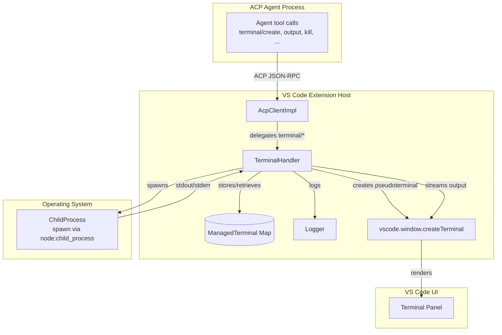
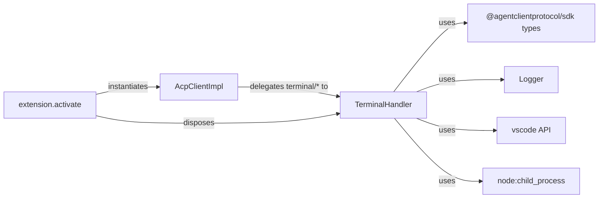
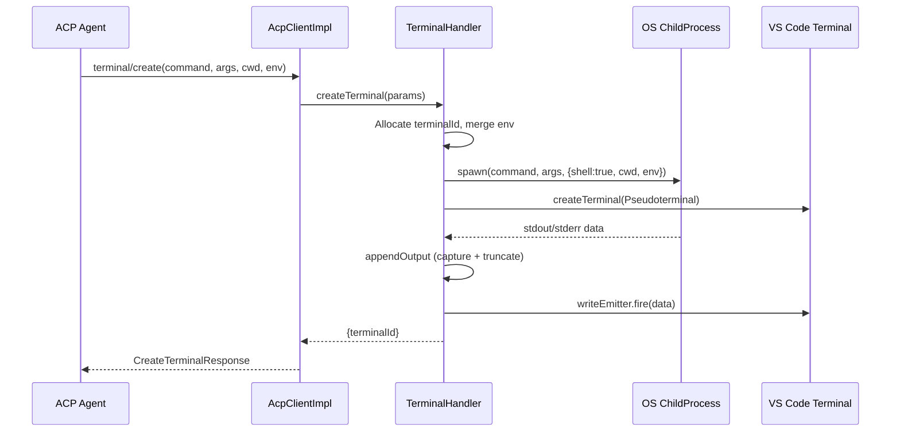
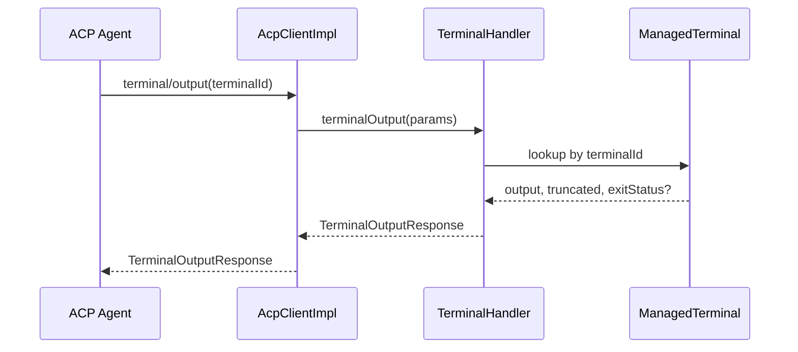
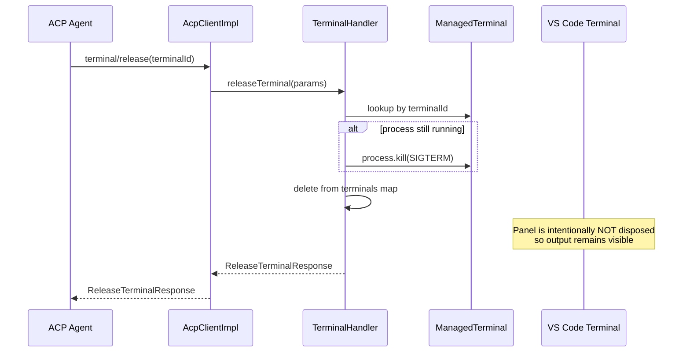
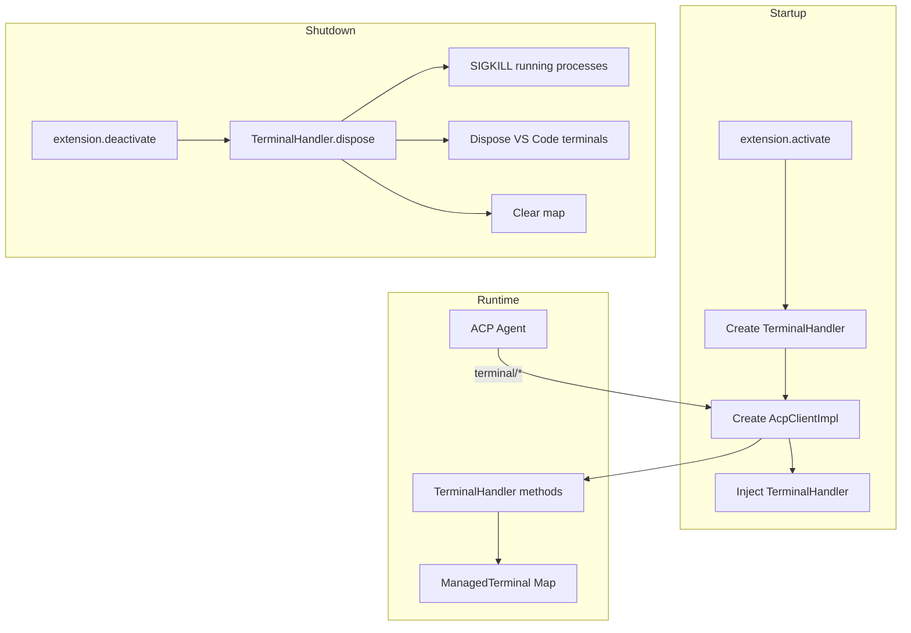

# handlers_terminal

The `handlers_terminal` module provides the VS Code extension's implementation of the Agent Communication Protocol (ACP) terminal lifecycle. It bridges agent-issued terminal commands with the host operating system by spawning real child processes, capturing their output, and surfacing a visual terminal panel inside VS Code for the user.

This module is part of the larger `vscode_acp` host implementation. For the overall extension architecture, see [vscode_acp](vscode_acp.md). For how terminal requests are routed from the ACP connection into this handler, see [agent_management](agent_management.md). For the sibling handlers that complete the ACP client surface, see [handlers_file_system](handlers_file_system.md), [handlers_permission](handlers_permission.md), and [handlers_session_update](handlers_session_update.md).

---

## Overview

`TerminalHandler` lives in `vscode-acp/src/handlers/TerminalHandler.ts`. It is a stateful service that owns every terminal created on behalf of an ACP agent. The handler exposes five ACP terminal operations:

- `terminal/create` — spawn a shell command and return a terminal ID.
- `terminal/output` — return the accumulated stdout/stderr captured so far.
- `terminal/waitForExit` — block until the process exits and return its status.
- `terminal/kill` — send `SIGTERM` to a running terminal process.
- `terminal/release` — terminate the process and drop internal state, while leaving the VS Code terminal panel visible per the ACP spec.

Each terminal is represented internally by a `ManagedTerminal` object that tracks the child process, captured output, truncation state, exit status, and an optional VS Code pseudoterminal used for display.

---

## Architecture

### Component responsibilities

| Component | Responsibility |
|-----------|----------------|
| `AcpClientImpl` | Receives terminal requests from the ACP SDK and forwards them to `TerminalHandler`. |
| `TerminalHandler` | Owns terminal lifecycle, output capture, truncation, and VS Code terminal creation. |
| `ManagedTerminal` | Internal record of a single terminal: process handle, output buffer, exit state, and VS Code terminal reference. |
| `Logger` | Records terminal creation, release, and errors via `log` / `logError`. |
| VS Code `Terminal` | Visual panel created through a `Pseudoterminal` so the user can watch command output. |

---

## Dependencies

- **`@agentclientprotocol/sdk`** — Provides the request/response TypeScript types for terminal operations.
- **`vscode`** — Used to create a `Pseudoterminal` and surface a native terminal panel.
- **`node:child_process`** — Spawns the actual OS process and captures its streams.
- **`Logger`** — Centralized logging utility; see [utils](utils.md).
- **`AcpClientImpl`** — The ACP `Client` implementation that wires handler methods to the SDK; see [agent_management](agent_management.md).

---

## Data Flow

### Creating a terminal

### Reading terminal output

### Releasing a terminal

---

## Core Components

### `TerminalHandler`

The public class exported by this module. It maintains a private `Map<string, ManagedTerminal>` keyed by terminal ID and a monotonically increasing `nextId` counter.

#### `createTerminal(params: CreateTerminalRequest): Promise<CreateTerminalResponse>`

Spawns a new terminal process.

- Builds a terminal ID in the form `term_N`.
- Applies the requested `outputByteLimit` (defaults to 1 MB).
- Merges the parent process environment with any environment variables supplied in the request.
- Spawns the command with `shell: true` and piped stdio.
- Creates a VS Code `Pseudoterminal` and terminal panel named `AiNxt: <command>`.
- Captures stdout and stderr into a single output buffer, truncating from the beginning when the byte limit is exceeded.
- Streams output to the VS Code terminal panel in near real time.
- Returns `{ terminalId }`.

The output buffer is synchronized into the `ManagedTerminal` record every 100 ms while the process runs, and one final time when the process closes.

#### `terminalOutput(params: TerminalOutputRequest): Promise<TerminalOutputResponse>`

Returns the current captured output, the truncation flag, and, if the process has exited, the exit code and signal.

Throws if the terminal ID is unknown.

#### `waitForTerminalExit(params: WaitForTerminalExitRequest): Promise<WaitForTerminalExitResponse>`

Awaits the terminal's internal `exitPromise` and returns the final exit code and signal.

Throws if the terminal ID is unknown.

#### `killTerminal(params: KillTerminalRequest): Promise<KillTerminalResponse>`

Sends `SIGTERM` to the underlying process. Errors are logged but do not fail the response.

Throws if the terminal ID is unknown.

#### `releaseTerminal(params: ReleaseTerminalRequest): Promise<ReleaseTerminalResponse>`

Releases the terminal from handler ownership:

- Sends `SIGTERM` if the process is still running.
- Removes the `ManagedTerminal` from the internal map.
- **Does not dispose the VS Code terminal panel**, preserving output visibility as required by the ACP spec.

Throws if the terminal ID is unknown.

#### `dispose(): void`

Called during extension deactivation. Iterates all managed terminals, force-kills any still-running processes with `SIGKILL`, disposes their VS Code terminal panels, and clears the internal map.

### `ManagedTerminal`

Internal interface describing a tracked terminal:

| Field | Type | Description |
|-------|------|-------------|
| `id` | `string` | Stable terminal identifier (`term_N`). |
| `process` | `ChildProcess` | The spawned OS process. |
| `output` | `string` | Accumulated stdout/stderr text. |
| `truncated` | `boolean` | True if output exceeded the byte limit and was trimmed from the start. |
| `outputByteLimit` | `number` | Maximum bytes to retain. |
| `exitCode` | `number \| null` | Process exit code, if finished. |
| `exitSignal` | `string \| null` | Termination signal, if finished. |
| `exited` | `boolean` | True after the `close` event fires. |
| `exitPromise` | `Promise<void>` | Resolves when the process closes or errors. |
| `vsTerminal` | `vscode.Terminal` | Optional VS Code terminal panel. |

---

## Output Capture and Truncation

The handler keeps a single string buffer that combines stdout and stderr. To prevent unbounded memory growth, it enforces `outputByteLimit`:

1. After each chunk is appended, compute the UTF-8 byte length of the buffer.
2. If the buffer exceeds the limit, calculate the excess byte count.
3. Walk forward from the start of the string until the excess bytes have been crossed at a safe character boundary.
4. Slice the buffer at that point and set `truncated = true`.

This design guarantees that agents always receive the most recent output, which is the most useful tail for long-running commands, while bounding memory usage.

---

## VS Code Terminal Panel

For every created terminal, the handler constructs a `vscode.Pseudoterminal` backed by a `vscode.EventEmitter<string>`. The pseudoterminal:

- Writes a command prompt line (`$ <command> <args>`) when opened.
- Receives stdout/stderr data and forwards it to the terminal panel with newlines normalized to `\r\n`.

The panel is intentionally kept alive after `releaseTerminal` so users can continue inspecting output. Only `dispose()` (extension shutdown) destroys the panels.

---

## Error Handling

- Unknown terminal IDs throw `Error('Terminal not found: <id>')`, which propagates back through `AcpClientImpl` to the ACP agent as a JSON-RPC error.
- Process spawn errors are surfaced through the `exitPromise` and logged.
- Kill/release errors are caught and logged to avoid crashing the extension.

---

## Lifecycle Integration

`TerminalHandler` is instantiated once during `extension.activate` and injected into `AcpClientImpl` along with the file system, permission, and session-update handlers. See [extension_activation](extension_activation.md) for the full startup wiring.

When the extension deactivates, the dispose callback in `extension.ts` calls `TerminalHandler.dispose()`, which forcefully terminates any remaining terminal processes and cleans up UI panels.

---

## Related Modules

- [vscode_acp](vscode_acp.md) — Parent module for the VS Code extension.
- [agent_management](agent_management.md) — Spawns and manages ACP agent processes; `AcpClientImpl` bridges agent RPC to handlers.
- [handlers_file_system](handlers_file_system.md) — Sibling handler for ACP file read/write operations.
- [handlers_permission](handlers_permission.md) — Sibling handler for ACP permission requests.
- [handlers_session_update](handlers_session_update.md) — Sibling handler for ACP session update notifications.
- [utils](utils.md) — Logging and telemetry utilities used by this handler.
