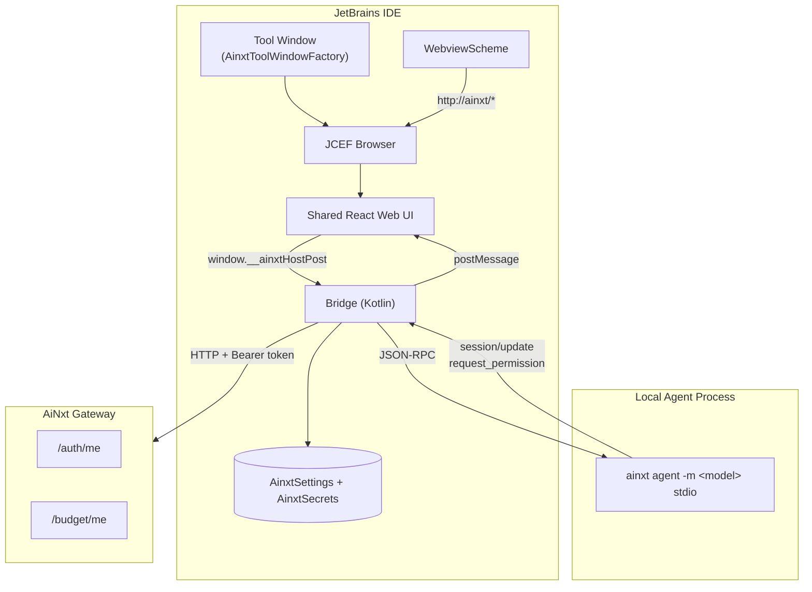
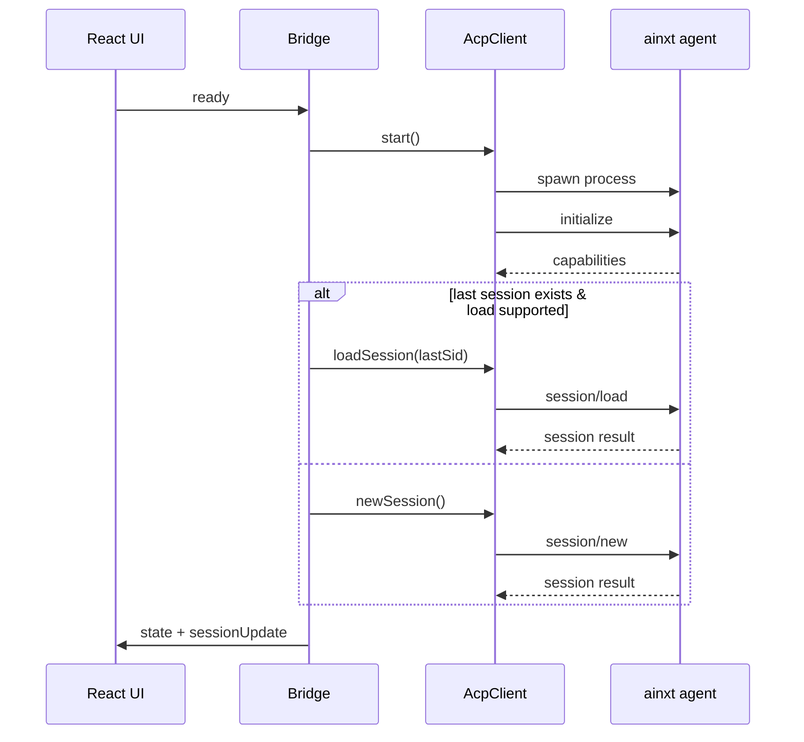
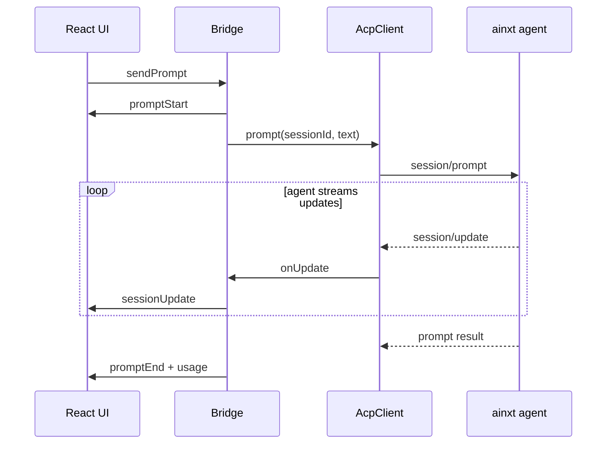
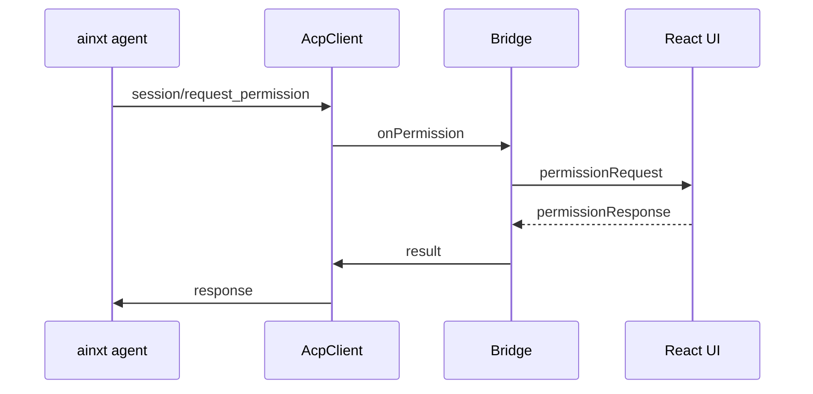

# intellij_host

The **intellij_host** module is the JetBrains IDE plugin that embeds the AiNxt coding assistant inside IntelliJ-based products (IntelliJ IDEA, PyCharm, WebStorm, etc.). It reuses the same React web UI as the VS Code extension while providing a Kotlin/JVM bridge to the AiNxt agent process.

## Purpose

- Host the shared AiNxt chat UI inside a JCEF browser panel.
- Spawn and communicate with the local `ainxt agent` CLI via the ACP (AiNxt Control Protocol) JSON-RPC stream.
- Mirror the VS Code extension's connection settings, authentication, and postMessage contract so the web UI works unchanged across both IDEs.
- Provide IntelliJ-specific integrations such as opening files, showing native diffs, refreshing the virtual file system, and picking files through the IDE file chooser.

## Architecture Overview

The plugin is intentionally thin: the heavy lifting of session management, agent lifecycle, and UI state is handled by the shared web UI and the `ainxt` agent. The Kotlin layer's job is to wire the IDE to that runtime.

## Core Components

### AinxtToolWindowFactory

`AinxtToolWindowFactory` is the entry point registered with IntelliJ's `ToolWindowFactory` extension point. When the AiNxt tool window is opened it:

1. Ensures the custom `http://ainxt/` scheme is registered via `WebviewScheme.ensureRegistered()`.
2. Creates a `JBCefBrowser` and a `Bridge` instance.
3. Installs a JavaScript query handler so the web UI can call back into Kotlin via `window.__ainxtHostPost`.
4. Loads `http://ainxt/index.html`, which serves the bundled React UI from plugin resources.

### Bridge

`Bridge` is the central message broker. It translates between the web UI's postMessage protocol and IntelliJ/Java APIs. Responsibilities include:

- **Lifecycle**: `connectOrResume()`, `restartFresh()`, `signOut()`.
- **Agent client**: Creates and owns an `AcpClient` configured from `AinxtSettings`/`AinxtSecrets`.
- **UI → host commands**: Handles `sendPrompt`, `cancelTurn`, `setModel`, `setMode`, `saveConnection`, `openFile`, `openDiff`, `pickFiles`, `attachPath`, `attachFolder`, `attachGit`, etc.
- **Host → UI notifications**: Pushes `state`, `sessionUpdate`, `permissionRequest`, `askRequest`, `planApprovalRequest`, `budgetState`, `workspaceFiles`, `filesAttached`, `error`, etc.
- **Budget refresh**: Calls the gateway's `/ainxt/v1/api/budget/me` endpoint using the access token from `~/.ainxt/credentials.json`.
- **File helpers**: `sendWorkspaceFiles`, `attachByPath`, `attachFolder`, `attachGit`, `pickFiles`, `openInEditor`, `openDiff`.

The Bridge keeps the same message contract as the VS Code host so the web UI is IDE-agnostic.

### AcpClient

`AcpClient` is the JVM counterpart of the VS Code ACP client. It spawns `ainxt agent -m <model> stdio` in **leader mode**, meaning the actual session lives in a persistent leader daemon and survives IDE reloads.

Key features:

- Speaks newline-delimited JSON-RPC 2.0 (ACP protocol version 1).
- Sends requests: `initialize`, `session/new`, `session/load`, `session/prompt`, `session/cancel`, `session/set_model`, `session/set_mode`.
- Handles server requests: `session/request_permission`, `ainxt.dev/ask_user_question`, `ainxt.dev/exit_plan_mode`, `fs/read_text_file`, `fs/write_text_file`.
- Routes `session/update` and `ainxt.dev/session_notification` notifications to the UI.
- Refreshes the IntelliJ virtual file system and opens newly written files via the `onFileWritten` callback.

### AinxtSettings & AinxtSecrets

- `AinxtSettings` is an application-level `PersistentStateComponent` that stores `gatewayUrl`, `allowInsecure`, `model`, and `binaryPath` in `ainxt.xml`.
- `AinxtSecrets` stores the gateway API key in the IDE's `PasswordSafe` so it is never written to disk in plain text.

These mirror the VS Code extension's `ainxt.gatewayUrl`, `ainxt.allowInsecure`, `ainxt.model`, `ainxt.binaryPath`, and `ainxt.apiKey` settings.

### WebviewScheme

`WebviewScheme` registers a custom CEF scheme handler factory for `http://ainxt/*`. Because Chromium blocks ES module loading from `file://` URLs, the bundled Vite/React UI must be served over an HTTP origin. The handler streams resources from the plugin's classpath under `/webview`, allowing a single UI build to be shared with the VS Code extension.

## Data Flow

### Starting a Session

### Sending a Prompt

### Permission / Ask / Plan Approval

The same synchronous request/response pattern is used for `ainxt.dev/ask_user_question` and `ainxt.dev/exit_plan_mode`.

## Relationship to Other Modules

- **[vscode_acp](../extension/README.md)**: The IntelliJ plugin shares the same React web UI and postMessage contract as the VS Code extension. Where VS Code uses a `WebviewView`, IntelliJ uses a JCEF browser, but the UI layer is identical.
- **[vscode_acp](../extension/README.md)**: The IntelliJ `AcpClient` implements the same ACP JSON-RPC protocol as the VS Code ACP client (`AcpClientImpl`, `SessionManager`, etc.). The agent process and session semantics are the same; only the host language and IDE APIs differ.

## Configuration

| Setting | Storage | Description |
|---------|---------|-------------|
| `gatewayUrl` | `AinxtSettings` | AiNxt gateway URL (default `http://localhost:8000`). |
| `allowInsecure` | `AinxtSettings` | Allow insecure TLS when set. |
| `model` | `AinxtSettings` | Default model ID passed to `ainxt agent -m`. |
| `binaryPath` | `AinxtSettings` | Path to the `ainxt` CLI; falls back to `AINXT_BINARY_PATH` env or `ainxt` on PATH. |
| API key | `AinxtSecrets` | Gateway access key stored in IDE PasswordSafe. |

## Limitations & Notes

- Some VS Code features are not yet implemented in the JetBrains host and return user notifications: `@problems` attachment, opening past threads, and checkpoint restore/undo.
- The host only advertises `fs/readTextFile` and `fs/writeTextFile` client capabilities; terminal and other tool capabilities are disabled, matching the current VS Code host surface.
- File attachment caps: 200 KB per file, 40 files / 400 KB total for folders, 4,000 files in the workspace picker.
