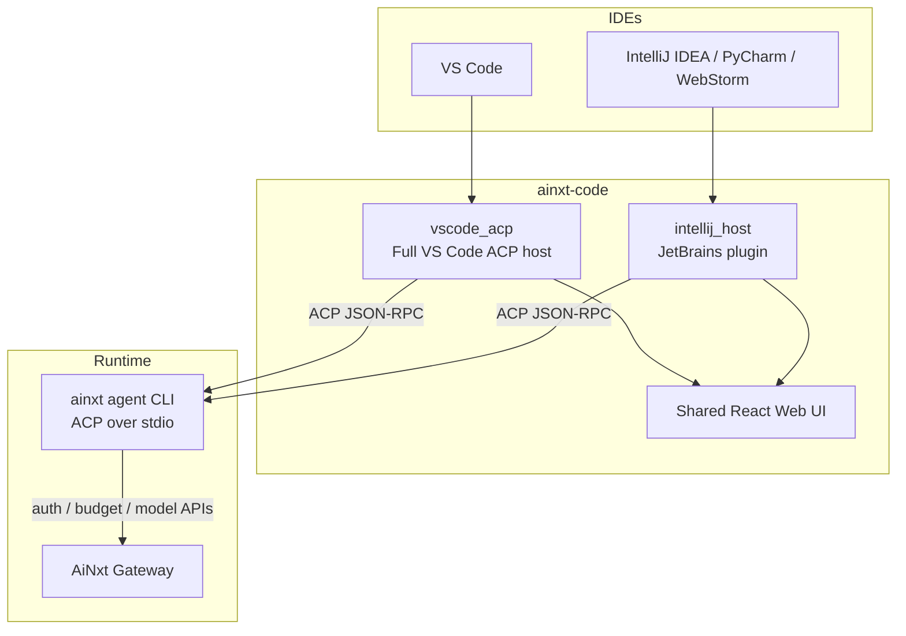
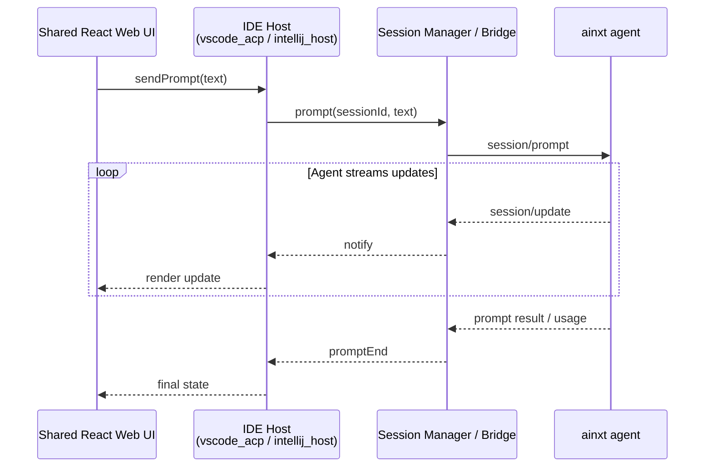
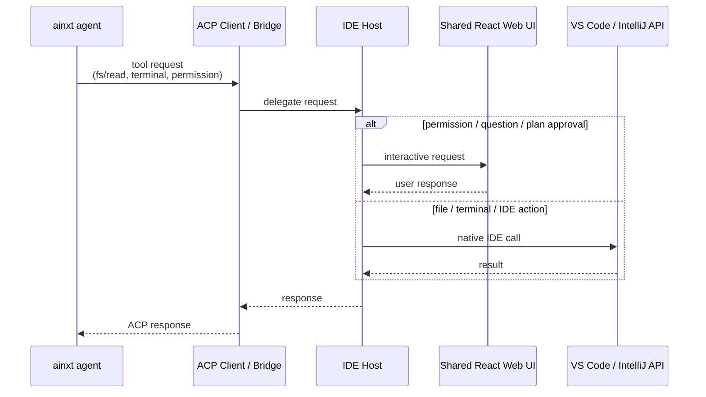

# ainxt-code Repository Overview

## Purpose

`ainxt-code` is the repository for the AiNxt IDE plugins. It brings the AiNxt coding assistant into popular editors by embedding a shared React chat UI, spawning a local `ainxt agent` process, and bridging the Agent Client Protocol (ACP) to each IDE's native APIs.

The repository contains two host implementations:

- **`vscode_acp`** — A full-featured VS Code extension that implements ACP client logic, session management, agent spawning, file/terminal handlers, and a rich webview UI directly inside the extension.
- **`intellij_host`** — A JetBrains IDE plugin written in Kotlin/JVM that hosts the same shared React UI inside a JCEF browser and provides a Kotlin bridge to the AiNxt agent.

All hosts share the same React web UI and a common postMessage/ACP contract, so the assistant behaves consistently across VS Code and IntelliJ-based products.

---

## End-to-End Architecture

### Repository Layout

### Typical Prompt Flow

### Tool Request Flow

---

## Core Modules

| Module | Path | Description | Documentation |
|--------|------|-------------|---------------|
| `intellij_host` | `hosts/intellij` | JetBrains plugin that embeds the shared React UI in a JCEF browser and bridges ACP to Kotlin/IntelliJ APIs. | [`intellij_host.md`](intellij/README.md) |
| `vscode_acp` | `vscode-acp` | Full-featured VS Code ACP host with built-in agent management, session orchestration, handlers, and webview UI. | [`vscode_acp.md`](extension/README.md) |
| `vscode_acp/agent_management` | `vscode-acp/src/core` | Spawns agents, implements the ACP client, and manages per-turn checkpoints. | [`agent_management.md`](extension/agent-management/README.md) |
| `vscode_acp/session_management` | `vscode-acp/src/core` | Manages ACP connections, sessions, resume/load, auth, and history. | [`session_management.md`](extension/session-management/README.md) |
| `vscode_acp/handlers` | `vscode-acp/src/handlers` | Bridges ACP tool requests to VS Code file system, terminal, permission, and session-update APIs. | [`handlers.md`](extension/handlers/README.md) |
| `vscode_acp/extension_ui` | `vscode-acp/src/ui`, `vscode-acp/src/extension.ts` | VS Code activation, chat webview provider, session tree, status bar, and interactive bridges. | [`extension_ui.md`](extension/ui.md) |
| `vscode_acp/webview_ui` | `vscode-acp/webview-ui` | React front-end bundle shared across VS Code and JetBrains hosts. | [`webview_ui.md`](webview/README.md) |
| `vscode_acp/config` | `vscode-acp/src/config` | Agent configuration, registry fetching, and secret injection. | [`config.md`](extension/config.md) |
| `vscode_acp/utils` | `vscode-acp/src/utils` | Logging, telemetry, and stream adapters. | [`utils.md`](extension/utils/README.md) |