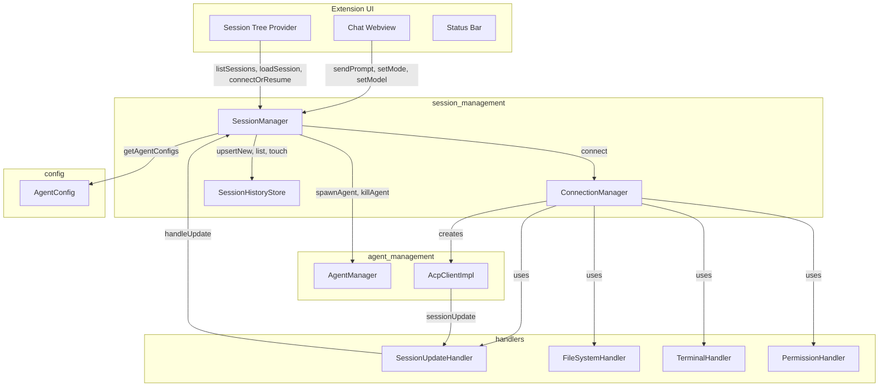
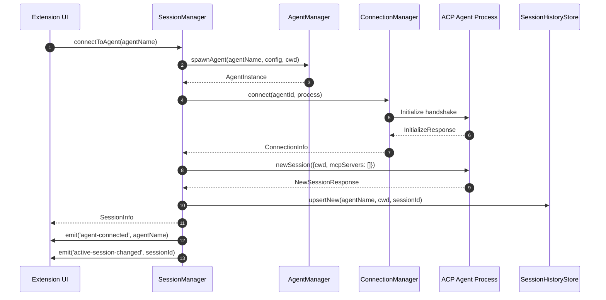
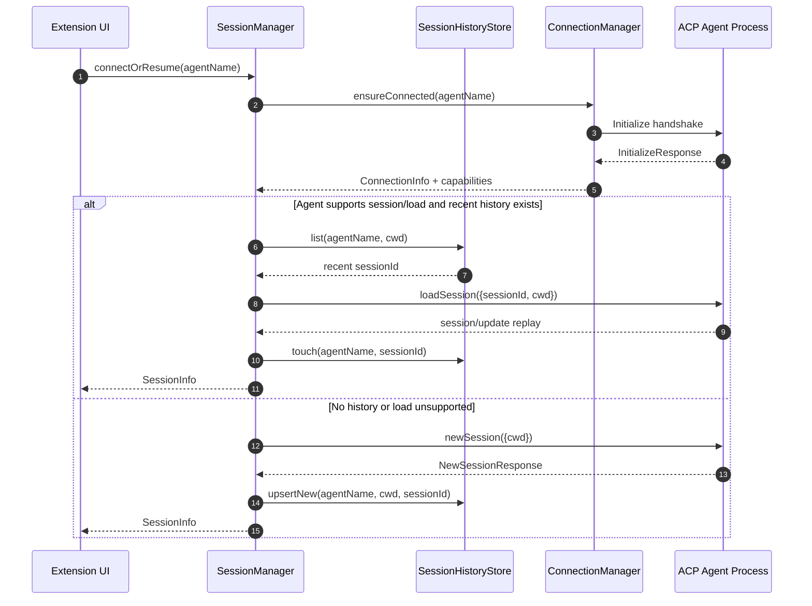
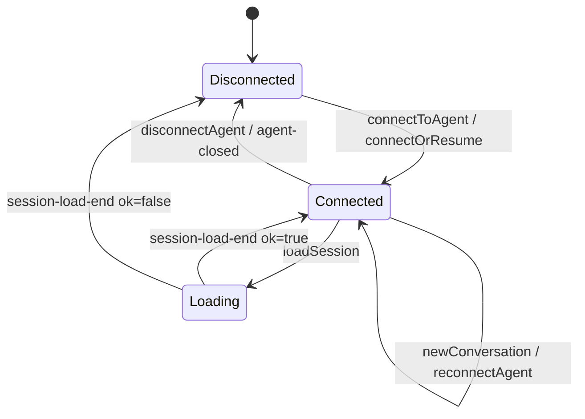

# Session Management

The `session_management` module is the central coordinator for the AiNxt VS Code extension's conversational state. It hides the Agent Client Protocol (ACP) "session" concept from the user and instead exposes an agent-centric model: the user picks an agent, and the extension transparently creates, resumes, loads, or reconnects the underlying ACP session.

This module is responsible for:

- Establishing and initializing ACP connections to spawned agent processes.
- Creating, resuming, loading, and closing ACP sessions.
- Maintaining the active session and enforcing a one-active-session-per-agent model.
- Caching session metadata, capabilities, and configuration options.
- Persisting a client-side history of sessions so they can be rendered in the session tree.
- Driving interactive authentication flows when an agent requires sign-in.

## Architecture Overview

The architecture follows a layered design:

1. **UI Layer** (`extension_ui`): Chat webview, session tree, and status bar initiate session operations.
2. **Orchestration Layer** (`SessionManager`): The public facade that coordinates agents, connections, history, and UI notifications.
3. **Connection Layer** (`ConnectionManager`): Translates spawned agent processes into initialized ACP `ClientSideConnection` instances.
4. **Persistence Layer** (`SessionHistoryStore`): Caches session metadata in VS Code workspace state.
5. **Protocol Layer** (`agent_management`, `handlers`): ACP client implementation and capability handlers used by the connection layer.

## Core Sub-Modules

The module is split into three focused areas:

| Sub-module | Responsibility | Key Components |
|------------|----------------|----------------|
| [session_management_connections](session_management_connections.md) | Spawns ACP connections from child processes and performs the initialization handshake. | `ConnectionManager`, `ConnectionInfo` |
| [session_management_history](session_management_history.md) | Persists and reconciles a client-side cache of sessions per agent. | `SessionHistoryStore`, `PersistedSessionEntry` |
| [session_management_orchestration](session_management_orchestration.md) | Orchestrates the full session lifecycle, auth flows, and active session state. | `SessionManager`, `SessionInfo`, `AgentCapabilitySummary` |

## Data Flow: Connecting to an Agent

## Data Flow: Resuming on Extension Reload

## Active Session Model

The extension enforces a simplified model for the user:

- Only one agent can be actively connected at a time.
- Each agent has at most one active session (`agentSessions` map).
- Switching agents disconnects the previous agent.
- `SessionManager` emits `active-session-changed` so the chat webview and status bar can update.

## Capability Discovery

When a connection is initialized, `SessionManager` derives an `AgentCapabilitySummary` from `initialize.agentCapabilities`:

- `list`: Agent supports `session/list`.
- `load`: Agent supports `session/load`.
- `resume`: Agent supports `session/resume`.

These flags determine which session operations are available in the session tree and whether the local history store is used as a fallback.

## Authentication Integration

Some agents require authentication before a session can be created. `SessionManager` handles this transparently:

1. Detects the ACP `auth required` error (`-32000`) from `newSession` or `listSessions`.
2. Presents available auth methods from the `initialize` response.
3. Drives browser-based OIDC/device-code flows via `ainxt.dev/auth/get_url`.
4. Supports API-key injection via `ainxt.dev/setApiKey`.

See [session_management_orchestration](session_management_orchestration.md) for the detailed auth flow.

## Relationship to Other Modules

- **[agent_management](agent_management.md)**: `SessionManager` spawns and kills agent processes through `AgentManager`, and `ConnectionManager` constructs `AcpClientImpl` instances to handle ACP server-to-client requests.
- **[handlers](handlers.md)**: `ConnectionManager` wires `FileSystemHandler`, `TerminalHandler`, `PermissionHandler`, and `SessionUpdateHandler` into each connection. `SessionManager` consumes `SessionUpdateHandler` notifications.
- **[extension_ui](extension_ui.md)**: The chat webview, session tree, and status bar are the primary consumers of `SessionManager` events and methods.
- **[config](config.md)**: `SessionManager` reads agent definitions via `getAgentConfigs` from `AgentConfig`.
- **[utils](utils.md)**: Logging and telemetry are provided by `Logger` and `TelemetryManager`.

## Key Design Decisions

1. **Session abstraction**: ACP sessions are hidden from users; the UI talks about "agents" and "conversations".
2. **Pending buffers**: `SessionManager` buffers `availableCommands`, `configOptions`, and `title` updates that arrive before a session is fully registered, preventing race conditions during session creation.
3. **History fallback**: `SessionHistoryStore` provides a client-side fallback for agents that support `session/load` or `session/resume` but do not advertise `session/list`.
4. **Single active session**: Switching agents automatically tears down the previous connection to keep resource usage predictable.
5. **Workspace-scoped history**: Session history is filtered by workspace `cwd` so only relevant sessions appear in the tree.

## See Also

- [session_management_connections](session_management_connections.md) — ACP connection establishment and traffic logging.
- [session_management_history](session_management_history.md) — Client-side session history cache and reconciliation.
- [session_management_orchestration](session_management_orchestration.md) — Session lifecycle, auth flows, and active session coordination.
