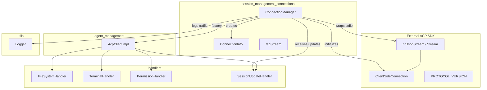
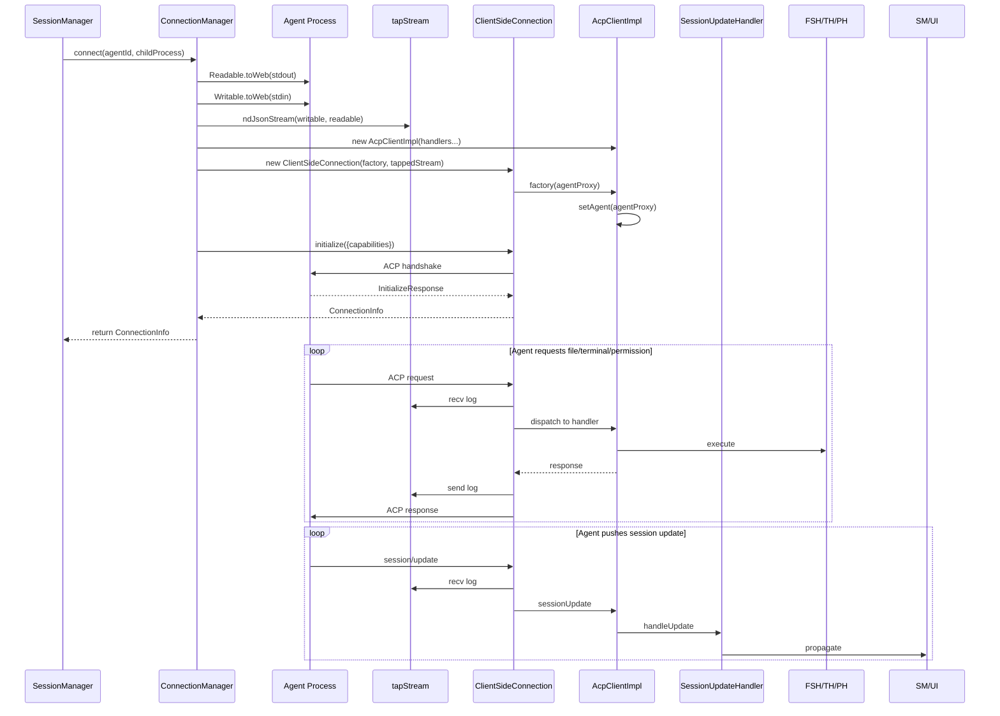
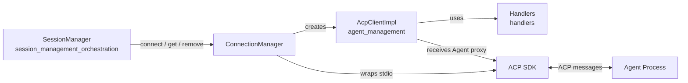
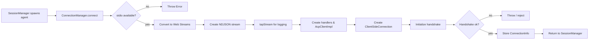
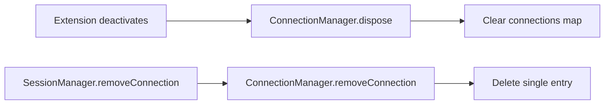

# Session Management Connections

The `session_management_connections` module is responsible for establishing, maintaining, and disposing of Agent Client Protocol (ACP) connections between the VS Code extension host and spawned agent processes. It acts as the low-level transport layer for the broader [session_management](session_management.md) subsystem, bridging Node.js child process stdio streams with the typed ACP SDK.

---

## Module Overview

This module contains a single core class, `ConnectionManager`, which:

- Accepts a spawned agent child process and wraps its `stdout`/`stdin` streams in an ACP-compatible JSON stream.
- Performs the ACP initialization handshake, advertising the host's capabilities (file system and terminal support).
- Instantiates the local ACP client implementation and wires it to the connection.
- Provides connection lookup and lifecycle management by `agentId`.
- Transparently logs all bidirectional ACP traffic for debugging and telemetry purposes.

The module intentionally does **not** handle session history, UI state, agent spawning, or high-level orchestration. Those concerns belong to sibling modules such as [session_management_history](session_management_history.md), [session_management_orchestration](session_management_orchestration.md), and [agent_management](agent_management.md).

---

## Architecture



### Component Responsibilities

| Component | Responsibility |
|-----------|----------------|
| `ConnectionManager` | Owns the map of active connections and exposes connect/lookup/dispose APIs. |
| `ConnectionInfo` | Value object holding the `ClientSideConnection`, `AcpClientImpl`, and `InitializeResponse` for an agent. |
| `tapStream` | Private helper that inserts `TransformStream` interceptors to log every sent and received ACP message. |

---

## Core Components

### `ConnectionInfo`

```typescript
export interface ConnectionInfo {
  connection: ClientSideConnection;
  client: AcpClientImpl;
  initResponse: InitializeResponse;
}
```

`ConnectionInfo` is the canonical handle returned after a successful connection. Callers (typically [SessionManager](session_management_orchestration.md)) use it to:

- Access the ACP connection for sending prompts and commands.
- Retrieve the local client implementation that handles incoming agent requests.
- Inspect agent metadata from the initialization response.

### `ConnectionManager`

#### Constructor

```typescript
constructor(private readonly sessionUpdateHandler: SessionUpdateHandler) {}
```

The manager requires a `SessionUpdateHandler` instance so that the `AcpClientImpl` it creates can propagate agent-side session updates to the rest of the extension.

#### `connect(agentId: string, process: ChildProcess): Promise<ConnectionInfo>`

The primary entry point. It performs the following steps:

1. Validates that the child process has `stdout` and `stdin` streams.
2. Converts Node.js streams to Web Streams using `Readable.toWeb` and `Writable.toWeb`.
3. Builds an NDJSON stream via `ndJsonStream(writable, readable)`.
4. Wraps the stream with `tapStream` to log traffic.
5. Creates handler instances for file system, terminal, permission, and session update operations.
6. Constructs an `AcpClientImpl` with those handlers.
7. Creates a `ClientSideConnection`, passing a factory that binds the remote `Agent` proxy to the local client.
8. Calls `connection.initialize(...)` to perform the ACP handshake.
9. Stores and returns the resulting `ConnectionInfo` keyed by `agentId`.

The initialization payload advertises:

- `protocolVersion`: the ACP protocol version from the SDK.
- `clientInfo`: extension name (`ainxt-vscode`) and version from `package.json`.
- `clientCapabilities`: `fs.readTextFile`, `fs.writeTextFile`, and `terminal`.

#### `getConnection(agentId: string): ConnectionInfo | undefined`

Looks up an active connection by agent identifier. Returns `undefined` if no connection exists.

#### `removeConnection(agentId: string): void`

Removes a connection from the internal map. This does **not** terminate the underlying process; callers must coordinate process shutdown separately (see [agent_management](agent_management.md)).

#### `dispose(): void`

Clears the internal connection map. Intended for extension deactivation cleanup.

#### `tapStream(stream: Stream): Stream`

Private method that returns a new `Stream` whose writable side logs outgoing messages and whose readable side logs incoming messages. Errors in the tap pipelines are caught and logged but do not break the main connection.

---

## Data Flow



### Traffic Logging

Every message crossing the connection is duplicated into the traffic log channel:

- **Outgoing** (`send`): host → agent
- **Incoming** (`recv`): agent → host

This is implemented with two `TransformStream` instances that enqueue the original chunk after logging, ensuring zero impact on message content.

---

## Dependencies

### Runtime Dependencies

| Dependency | Purpose |
|------------|---------|
| `@agentclientprotocol/sdk` | Provides `ClientSideConnection`, `ndJsonStream`, `PROTOCOL_VERSION`, and ACP types. |
| `node:child_process` | Source of the agent `ChildProcess` whose stdio is wired into the connection. |
| `node:stream` | Used to convert Node.js streams to Web Streams. |

### Internal Dependencies

| Module | Components Used | Relationship |
|--------|-----------------|--------------|
| [agent_management](agent_management.md) | `AcpClientImpl` | ConnectionManager creates and configures the local ACP client. |
| [handlers](handlers.md) | `FileSystemHandler`, `TerminalHandler`, `PermissionHandler`, `SessionUpdateHandler` | Handlers are injected into `AcpClientImpl` to satisfy agent requests. |
| [utils](utils.md) | `log`, `logError`, `logTraffic` | All connection steps and traffic are logged through the shared logger. |

### Upstream Consumers

| Module | Consumer | Usage |
|--------|----------|-------|
| [session_management_orchestration](session_management_orchestration.md) | `SessionManager` | Calls `connect`, `getConnection`, and `removeConnection` during session lifecycle operations. |

---

## Component Interaction



`ConnectionManager` sits at the boundary between the host extension and the external agent process. It is intentionally thin: it does not interpret ACP messages beyond the initialization handshake. Message dispatch and business logic live in `AcpClientImpl` and the handler modules.

---

## Process Flows

### Establishing a New Connection



### Disposing Connections



> Note: `dispose` and `removeConnection` only affect the manager's internal registry. Process termination is handled by [AgentManager](agent_management.md).

---

## Error Handling

- **Missing stdio**: `connect` throws immediately if `process.stdout` or `process.stdin` is missing.
- **Initialization failure**: Rejected `connection.initialize(...)` promise propagates to the caller.
- **Traffic tap errors**: Caught and logged via `logError`; the underlying connection remains active.

---

## Related Documentation

- [session_management](session_management.md) — parent module overview
- [session_management_orchestration](session_management_orchestration.md) — high-level session lifecycle and consumer of this module
- [session_management_history](session_management_history.md) — persisted session metadata
- [agent_management](agent_management.md) — agent spawning and the `AcpClientImpl`
- [handlers](handlers.md) — request handlers injected into the ACP client
- [utils](utils.md) — logging and telemetry utilities
