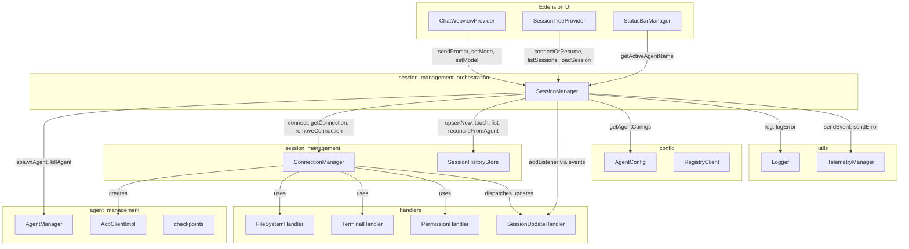
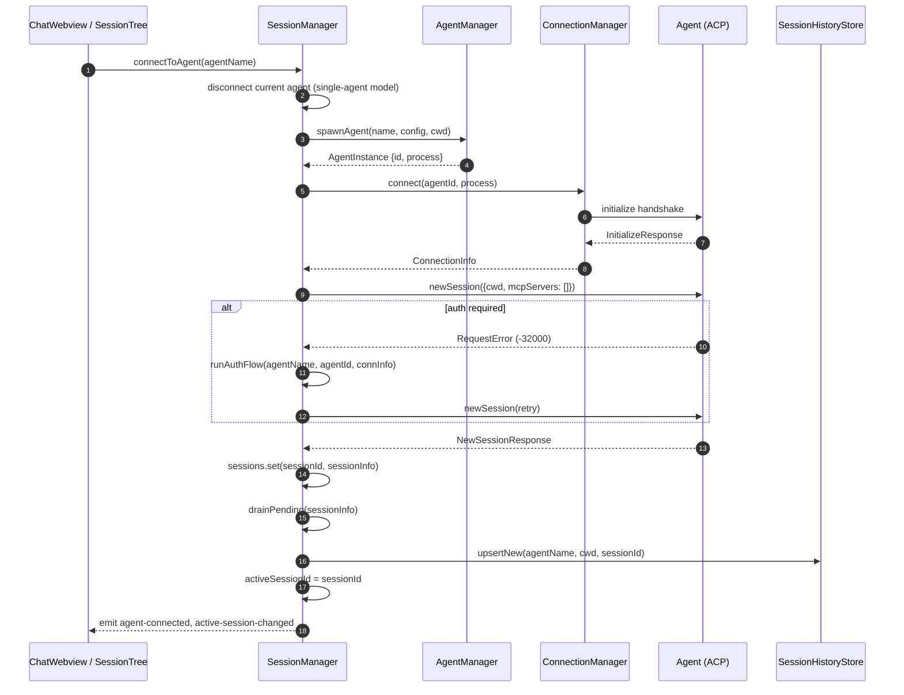
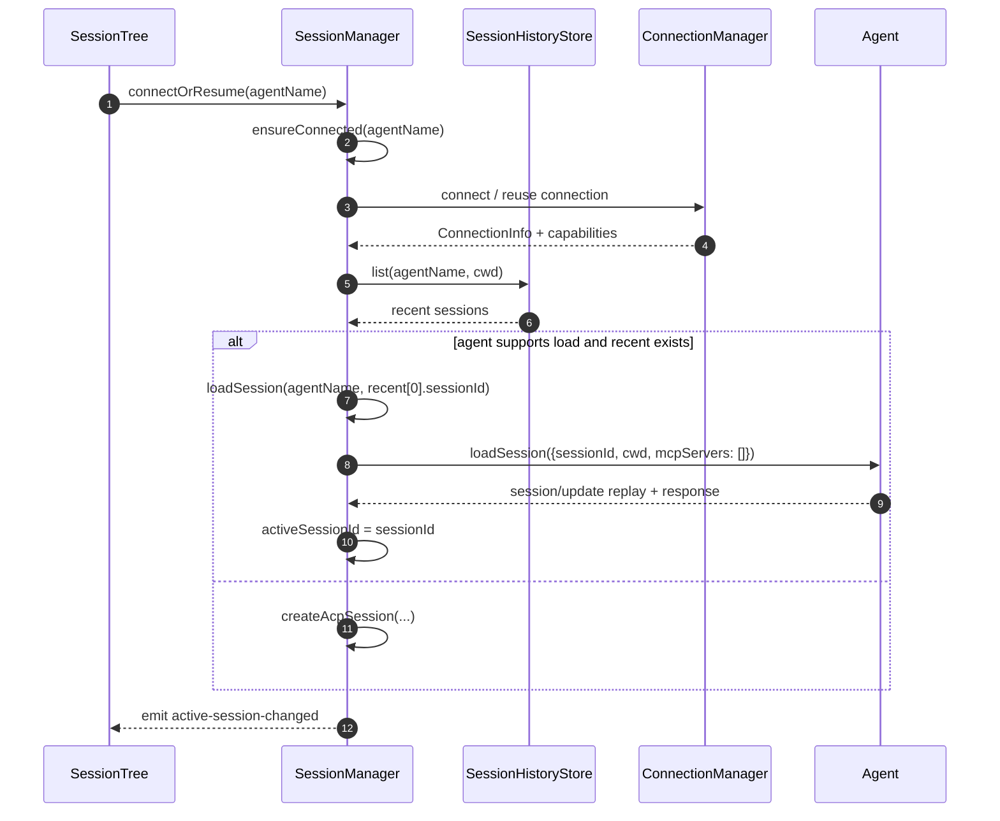
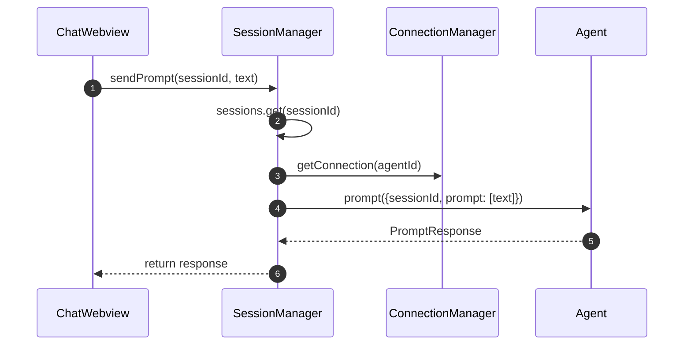
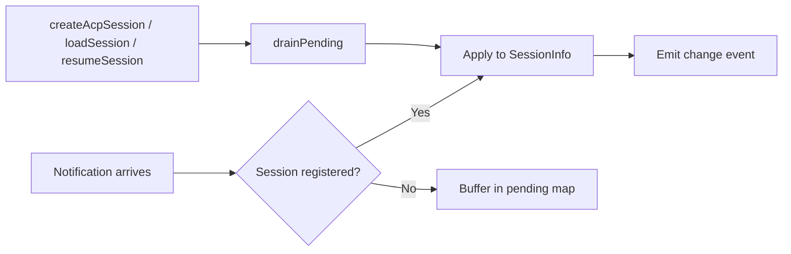

# Session Management Orchestration

The `session_management_orchestration` module is the central coordinator for all ACP (Agent Client Protocol) session lifecycle operations in the VS Code extension. It hides the protocol-level concept of a "session" from the user and exposes an agent-centric model: the user picks an agent, and the orchestrator spawns the process, establishes the connection, creates or resumes the ACP session, and routes subsequent interactions such as prompts, mode changes, and configuration updates.

This module is implemented primarily by `SessionManager` in `vscode-acp/src/core/SessionManager.ts`.

---

## 1. Purpose and Core Functionality

`SessionManager` is responsible for:

- **Agent-centric connection orchestration** — translating a user-selected agent name into a running process, an ACP connection, and an active session.
- **Session lifecycle management** — creating, loading, resuming, and disconnecting sessions while maintaining a single active session at a time.
- **Authentication coordination** — detecting `auth required` errors, prompting the user to select an auth method, and driving browser-based OIDC/device-code flows.
- **State synchronization** — applying push notifications for session info, available commands, and config options, including buffering updates that arrive during session creation races.
- **History integration** — working with the persistent session history store so recent conversations can be listed, resumed, and labeled.
- **Capability discovery** — caching per-agent capability summaries (`list`, `load`, `resume`) so UI components can decide which actions are available without reconnecting.

The orchestrator emits events (e.g., `agent-connected`, `active-session-changed`, `config-options-changed`) that the chat webview, session tree, and status bar consume.

---

## 2. Architecture

### 2.1 High-level architecture



### 2.2 Component relationships

| Component | Module | Role in orchestration |
|-----------|--------|----------------------|
| `SessionManager` | `session_management_orchestration` | Central orchestrator; owns session maps, active session state, and capability cache. |
| `AgentManager` | `agent_management` | Spawns and kills agent child processes. |
| `ConnectionManager` | `session_management_connections` | Wraps stdio in ACP streams, performs initialization handshake, and stores live `ConnectionInfo`. |
| `SessionHistoryStore` | `session_management_history` | Persists recent session metadata per agent/workspace for resume and tree rendering. |
| `SessionUpdateHandler` | `handlers` | Broadcasts ACP session/update notifications to registered listeners. |
| `AgentConfig` / `RegistryClient` | `config` | Supplies agent command/argument/environment definitions. |
| `Logger` / `TelemetryManager` | `utils` | Records diagnostic logs and usage events. |

For details on how connections are established, see [session_management_connections.md](session_management_connections.md). For persistent history semantics, see [session_management_history.md](session_management_history.md). For process spawning, see [agent_management.md](agent_management.md).

---

## 3. Data Model

### 3.1 SessionInfo

The in-memory representation of an active ACP session:

```typescript
interface SessionInfo {
  sessionId: string;
  agentId: string;           // Process id from AgentManager
  agentName: string;         // Config key (e.g., "ainxt")
  agentDisplayName: string;  // Human-readable title from initialize response
  cwd: string;               // Workspace folder path
  createdAt: string;         // ISO timestamp
  initResponse: InitializeResponse;
  modes: SessionModeState | null;
  models: SessionModelState | null;
  configOptions: SessionConfigOption[] | null;
  availableCommands: AvailableCommand[];
  title?: string;
}
```

### 3.2 AgentCapabilitySummary

Derived from `initialize.agentCapabilities` and cached per agent:

```typescript
interface AgentCapabilitySummary {
  list: boolean;   // Supports session/list
  load: boolean;   // Supports session/load (history replay)
  resume: boolean; // Supports session/resume (light resume)
}
```

### 3.3 Internal maps

`SessionManager` maintains several private maps:

- `sessions: Map<sessionId, SessionInfo>` — all currently live sessions.
- `activeSessionId: string | null` — the single session that currently owns the chat UI.
- `agentSessions: Map<agentName, sessionId>` — enforces one active session per agent.
- `capabilities: Map<agentName, AgentCapabilitySummary>` — cached capability flags.
- `pendingAvailableCommands`, `pendingConfigOptions`, `pendingTitles` — buffers for notifications that race ahead of session registration.
- `loadingSessionIds: Set<sessionId>` — sessions currently replaying history via `session/load`.

---

## 4. Data Flow

### 4.1 Connecting to an agent (fresh session)



### 4.2 Resuming a previous session



### 4.3 Sending a prompt



### 4.4 Handling push notifications

ACP notifications such as `available_commands_update`, `config_option_update`, and `session_info_update` can arrive before `createAcpSession` has registered the session. `SessionManager` buffers these in `pending*` maps and drains them as soon as the session is registered.



---

## 5. Key Processes

### 5.1 Authentication flow

When `newSession` or `listSessions` returns an ACP auth-required error (`-32000`), `SessionManager` runs an interactive flow:

1. Read `authMethods` from the initialize response.
2. If multiple methods exist, show a VS Code quick-pick; otherwise show a modal confirmation.
3. Call `driveAuthBrowser`, which:
   - Starts `connection.authenticate({methodId, meta: {headless: false}})`.
   - Calls the agent extension method `ainxt.dev/auth/get_url`.
   - Opens the returned URL externally and, for device-code flows, copies the user code to the clipboard.
4. On success, retry the original ACP request.

For API-key auth, `signIn` calls `ainxt.dev/setApiKey` and skips the browser handshake.

### 5.2 Single-active-session model

The extension enforces that only one agent/session is actively chatting at a time:

- `connectToAgent` disconnects the current agent before connecting a new one.
- `loadSession` and `resumeSession` disconnect a different active agent if necessary.
- `agentSessions` ensures at most one session per agent.

This simplifies the chat webview because it only needs to render one session's state.

### 5.3 Capability-driven UI behavior

`SessionManager` caches capability summaries after the first initialization. The session tree uses these flags to decide whether to offer:

- **List** — render server-side session lists.
- **Load** — allow full history replay.
- **Resume** — allow lightweight session resumption.

`ensureConnected` provides a lightweight probe path that spawns and initializes an agent without creating a session, so the tree can discover capabilities without disturbing the active chat.

---

## 6. Public API Surface

### 6.1 Connection and lifecycle

| Method | Description |
|--------|-------------|
| `connectToAgent(agentName)` | Spawn, connect, and create a fresh session for an agent. |
| `connectOrResume(agentName)` | Resume the most recent session if possible; otherwise start fresh. |
| `reconnectAgent(agentName)` | Kill and respawn an agent (used after settings change). |
| `disconnectAgent(agentName)` | Kill the process and remove the session. |
| `newConversation()` | Disconnect the active agent and start a fresh conversation. |
| `ensureConnected(agentName)` | Spawn/initialize without creating a session; caches capabilities. |
| `loadSession(agentName, sessionId)` | Replay full history via `session/load` and switch to it. |
| `resumeSession(agentName, sessionId)` | Lightweight resume via `session/resume`. |
| `listSessions(agentName, opts?)` | Query the agent's `session/list` endpoint. |

### 6.2 Interaction

| Method | Description |
|--------|-------------|
| `sendPrompt(sessionId, text)` | Send a user prompt to the active session. |
| `cancelTurn(sessionId)` | Cancel an in-flight prompt turn. |
| `setMode(sessionId, modeId)` | Set session mode; transparently maps to `configOptions` when present. |
| `setModel(sessionId, modelId)` | Set session model; transparently maps to `configOptions` when present. |
| `setConfigOption(sessionId, configId, value)` | Set a generic ACP session config option. |

### 6.3 Auth

| Method | Description |
|--------|-------------|
| `authMethods(agentName)` | Advertised auth methods from initialize response. |
| `authStatus(agentName)` | Signed-in email and advertised methods. |
| `signIn(agentName, methodId, apiKey?)` | Authenticate or set an API key. |
| `signOut(agentName)` | Clear agent credentials. |

### 6.4 State accessors

| Method | Description |
|--------|-------------|
| `getSession(sessionId)` | In-memory `SessionInfo`. |
| `getActiveSession()` / `getActiveSessionId()` | Currently active session. |
| `getActiveAgentName()` | Agent name of the active session. |
| `isAgentConnected(agentName)` / `getConnectedAgentNames()` | Connection status. |
| `getCachedCapabilities(agentName)` | Cached capability summary. |
| `isLoading(sessionId)` | Whether the session is mid-history-replay. |
| `listLocalSessions(agentName)` | Recent local history entries. |

### 6.5 State mutators used by notification handlers

| Method | Description |
|--------|-------------|
| `applyAvailableCommands(sessionId, commands)` | Update commands and emit. |
| `applyConfigOptions(sessionId, options)` | Update config options and emit. |
| `applySessionInfoUpdate(sessionId, update)` | Update title and emit. |
| `recordFirstPrompt(sessionId, prompt)` | Store first prompt as title fallback. |
| `touchHistory(sessionId)` | Bump `lastActiveAt`. |

---

## 7. Events

`SessionManager` extends `EventEmitter` and emits the following events:

| Event | Payload | Meaning |
|-------|---------|---------|
| `agent-connected` | `agentName` | An agent was successfully connected. |
| `agent-disconnected` | `agentName` | An agent was disconnected. |
| `agent-error` | `agentId, error` | Agent process reported an error. |
| `agent-closed` | `agentId, code` | Agent process exited. |
| `active-session-changed` | `sessionId \| null` | The active session changed. |
| `clear-chat` | — | UI should clear the chat panel (new conversation). |
| `mode-changed` | `sessionId, modeId` | Session mode changed. |
| `model-changed` | `sessionId, modelId` | Session model changed. |
| `config-options-changed` | `sessionId, options` | Config options changed. |
| `available-commands-changed` | `sessionId, commands` | Available commands changed. |
| `session-info-changed` | `sessionId, update` | Title or updatedAt changed. |
| `session-load-start` | `sessionId, agentName` | History replay started. |
| `session-load-end` | `sessionId, agentName, ok` | History replay finished. |

---

## 8. Integration with Other Modules

- **agent_management**: `SessionManager` delegates process spawning/killing to `AgentManager` and receives process lifecycle events (`agent-error`, `agent-closed`). See [agent_management.md](agent_management.md).
- **session_management_connections**: `ConnectionManager` is the lower-level owner of ACP streams and initialization. `SessionManager` calls `connect`, `getConnection`, and `removeConnection`. See [session_management_connections.md](session_management_connections.md).
- **session_management_history**: `SessionHistoryStore` persists session metadata. `SessionManager` creates entries, touches activity, and reconciles against agent-provided lists. See [session_management_history.md](session_management_history.md).
- **handlers**: `SessionUpdateHandler` broadcasts ACP notifications; `SessionManager` is both a consumer (via `apply*` methods) and an indirect producer (via `ConnectionManager` wiring). See [handlers.md](handlers.md).
- **extension_ui / chat_webview**: `ChatWebviewProvider` drives `sendPrompt`, `setMode`, `setModel`, and reacts to orchestrator events. See [chat_webview.md](chat_webview.md).
- **extension_ui / session_tree**: `SessionTreeProvider` calls `connectOrResume`, `listSessions`, `loadSession`, and reads cached capabilities. See [session_tree.md](session_tree.md).
- **config**: Agent definitions come from `AgentConfig` and `RegistryClient`. See [config.md](config.md).
- **utils**: Logging and telemetry are handled by `Logger` and `TelemetryManager`. See [utils.md](utils.md).

---

## 9. Error Handling and Edge Cases

- **Auth-required errors** (`-32000`) are detected by `isAuthRequiredError` and trigger the interactive auth flow before retrying.
- **Spawn/connect failures** kill the agent process and propagate the error to the UI.
- **Race conditions** between `newSession` resolution and early notifications are closed by buffering pending state and draining it synchronously after session registration.
- **Session load failures** prune stale entries from `SessionHistoryStore` when the agent reports the session is gone.
- **Single-agent enforcement** disconnects any previously active agent before connecting a new one, preventing resource leaks and UI ambiguity.
- **Process crashes** are handled by listening to `agent-error` and `agent-closed` from `AgentManager`, cleaning up maps, and emitting disconnection events.

---

## 10. Summary

`session_management_orchestration` is the glue layer that turns low-level ACP primitives (processes, connections, sessions) into a coherent user-facing chat experience. It manages the one-active-agent invariant, coordinates authentication, synchronizes session state with push notifications, and integrates with persistent history so that conversations can survive extension reloads. Downstream UI components depend on its events and accessors, while it delegates process and connection details to the `agent_management` and `session_management_connections` modules.
