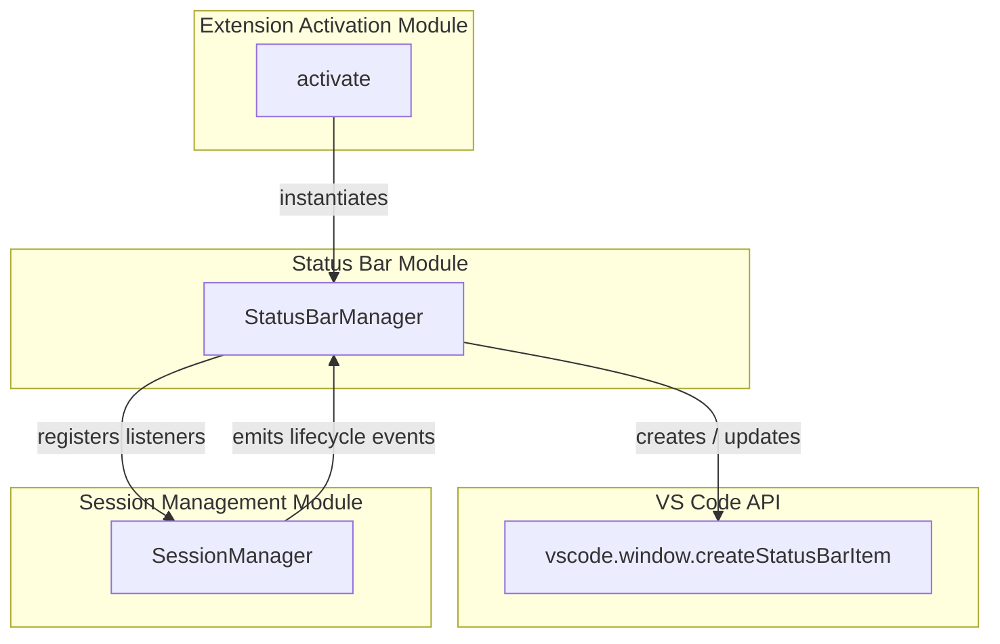
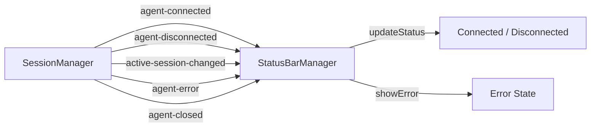
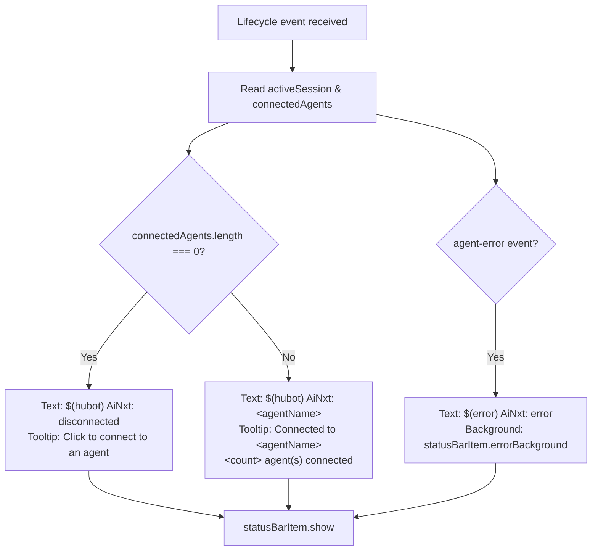
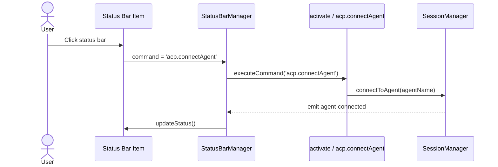
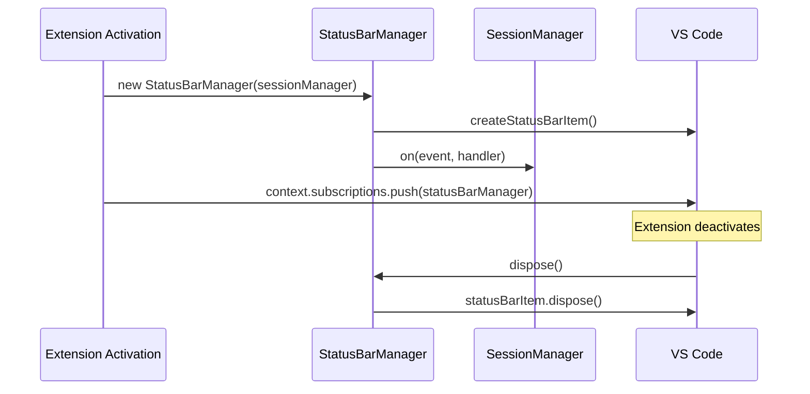
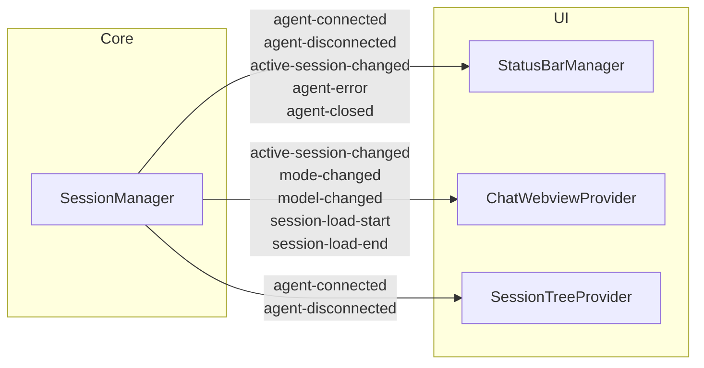

# Status Bar Module

The **status bar** module provides a compact, always-visible indicator of the AiNxt agent connection state inside the VS Code status bar. It translates low-level session lifecycle events into a single, user-friendly UI element that shows whether AiNxt is disconnected, connected to a specific agent, or in an error state. Clicking the item triggers the primary connection flow, making it both an indicator and a quick action entry point.

---

## Overview

`StatusBarManager` is a thin UI adapter that sits between the [session management](session_management.md) layer and VS Code's status bar API. It does not own connection logic, agent processes, or session history. Instead, it observes `SessionManager` events and renders the current state as a `vscode.StatusBarItem`.

The module is intentionally small and focused: it reduces the entire connection surface to three visual states and one user action. This keeps the status bar predictable while still surfacing enough detail (agent display name, number of connected agents, active session) for users to understand what is running.

---

## Responsibilities

- Render a persistent status bar item aligned to the left of the VS Code status bar.
- Display one of three states:
  - **Disconnected** — no agents connected; clicking starts the connection flow.
  - **Connected** — shows the active agent's display name and a tooltip with the connection count.
  - **Error** — highlighted with the error background color when an agent error occurs.
- React to session lifecycle events emitted by `SessionManager`.
- Dispose of the status bar item when the extension shuts down.

---

## Architecture

`StatusBarManager` is instantiated once during extension activation and registered as a disposable in the extension context. It depends only on `SessionManager` for state and on the VS Code API for rendering.

---

## Core Components

### `StatusBarManager`

Located in `vscode-acp/src/ui/StatusBarManager.ts`.

| Member | Type | Purpose |
|--------|------|---------|
| `statusBarItem` | `vscode.StatusBarItem` | The rendered status bar item. Created in the constructor and disposed on shutdown. |
| `constructor(sessionManager)` | — | Creates the status bar item, binds the `acp.connectAgent` command, performs the initial render, and subscribes to `SessionManager` events. |
| `updateStatus()` | private | Reads the active session and connected agent list from `SessionManager`, then updates text, tooltip, and background color. |
| `showError()` | private | Sets the error icon and applies the VS Code error background color. |
| `dispose()` | public | Disposes the underlying `vscode.StatusBarItem`. |

---

## Event-Driven Updates

`StatusBarManager` listens to five events from `SessionManager`. Each event maps to a deterministic UI update.

| Event | Handler | Visual Result |
|-------|---------|---------------|
| `agent-connected` | `updateStatus()` | Connected state with agent name. |
| `agent-disconnected` | `updateStatus()` | Falls back to disconnected or next connected agent. |
| `active-session-changed` | `updateStatus()` | Updates the displayed agent name to match the active session. |
| `agent-error` | `showError()` | Error icon and error background color. |
| `agent-closed` | `updateStatus()` | Re-evaluates connection state after an agent exits. |

The status bar item is always shown after an update so it remains visible once the extension has activated.

---

## Status Rendering Logic

When at least one agent is connected, the displayed name is resolved in this order:

1. `activeSession.agentDisplayName` — the human-friendly title returned by the agent during initialization.
2. `connectedAgents[0]` — the configured agent name, used as a fallback when no active session exists.

The tooltip includes both the active agent name and the total number of connected agents, which is useful when multiple agents are managed through the [session tree](session_tree.md).

---

## User Interaction

The status bar item is clickable and bound to the `acp.connectAgent` command. This command is defined in the [extension activation](extension_activation.md) module and handles:

- Prompting the user to select an agent if none is specified.
- Confirming agent switches when chat content would be lost.
- Executing `SessionManager.connectToAgent()` to establish the connection.

Because the status bar item delegates to this command, users can reconnect from anywhere in the IDE without opening the chat panel or session tree.

---

## Lifecycle and Disposal

`StatusBarManager` follows the standard VS Code disposable pattern. During activation it is pushed into `context.subscriptions`, so VS Code disposes it automatically when the extension deactivates. The `dispose()` method releases the native status bar item.

---

## Dependencies

### Direct Dependencies

| Dependency | Module | Role |
|------------|--------|------|
| `SessionManager` | [session_management](session_management.md) | Source of truth for active sessions, connected agents, and lifecycle events. |
| `vscode.StatusBarItem` | VS Code API | Native status bar rendering surface. |
| `acp.connectAgent` command | [extension_activation](extension_activation.md) | Command executed when the user clicks the status bar item. |

### Related UI Modules

| Module | Relationship |
|--------|--------------|
| [chat_webview](chat_webview.md) | Also listens to `SessionManager` events; the status bar provides a compact summary of the same state shown in the chat panel. |
| [session_tree](session_tree.md) | Renders the full list of agents and sessions; the status bar shows only the active/connected summary. |

---

## Data Flow

`StatusBarManager` is one of several UI consumers of `SessionManager` events. It receives the same events as the chat webview and session tree but interprets them only for status bar rendering. This keeps the module decoupled from the richer UI logic in the chat webview.

---

## Error Handling

The module does not attempt to recover from errors itself. When `SessionManager` emits `agent-error`, `StatusBarManager` immediately switches the status bar item to the error state. The user can click the item to re-run the connection command, which will trigger the full connection and authentication flow managed by [session_management](session_management.md).

---

## Extensibility Considerations

Because the status bar item is intentionally minimal, future enhancements should preserve its single-purpose design:

- Adding a context menu can be done by registering additional commands and contributing them through the extension manifest, not by expanding `StatusBarManager`.
- Animating the icon during connection can be achieved by listening to a new `agent-connecting` event from `SessionManager` without changing the core rendering logic.
- Supporting multiple active sessions would primarily affect the tooltip and click behavior; the current text already falls back to the first connected agent name.

---

## Summary

The status bar module is a lightweight observer of the AiNxt session lifecycle. By delegating all connection logic to [session_management](session_management.md) and all command handling to [extension_activation](extension_activation.md), it remains a focused presentation layer. It gives users a persistent, clickable summary of whether AiNxt is connected and, if so, to which agent.
