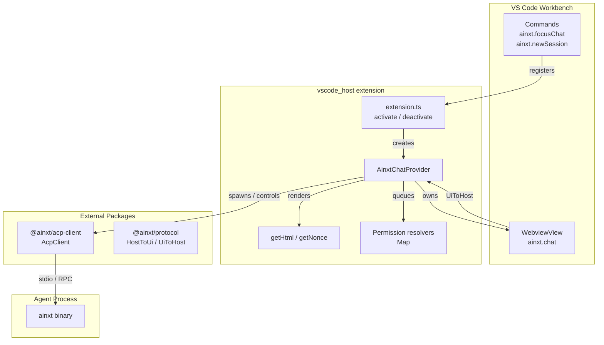
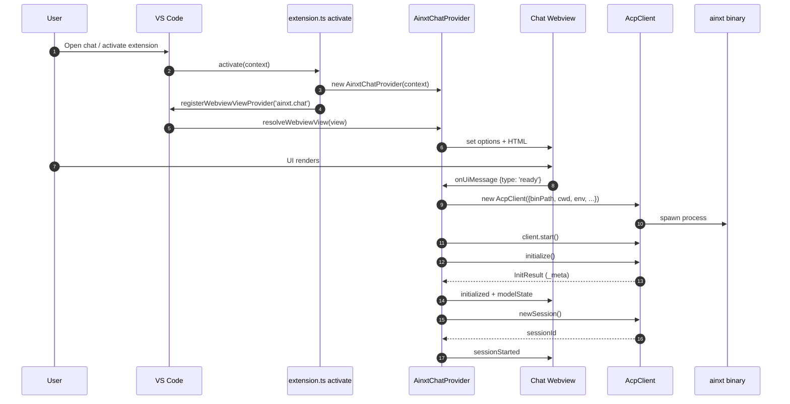
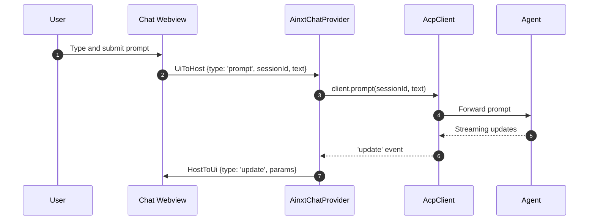
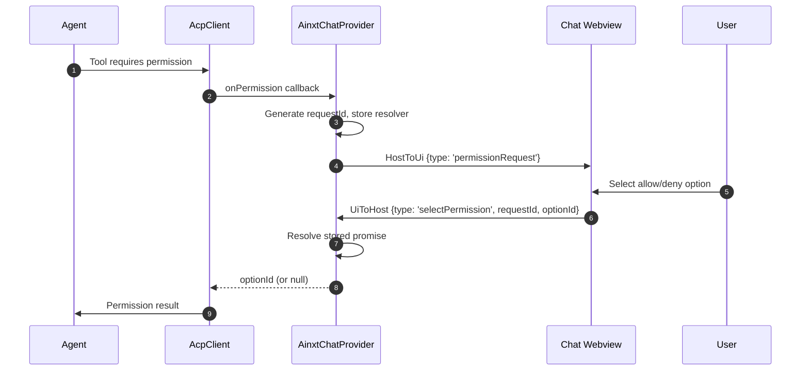
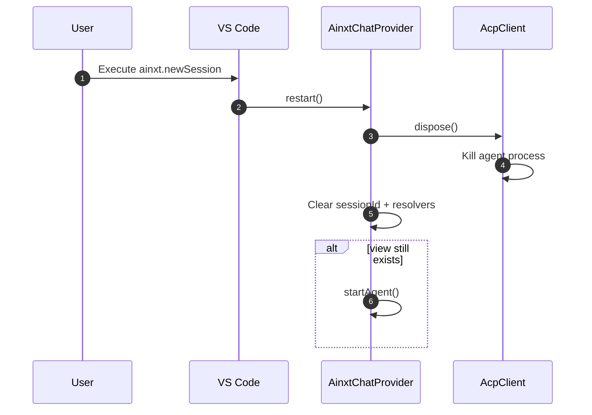

# vscode_host

The `vscode_host` module is the Visual Studio Code extension entry point for the Ainxt IDE integration. It provides a lightweight chat panel inside VS Code, bootstraps the local `ainxt` agent binary through the `@ainxt/acp-client` package, and bridges messages between the webview UI and the running agent.

This module intentionally keeps host-side logic minimal: session management, tool execution, file system access, and terminal handling are delegated to the external `AcpClient` and the agent process it spawns. For a more feature-rich VS Code host that implements these concerns directly in TypeScript, see the [`vscode_acp`](vscode_acp.md) module. The IntelliJ-based equivalent is documented in [`intellij_host`](intellij_host.md).

---

## Module Purpose and Core Functionality

`vscode_host` is responsible for:

1. **Extension activation** – Registers a `WebviewViewProvider`, focus command, and new-session command with VS Code.
2. **Chat webview hosting** – Builds the webview HTML from built assets in `media/assets`, applies a strict Content Security Policy, and loads the chat UI.
3. **Agent lifecycle** – Spawns the `ainxt` binary via `AcpClient`, initializes the connection, creates a new session, and tears everything down on dispose.
4. **UI ↔ agent bridging** – Receives `UiToHost` messages (prompts, cancellations, model selection, slash commands, permission answers) and forwards them to `AcpClient`; forwards agent `update`, `exit`, and permission requests back to the UI as `HostToUi` messages.
5. **Permission mediation** – Displays permission requests from the agent in the webview and resolves the agent's promise once the user selects an option.
6. **Configuration passthrough** – Reads VS Code settings (`ainxt.binaryPath`, `ainxt.gatewayUrl`, `ainxt.apiBaseUrl`) and injects them as environment variables or the executable path for the agent.

---

## Architecture Overview

The architecture is a thin adapter layer: `AinxtChatProvider` adapts the VS Code webview API to the `AcpClient` API. All heavy lifting (agent process management, ACP protocol serialization, tool implementations) lives in `@ainxt/acp-client` and the agent binary.

---

## Key Components

### `activate(context: vscode.ExtensionContext)`

Entry point called by VS Code when the extension loads. It:

- Instantiates `AinxtChatProvider`.
- Registers the webview view provider for the view ID `ainxt.chat`.
- Registers two commands:
  - `ainxt.focusChat` – reveals the chat view.
  - `ainxt.newSession` – disposes the current agent and starts a fresh session.

All registrations are pushed into `context.subscriptions` so VS Code cleans them up on deactivation.

### `deactivate()`

Currently a no-op. Cleanup is performed by `AinxtChatProvider.dispose()` when the webview is closed or a new session is requested.

### `AinxtChatProvider`

The central provider implementing `vscode.WebviewViewProvider`.

| Member | Responsibility |
|--------|----------------|
| `view` | Reference to the active `WebviewView`. |
| `client` | Active `AcpClient` instance. Only one client is kept at a time. |
| `sessionId` | Current ACP session identifier returned by `client.newSession()`. |
| `permResolvers` | Map from generated permission request IDs to promise resolvers. |
| `permSeq` | Monotonically increasing counter for permission request IDs. |

#### `resolveWebviewView(view)`

Called by VS Code when the chat view becomes visible. It:

1. Stores the view reference.
2. Configures the webview to allow scripts and restricts local resource roots to `media/`.
3. Generates the HTML via `getHtml()`.
4. Subscribes to `onDidReceiveMessage` for UI messages and `onDidDispose` for cleanup.

#### `startAgent()`

Idempotent agent bootstrap routine. If a client already exists, it returns immediately. Otherwise it:

1. Reads VS Code configuration for `binaryPath`, `gatewayUrl`, and `apiBaseUrl`.
2. Determines the working directory from the first workspace folder, `$HOME`, or `process.cwd()`.
3. Builds an `env` record with optional `AINXT_GATEWAY_URL` and `AINXT_API_BASE_URL`.
4. Constructs `AcpClient` with logging and permission callbacks.
5. Wires `update` and `exit` event handlers.
6. Starts the client, calls `initialize()`, posts initialization metadata (agent version, slash commands, model state) to the UI, and creates a new session.

Errors during startup are caught and posted to the UI as an `error` message.

#### `onUiMessage(msg: UiToHost)`

Message dispatcher for UI events:

| Message | Action |
|---------|--------|
| `ready` | Triggers `startAgent()`. |
| `prompt` | Forwards `client.prompt(sessionId, text)`. |
| `cancel` | Calls `client.cancel(sessionId)`. |
| `newSession` | Calls `restart()`. |
| `selectPermission` | Resolves the pending permission promise. |
| `setModel` | Calls `client.setModel(sessionId, modelId)`. |
| `runCommand` | Sends a slash command prompt (`/<name> <input>`). |

#### `requestPermission(req)`

Implements the user-in-the-loop permission flow:

1. Generates a unique request ID.
2. Posts a `permissionRequest` message to the webview with the ID, options, and tool call details.
3. Returns a `Promise<string | null>` that resolves when the user selects an option or the request is cancelled.

The resolver is stored in `permResolvers` and removed once answered.

#### `restart()` / `dispose()`

`restart()` disposes the current client and session, then re-starts the agent if the view is still available. `dispose()` releases the `AcpClient`, clears state, and drops all pending permission resolvers.

### `getHtml(webview, mediaRoot)`

Dynamically builds the webview HTML:

- Reads `media/assets` to discover the bundled JS and CSS files.
- Generates a random nonce with `getNonce()`.
- Converts local asset paths to webview URIs.
- Constructs a strict CSP:
  - `default-src 'none'`
  - `img-src ${cspSource} data:`
  - `style-src ${cspSource} 'unsafe-inline'`
  - `font-src ${cspSource}`
  - `script-src 'nonce-${nonce}'`

If the media assets have not been built yet, the HTML will simply lack the script/style links and the webview will show an empty root container.

### `toModelInfo(m)`

Normalizes an unknown model descriptor from the agent into the `ModelInfo` shape expected by the UI. It prefers `modelId`, falls back to `id`, and uses `name` when available.

### `getNonce()`

Generates a 32-character alphanumeric nonce used for CSP and script tag integrity.

---

## Data Flows

### Extension Activation and Agent Startup

### Sending a Prompt

### Permission Request Flow

### New Session / Dispose

---

## Configuration

The module reads the VS Code configuration namespace `ainxt`:

| Setting | Default | Purpose |
|---------|---------|---------|
| `ainxt.binaryPath` | `ainxt` | Executable used to spawn the agent. |
| `ainxt.gatewayUrl` | – | If set, injected as `AINXT_GATEWAY_URL` in the agent environment. |
| `ainxt.apiBaseUrl` | – | If set, injected as `AINXT_API_BASE_URL` in the agent environment. |

The working directory for the agent is chosen in this order:

1. First workspace folder path.
2. `process.env.HOME`.
3. `process.cwd()`.

---

## Dependencies

### Runtime Dependencies

- **VS Code Extension API** (`vscode`) – Webview views, commands, configuration, lifecycle.
- **Node.js built-ins** (`node:fs`, `node:path`) – Asset discovery and path handling.
- **`@ainxt/acp-client`** – External ACP client that manages the agent process and protocol.
- **`@ainxt/protocol`** – Shared TypeScript types for `HostToUi`, `UiToHost`, `ModelInfo`, `SlashCommand`.

### Module Relationships

- **[`vscode_acp`](vscode_acp.md)** – A more advanced VS Code host that re-implements ACP client logic, session management, agent spawning, file/terminal handlers, and a richer webview UI directly inside the extension. `vscode_host` is the minimal alternative.
- **[`intellij_host`](intellij_host.md)** – The IntelliJ/Android Studio equivalent host. It solves the same problem (IDE chat panel + agent bridge) on the IntelliJ platform.

---

## Security Considerations

- **Content Security Policy:** The webview uses a nonce-based CSP that only allows scripts from the exact nonce and local assets. Inline styles are permitted with `'unsafe-inline'`; this could be tightened if the bundled UI moves all styles to the external CSS file.
- **Local Resource Roots:** Only the extension's `media` directory is exposed to the webview.
- **Permission Mediation:** All agent tool permissions are explicitly surfaced to the user through the webview. The host never auto-approves a permission request.
- **Environment Variables:** Sensitive URLs are passed through environment variables rather than command-line arguments, reducing exposure in process listings.

---

## Error Handling

- If the agent fails to start (e.g., binary missing, not authenticated, gateway unreachable), `startAgent()` catches the error and posts a user-friendly `error` message to the webview suggesting `ainxt login` or `AINXT_API_KEY` setup.
- Individual message handlers (prompt, setModel, runCommand) swallow errors with `.catch(() => {})` or post the error message to the UI, preventing unhandled promise rejections from crashing the extension.
- If the agent process exits, the `exit` event handler clears the client and session state so a subsequent `restart()` can spawn a new process.

---

## Extension Lifecycle

1. **Install / Activate** – VS Code loads `extension.ts` and calls `activate()`.
2. **View Resolution** – When the user opens the Ainxt chat sidebar, VS Code calls `resolveWebviewView()`.
3. **UI Ready** – The webview posts `ready`; the provider starts the agent.
4. **Running** – User prompts and agent updates flow back and forth.
5. **New Session** – `ainxt.newSession` disposes the old agent and starts a new one.
6. **Deactivate / Dispose** – VS Code calls `deactivate()`; the provider's `dispose()` releases the agent and clears state.

---

## See Also

- [`vscode_acp`](vscode_acp.md) – Full-featured VS Code ACP host with built-in session, agent, file, terminal, and UI management.
- [`intellij_host`](intellij_host.md) – IntelliJ platform host implementation.
