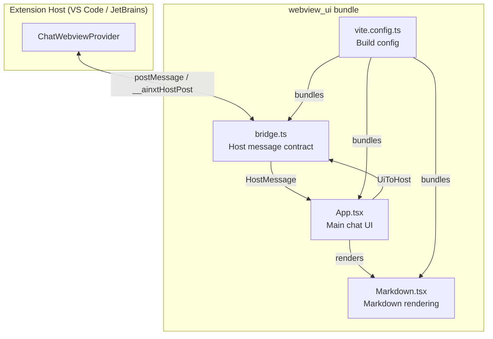
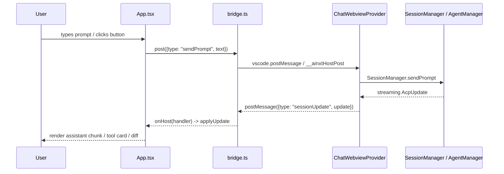

# webview_ui Module

The `webview_ui` module is the front-end view layer of the AiNxt IDE extension. It is a React + TypeScript application that runs inside the VS Code webview (and can also run inside JetBrains JCEF via a compatibility bridge). Its sole responsibility is to render the chat interface, display agent messages and tool output, collect user input, and exchange messages with the extension host.

## Purpose

- Provide a modern, keyboard-friendly chat UI for interacting with the AiNxt agent.
- Render streaming assistant responses, tool calls, diffs, plans, subagent progress, and permission/ask/plan-approval dialogs.
- Communicate with the extension host through a thin, host-agnostic message bridge.
- Support both VS Code webviews and JetBrains JCEF tool windows from the same bundle.

## Architecture Overview

The module is intentionally thin: all business logic (session management, agent spawning, file system operations, terminal handling) lives in sibling modules such as [`session_management`](../extension/session-management/README.md), [`agent_management`](../extension/agent-management/README.md), and [`handlers`](../extension/handlers/README.md). The webview UI only renders state and forwards user actions to the host.

## Sub-modules

| Sub-module | File(s) | Responsibility |
|------------|---------|----------------|
| [webview_ui_bridge](bridge.md) | `bridge.ts` | Defines the host ↔ UI message contract and abstracts `vscode.postMessage` vs JetBrains `__ainxtHostPost`. |
| [webview_ui_app](app.md) | `App.tsx` | Main React application: message list, composer, activity indicators, permission/ask/plan dialogs, diff views, status bar. |
| [webview_ui_markdown](markdown.md) | `Markdown.tsx` | Renders agent markdown with syntax highlighting, GitHub-flavored markdown, and copy-to-clipboard code blocks. |
| [webview_ui_build](build.md) | `vite.config.ts` | Vite build configuration that emits a predictable single JS/CSS bundle for the extension to load. |

## Data Flow

## Host Compatibility

The same `webview_ui` bundle is loaded by:

- **VS Code**: `ChatWebviewProvider` injects the bundled JS/CSS via `asWebviewUri` and communicates through `vscode.postMessage`.
- **JetBrains IntelliJ**: `AinxtToolWindowFactory` loads the same bundle in a JCEF browser and injects `window.__ainxtHostPost` as the bridge.

See [`extension_ui`](../extension/ui.md) and [`intellij_host`](../intellij/README.md) for how each host loads and drives this UI.

## Key Design Decisions

1. **Host-agnostic bridge**: `bridge.ts` prefers `window.__ainxtHostPost` for JetBrains, falls back to `vscode.postMessage` for VS Code, and finally to `window.parent.postMessage` for browser development. This lets one bundle serve multiple hosts.
2. **Single source of truth**: The extension host owns session state; the UI only mirrors it. User actions are sent as messages, not local state mutations.
3. **Streaming updates**: `AcpUpdate` messages are applied incrementally so the user sees assistant text, tool progress, subagent status, and plan updates in real time.
4. **Inline diffs**: File edits are rendered inline with line-level LCS diffs and can open the file or a side-by-side diff in the host.
5. **Predictable build output**: `vite.config.ts` disables hashed filenames so the extension can reference `assets/main.js` and `assets/main.css` reliably.

## Dependencies

- **React** + **Vite**: UI framework and build tool.
- **highlight.js** / **rehype-highlight**: Syntax highlighting for code blocks and diff views.
- **react-markdown** + **remark-gfm**: Markdown rendering.
- **Extension host**: [`ChatWebviewProvider`](../extension/ui.md) (VS Code) or [`AinxtToolWindowFactory`](../intellij/README.md) (IntelliJ).
- **Core logic modules**: [`session_management`](../extension/session-management/README.md), [`agent_management`](../extension/agent-management/README.md), [`handlers`](../extension/handlers/README.md).

## Related Documentation

Detailed documentation for each sub-module:

- [webview_ui_bridge](bridge.md) — host ↔ UI message contract and cross-IDE bridge.
- [webview_ui_app](app.md) — main chat UI, composer, diff rendering, and dialogs.
- [webview_ui_markdown](markdown.md) — markdown rendering with syntax highlighting.
- [webview_ui_build](build.md) — Vite build configuration for the webview bundle.
