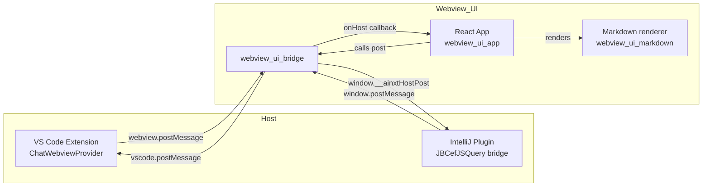
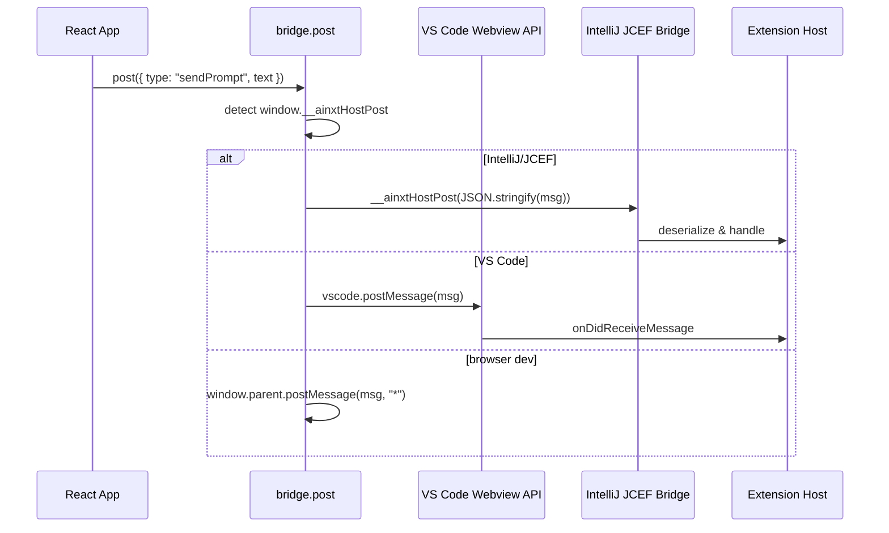
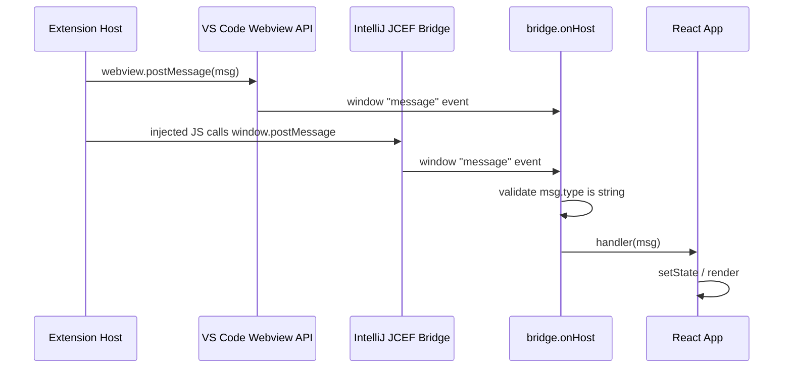
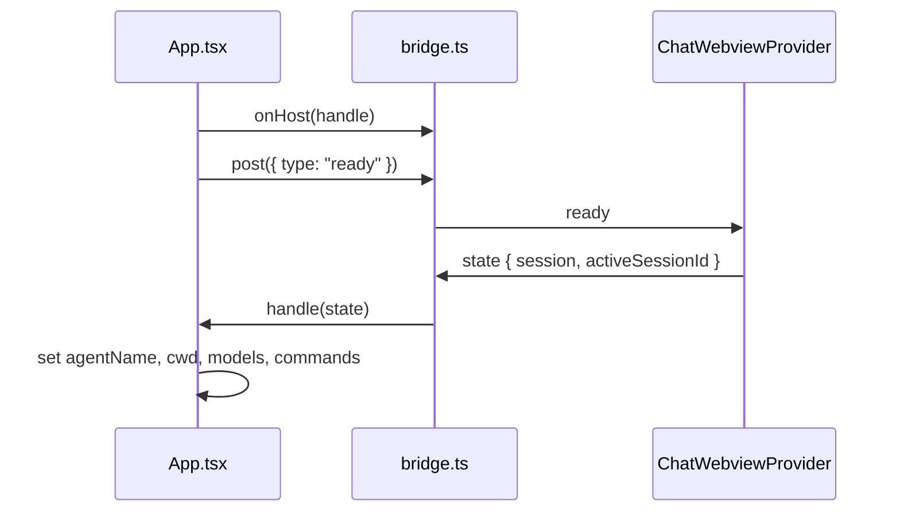
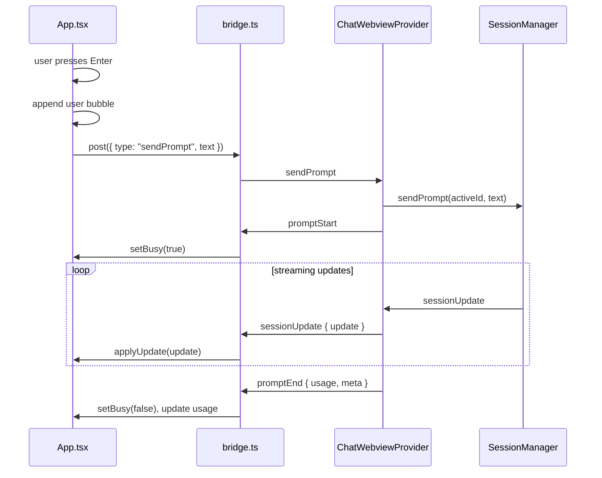
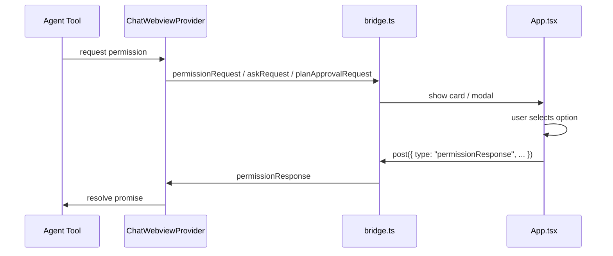
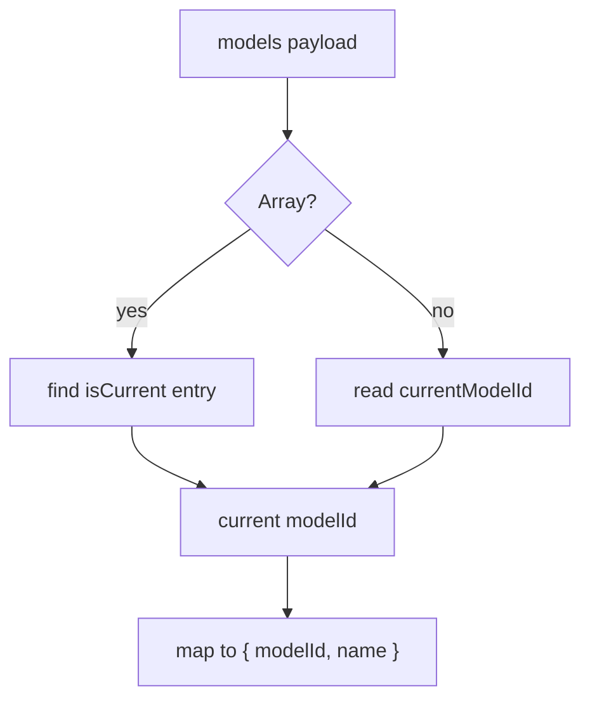

# webview_ui_bridge

The `webview_ui_bridge` module is the thin, host-agnostic communication layer that lets the React-based AiNxt chat UI run inside both the VS Code webview and the IntelliJ/JCEF tool window. It is implemented as a single TypeScript file (`vscode-acp/webview-ui/src/bridge.ts`) that defines the message contract, serializes outgoing UI actions, and dispatches incoming host notifications.

## Purpose

- Provide a **single source of truth** for the `postMessage` contract between the webview UI and the extension host.
- Make the React UI **portable** across VS Code and JetBrains IDEs without host-specific branches in the view code.
- Offer lightweight helpers (`normalizeModels`, `onHost`, `post`) that the rest of the webview UI consumes.

## Core Components

### `post`

Sends a message from the webview UI to the extension host. It tries three transports in order:

1. `window.__ainxtHostPost` — the JCEF bridge injected by the IntelliJ plugin.
2. `vscode.postMessage` — the VS Code webview API.
3. `window.parent.postMessage(..., "*")` — a browser-development fallback.

This priority order is what makes the same bundled UI work in both VS Code and IntelliJ.

### `onHost`

Registers a listener for messages coming from the extension host. It wraps `window.addEventListener("message", ...)` and returns an unsubscribe function. The listener validates that the event data is an object with a `type` string before forwarding it.

### `normalizeModels`

The host can send model state in two shapes: an object with `currentModelId`/`availableModels`, or an array where the current model is flagged with `isCurrent`. `normalizeModels` collapses both into a consistent `{ current, list }` shape used by the model picker in [webview_ui_app](app.md).

### Message Types

#### `UiToHost`

A discriminated union of every action the UI can initiate. Examples include:

- Lifecycle: `ready`
- Chat: `sendPrompt`, `cancelTurn`
- Configuration: `setModel`, `setMode`, `setConfigOption`
- Context: `pickFiles`, `attachPath`, `attachFolder`, `attachProblems`, `attachGit`
- Navigation: `openFile`, `openDiff`, `openSettings`
- Connection: `saveConnection`, `signOut`
- Interactive approvals: `permissionResponse`, `askResponse`, `planApprovalResponse`

#### `HostMessage`

A broad interface for host → UI messages. Key fields include:

- `type` — discriminant for routing.
- `session` / `activeSessionId` — current session snapshot.
- `update` — an `AcpUpdate` streamed during a turn.
- `models`, `modes`, `configOptions` — configuration state.
- `permissionRequest`, `askRequest`, `planApprovalRequest` — interactive prompts.
- `budget`, `workspaceFiles`, `threads`, `checkpoint` — auxiliary state.

#### `SessionState`

A snapshot of the active session exposed to the UI: `sessionId`, `agentName`, `title`, `cwd`, plus the configuration fields `modes`, `models`, `configOptions`, and `availableCommands`.

#### `AcpUpdate`

A wrapper around agent session notifications. The `sessionUpdate` field is the discriminant (e.g. `agent_message_chunk`, `tool_call`, `plan`, `available_commands_update`). Additional fields such as `content`, `toolCallId`, `title`, `status`, and `entries` carry update-specific data.

#### `AskQuestion`

Represents one question from the `ainxt.dev/ask_user_question` tool. Contains the question text, selectable options, and whether multiple selections are allowed.

## Architecture

The bridge sits between the host-specific transports and the React application. All host-specific details are encapsulated in `post` and `onHost`; the rest of the UI consumes only the typed `HostMessage` and `UiToHost` contracts.

## Data Flow

### Outgoing: UI → Host

### Incoming: Host → UI

## Component Interactions

- [webview_ui_app](app.md) imports `post`, `onHost`, `normalizeModels`, and the type interfaces to drive the chat UI.
- [chat_webview](../extension/chat-webview/README.md) (`ChatWebviewProvider`) is the VS Code host counterpart: it receives `UiToHost` messages and emits `HostMessage` notifications.
- [session_management](../extension/session-management/README.md) produces the `AcpUpdate` stream that the bridge forwards as `sessionUpdate` messages.
- [agent_management](../extension/agent-management/README.md) owns the tools whose progress and permission requests surface through the bridge as `permissionRequest`, `askRequest`, and `planApprovalRequest` messages.
- [webview_ui_markdown](markdown.md) renders assistant messages locally but does not use the bridge directly.

## Process Flows

### Initial Load

### Sending a Prompt

### Interactive Approval (Permission / Ask / Plan)

## Configuration & Model Normalization

The host may send model lists in legacy or modern shapes. `normalizeModels` ensures the UI always receives a uniform object:

This lets [webview_ui_app](app.md) render the model picker without caring which host produced the payload.

## Security & Portability Notes

- The bridge does not execute or evaluate message content; it only serializes/deserializes JSON and validates the `type` field.
- The browser-dev fallback (`window.parent.postMessage(..., "*")`) is intended for local development and is the least restrictive transport.
- In production, VS Code and IntelliJ enforce their own content-security policies and origin restrictions around the webview.

## Related Modules

- [webview_ui_app](app.md) — React application that consumes this bridge.
- [webview_ui_markdown](markdown.md) — markdown rendering used by the chat UI.
- [chat_webview](../extension/chat-webview/README.md) — VS Code host provider that implements the other side of this contract.
- [session_management](../extension/session-management/README.md) — produces session updates forwarded through the bridge.
- [agent_management](../extension/agent-management/README.md) — owns agent tools whose progress and approvals are surfaced through the bridge.
