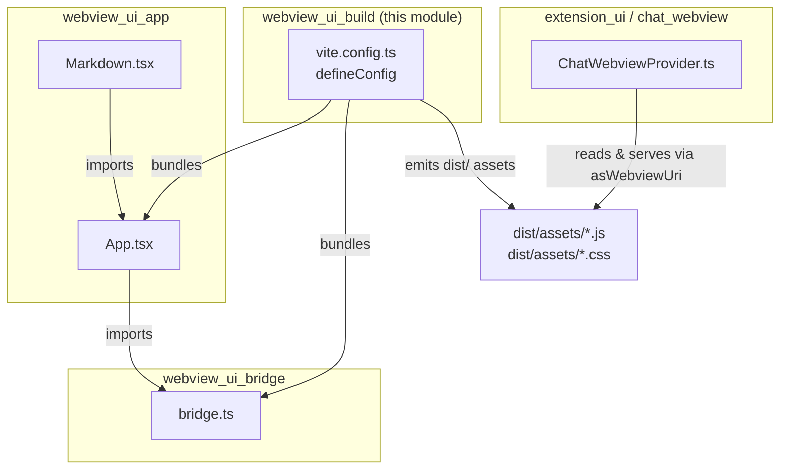
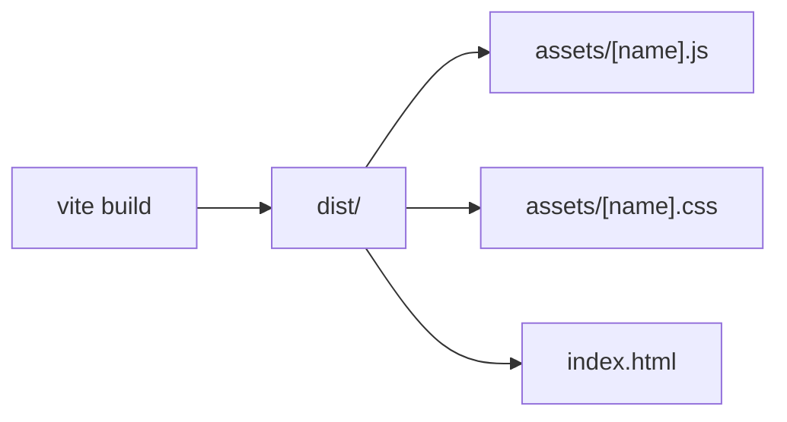
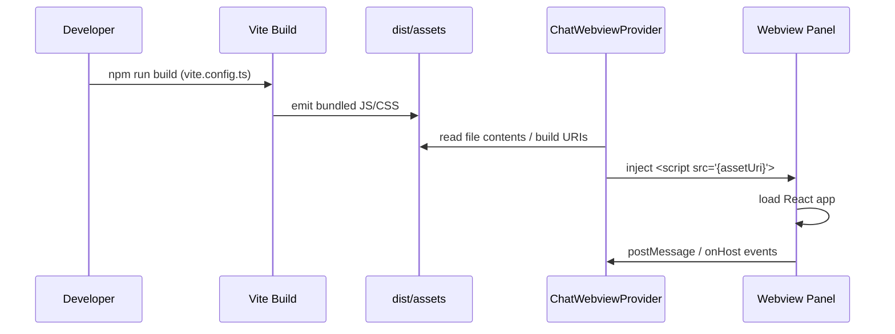

# webview_ui_build

The `webview_ui_build` module provides the build configuration for the AiNxt chat webview UI. It is a thin but critical layer that transforms the React-based webview source code into a deterministic set of static assets that the VS Code extension can load into a webview panel via `asWebviewUri`.

## Purpose

The webview UI is implemented as a standalone React application under `vscode-acp/webview-ui/`. This module owns the Vite configuration that:

- Bundles the React application and its dependencies.
- Emits a predictable, flat asset structure (`assets/[name].js`, `assets/[name].css`).
- Uses relative paths (`base: "./"`) so the extension can serve the files from the webview's local URI regardless of the exact resource path.
- Cleans the output directory on each build to avoid stale artifacts.

In short, `vite.config.ts` is the bridge between the webview UI source code and the runtime loading logic in the extension host.

## Architecture



### Component Overview

| Component | File | Responsibility |
|-----------|------|----------------|
| `defineConfig` | `vscode-acp/webview-ui/vite.config.ts` | Vite build configuration: React plugin, relative base URL, deterministic output file names, and clean output directory. |

## Build Output

The configuration intentionally produces a flat, deterministic asset layout:



Key settings:

- `base: "./"` — All generated asset URLs are relative, which is required because the webview runs in a sandboxed `vscode-webview://` origin and the extension resolves the actual URI at runtime.
- `emptyOutDir: true` — Prevents old hashed or renamed files from accumulating across builds.
- `entryFileNames`, `chunkFileNames`, `assetFileNames` — Force stable names without content hashes so the extension's HTML template can reference them without needing to parse a manifest.

## Data Flow



## Relationship to Other Modules

- [webview_ui_app](app.md) — The React components (`App.tsx`, `Markdown.tsx`) that this build configuration bundles.
- [webview_ui_bridge](bridge.md) — The message bridge (`bridge.ts`) that is bundled alongside the UI and handles communication between the webview and the extension host.
- [chat_webview](../extension/chat-webview/README.md) — The extension-side provider (`ChatWebviewProvider.ts`) that loads the built assets into the webview panel using `getHtmlContent` and `asWebviewUri`.

## How It Fits Into the System

The VS Code extension cannot directly serve arbitrary files to a webview. Instead, `ChatWebviewProvider` reads the built files from the extension's disk location and converts them to webview-safe URIs. Because the file names are stable (no content hash), the provider can construct the HTML template with fixed paths such as `assets/index.js` and `assets/index.css`. The relative `base` ensures those paths resolve correctly inside the webview sandbox.

> **Note:** This module does not contain runtime logic. For details on how the webview is initialized, how messages are exchanged, or how the UI state is managed, see the linked modules above.

## Configuration Reference

```typescript
import { defineConfig } from "vite";
import react from "@vitejs/plugin-react";

export default defineConfig({
  plugins: [react()],
  base: "./",
  build: {
    outDir: "dist",
    emptyOutDir: true,
    rollupOptions: {
      output: {
        entryFileNames: "assets/[name].js",
        chunkFileNames: "assets/[name].js",
        assetFileNames: "assets/[name].[ext]",
      },
    },
  },
});
```

### Option Explanations

| Option | Value | Why It Matters |
|--------|-------|----------------|
| `plugins` | `[react()]` | Enables React Fast Refresh and JSX/TSX transpilation during development and production builds. |
| `base` | `"./"` | Ensures all emitted asset references are relative, which is required for `asWebviewUri` resolution. |
| `build.outDir` | `"dist"` | Matches the directory the extension expects to load assets from. |
| `build.emptyOutDir` | `true` | Guarantees a clean build with no stale assets. |
| `rollupOptions.output.*FileNames` | `assets/[name].js` / `assets/[name].[ext]` | Produces stable, predictable file names without content hashes. |

## Development Notes

- Do not add content hashes to the output file names unless `ChatWebviewProvider` is also updated to discover the hashed names (e.g., by parsing a manifest).
- Keep `base` relative. An absolute base would break asset loading inside the webview because the webview origin differs from the extension host origin.
- The build is typically invoked from the `webview-ui` package scripts; the extension package then includes the `dist` folder in its published artifact.
