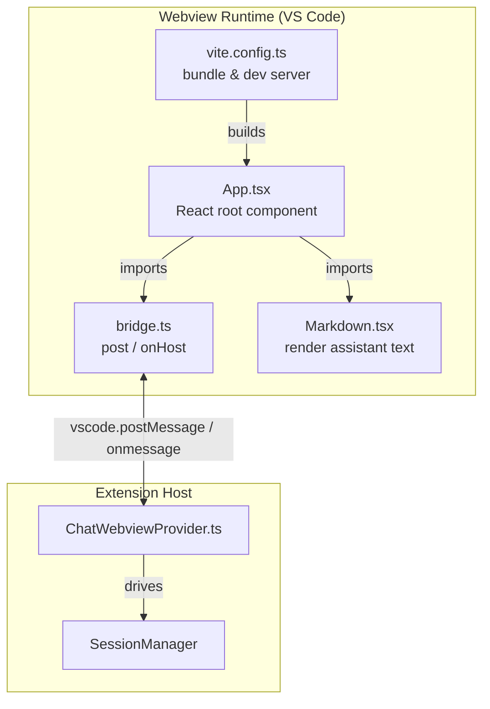
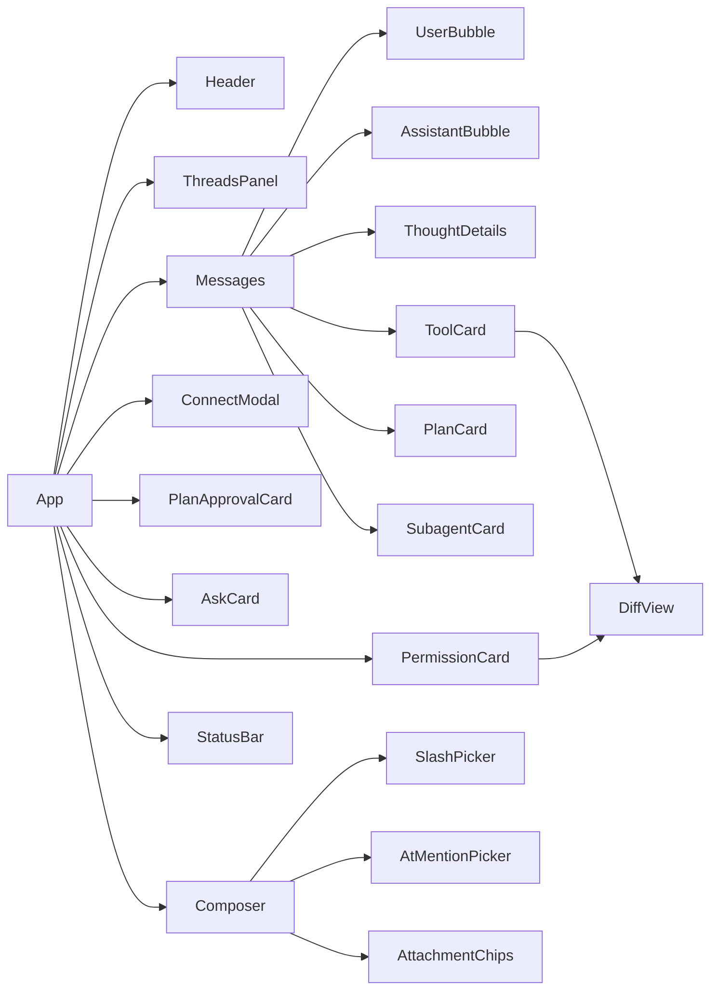
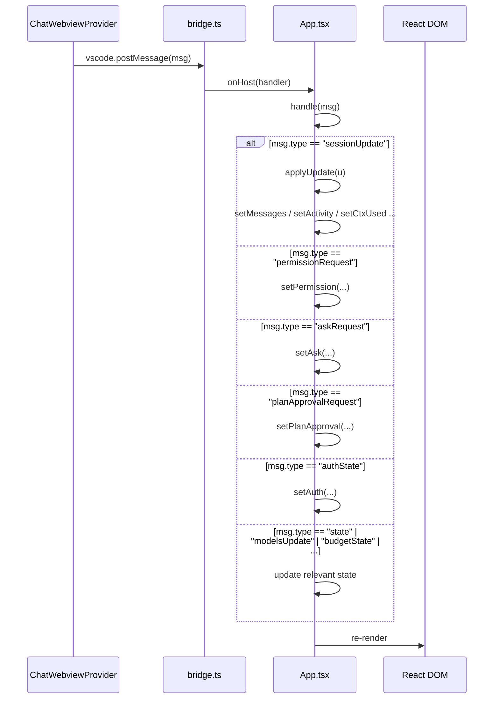
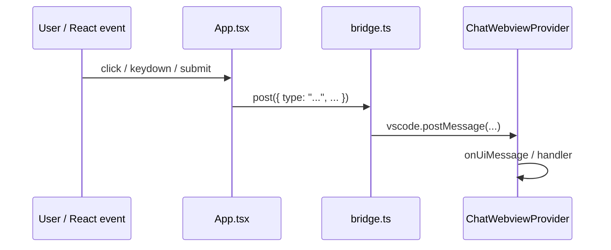
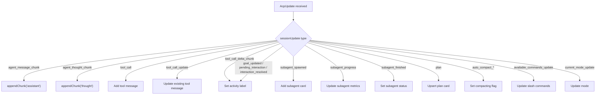
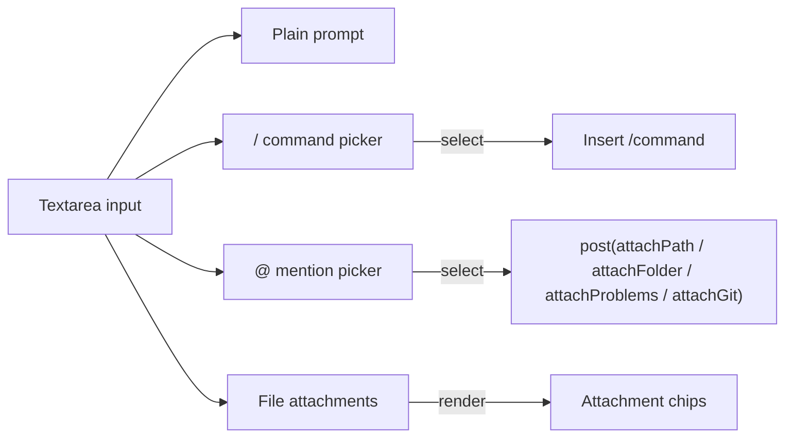
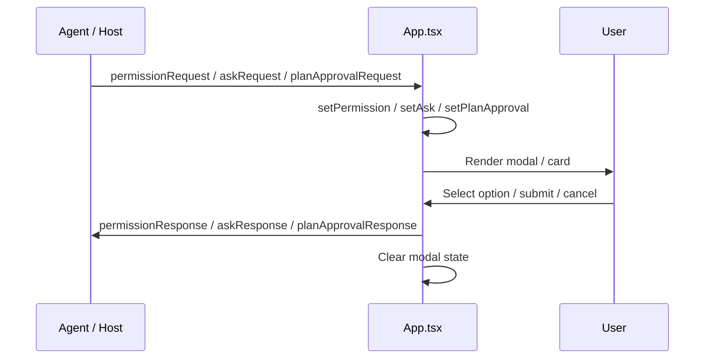
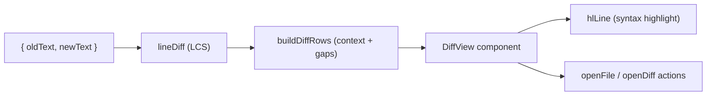

# webview_ui_app

The `webview_ui_app` module is the React front-end application that powers the AiNxt chat interface inside the VS Code webview panel. It renders the conversational UI, handles user input (prompts, slash commands, `@`-mentions, file attachments), displays agent messages, tool calls, subagent progress, plans, permission requests, and interactive diff views. The module communicates with the extension host through the [webview_ui_bridge](webview_ui_bridge.md) abstraction.

---

## Overview

`App.tsx` is the single top-level React component for the webview. It is bundled by the [webview_ui_build](webview_ui_build.md) Vite configuration and loaded by the [chat_webview](chat_webview.md) provider. The component is intentionally self-contained: all state lives in React hooks, and all host communication is routed through `post()` and `onHost()` from [webview_ui_bridge](webview_ui_bridge.md).

### Responsibilities

- Render the chat surface (header, message list, composer, status bar).
- Receive and apply session updates from the agent (text chunks, tool calls, plans, subagents, compactions).
- Send user prompts, command invocations, attachment requests, and interactive responses (permissions, asks, plan approvals, connection setup).
- Render code diffs inline using a custom line-level LCS diff algorithm and syntax highlighting.
- Expose `@`-mention and `/` command pickers for workspace context and available commands.
- Track and display token usage, context-window occupancy, budget state, and session totals.

---

## Architecture

The webview is a standard VS Code extension webview: the bundled React app runs in an isolated `<iframe>`, and all data exchange with the extension happens through `acquireVsCodeApi().postMessage` and the `window.message` event. The [webview_ui_bridge](webview_ui_bridge.md) module wraps this low-level transport so that `App.tsx` can remain transport-agnostic.

---

## Component Structure

### `App`

The root component. It owns all top-level state:

| State | Purpose |
|-------|---------|
| `messages` | Chat history: user, assistant, thought, tool, plan, and subagent messages. |
| `agentName`, `cwd` | Displayed session metadata. |
| `models` | Current model and available model list from the host. |
| `commands` | Slash commands exposed by the active agent. |
| `busy`, `loading`, `activity`, `elapsed` | Turn-in-progress indicators. |
| `error` | Transient error banner. |
| `usage`, `session`, `ctxUsed`, `ctxWindow`, `compacting` | Token accounting and context-window monitoring. |
| `budget`, `mode`, `canRestore` | Budget, plan mode, and checkpoint-restore state. |
| `threads`, `showThreads` | Conversation history list. |
| `permission`, `ask`, `planApproval` | Pending interactive requests from the agent. |
| `auth`, `showConnect`, `connForm` | Gateway authentication state and connection form. |
| `input`, `attachments`, `workspaceFiles` | Composer state and attachment data. |

### `DiffView`

Renders a single file change as a collapsible, syntax-highlighted diff. It uses `buildDiffRows` and `lineDiff` to compute a compact line-level diff with three lines of context around each change. Each diff card provides:

- **Open file** — jumps to the first changed line in the editor.
- **Side-by-side diff** — opens a full diff view in VS Code.
- Inline syntax highlighting via `highlight.js`.

### Helper Functions

| Function | Role |
|----------|------|
| `lineDiff` | Computes a line-level longest-common-subsequence diff between old and new text. Falls back when the problem size exceeds 4 million cell comparisons. |
| `buildDiffRows` | Converts raw diff ops into display rows, collapsing unchanged regions into `gap` rows with three lines of context around changes. |
| `textOf` | Extracts plain text from ACP content blocks (handles `text` and nested `content` types). |
| `diffsOf` | Extracts structured diff objects from ACP content blocks. |
| `hlLine` | Syntax-highlights a single line using `highlight.js` with language detection. |
| `langOf` | Maps file extensions to `highlight.js` language identifiers. |
| `contextWindowOf` | Reads the current model's `totalContextTokens` from the model list. |
| `fmtK` | Formats large token counts as `k`/`M` suffixed strings. |
| `uid` | Generates short unique message IDs. |
| `num` | Safely coerces unknown values to finite numbers. |
| `escapeHtml` | Escapes HTML entities for safe rendering. |

---

## Data Flow

### Incoming: Host → Webview

The `handle` function is the single entry point for all host messages. It dispatches by `msg.type` and updates React state accordingly. `sessionUpdate` messages are further routed through `applyUpdate`, which implements the fine-grained update protocol for streaming agent output.

### Outgoing: Webview → Host

Common outgoing message types produced by `App.tsx`:

| Message Type | Trigger |
|--------------|---------|
| `ready` | Component mount — tells the host the webview is ready for state. |
| `sendPrompt` | User sends a message. |
| `cancelTurn` | User clicks the stop button during a turn. |
| `newChat` | User clicks the new-chat button. |
| `setModel` | User changes the model dropdown. |
| `signOut` / `saveConnection` | Authentication actions. |
| `permissionResponse` | User resolves a permission request. |
| `askResponse` | User submits answers to an ask card. |
| `planApprovalResponse` | User approves, cancels, or abandons a plan. |
| `attachPath` / `attachFolder` / `attachProblems` / `attachGit` / `pickFiles` | Attachment actions. |
| `openFile` / `openDiff` | Diff card actions. |
| `restoreCheckpoint` | Undo edits from the current turn. |
| `listThreads` / `openThread` | Conversation history actions. |
| `openSettings` | Open extension settings. |

---

## Session Update Handling

`applyUpdate` is the heart of the streaming UI. It interprets `AcpUpdate` objects from the agent and mutates the message list incrementally.

Key design choices:

- **Streaming chunks are appended in place** — consecutive assistant or thought chunks merge into the same message bubble until the role changes.
- **Tool calls are first-class messages** — each tool invocation gets its own card with status, output, and inline diffs.
- **Plans evolve in place** — only the most recent plan card is updated; older plans remain in history.
- **Subagent cards show live progress** — turn count, tool count, tokens, context percentage, duration, and tools used.

---

## Composer Interactions

The composer at the bottom of the UI supports three input modes:

### Slash Commands

When the input starts with `/`, the composer filters `commands` (received via `available_commands_update`) and shows a picker. Selecting a command replaces the current token with `/{name} `.

### `@`-Mentions

A trailing `@query` token opens a picker with:

- Special items: `@problems` and `@git`.
- Workspace folders.
- Workspace files.

Selecting a file or folder sends an attachment request to the host. Special items trigger `attachProblems` or `attachGit`.

### Attachments

Files attached via the paper-clip button, `@`-mention, or host-initiated `filesAttached` messages are rendered as chips above the textarea. When a prompt is sent, attached file contents are injected as fenced code blocks so the model can read them.

---

## Permission, Ask, and Plan Approval Flows

The webview can be interrupted by three interactive request types. Each blocks the agent until the user responds.

- **Permission requests** may include inline diffs so the user can review exactly what the agent wants to change.
- **Ask requests** support single- and multi-select questions plus a free-text "Other" field.
- **Plan approval** lets the user approve the plan, request more planning (with optional feedback), or abandon it.

---

## Diff Rendering Pipeline

The diff pipeline is intentionally implemented in the UI layer rather than relying on an external diff library. This keeps the webview bundle small and avoids dependencies that may not run inside the webview's strict CSP environment.

---

## Dependencies

### Direct Imports

| Module | Imported Items | Purpose |
|--------|----------------|---------|
| [webview_ui_bridge](webview_ui_bridge.md) | `normalizeModels`, `onHost`, `post`, `AcpUpdate`, `AskQuestion`, `HostMessage`, `SessionState` | Host communication and message types. |
| [webview_ui_markdown](webview_ui_markdown.md) | `Markdown` | Render assistant messages and plan content. |
| `./logo-data` | `LOGO` | AiNxt logo data URL. |
| `highlight.js` | `hljs` | Syntax highlighting for diff lines. |
| `react` | Hooks | Component state and effects. |

### Host-Side Counterparts

| Module | Role |
|--------|------|
| [chat_webview](chat_webview.md) | Owns the webview, serializes state, and forwards user actions to [session_management](session_management.md) and [agent_management](agent_management.md). |
| [session_management](session_management.md) | Manages agent sessions and emits the `sessionUpdate` stream consumed by `App.tsx`. |
| [agent_management](agent_management.md) | Spawns agents and handles tool execution; produces tool-call and subagent updates. |
| [handlers](handlers.md) | Implements file-system, terminal, permission, and session-update handlers invoked on behalf of the agent. |

---

## Build and Runtime Context

The `App.tsx` file is part of the `webview-ui` package. It is built by [webview_ui_build](webview_ui_build.md) and the resulting static assets are served by the [chat_webview](chat_webview.md) provider through a VS Code webview. Because the webview runs in a restricted environment, the code avoids Node.js APIs and relies exclusively on browser APIs plus the VS Code webview message channel.

---

## Related Documentation

- [webview_ui_bridge](webview_ui_bridge.md) — Message transport and type definitions used by this module.
- [webview_ui_markdown](webview_ui_markdown.md) — Markdown rendering component used for assistant output.
- [webview_ui_build](webview_ui_build.md) — Vite build configuration for the webview bundle.
- [chat_webview](chat_webview.md) — Extension-side webview provider that loads and communicates with `App.tsx`.
- [session_management](session_management.md) — Session lifecycle and update stream generation.
- [agent_management](agent_management.md) — Agent spawning and tool execution.
- [handlers](handlers.md) — Host-side handlers for tools and permissions.
