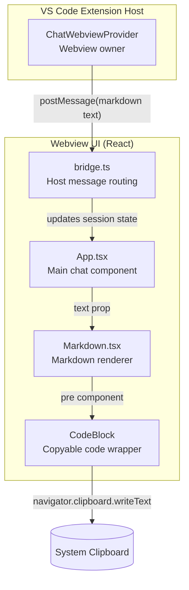
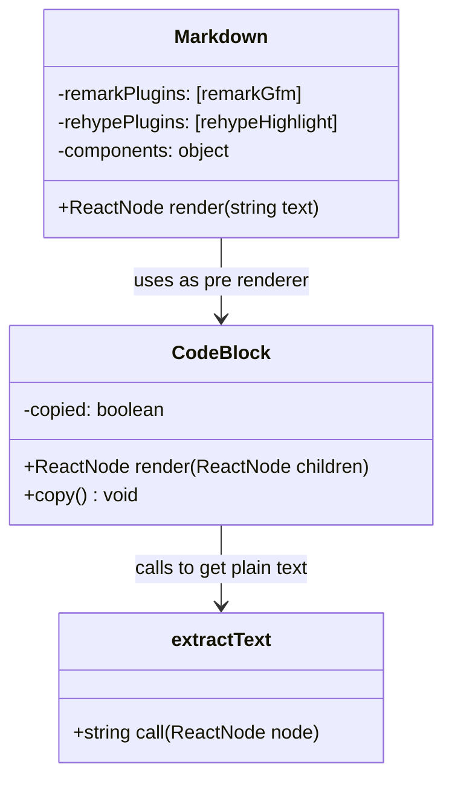
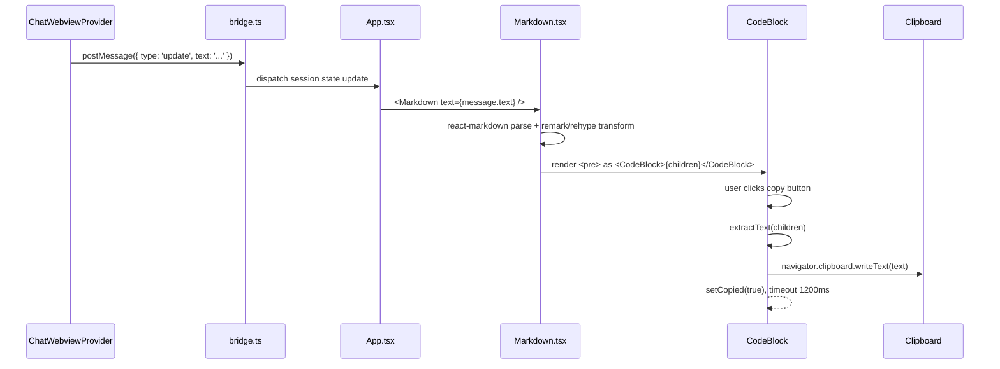
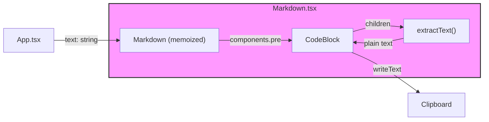
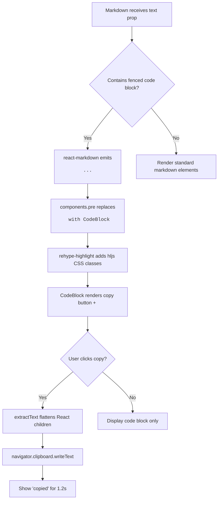

# webview_ui_markdown

The `webview_ui_markdown` module provides the markdown rendering layer for the Ainxt chat webview. It transforms raw markdown text returned by the agent into a safe, syntax-highlighted React UI, with copy-to-clipboard support for code blocks and external-link handling for anchor tags.

---

## Overview

Located in `vscode-acp/webview-ui/src/Markdown.tsx`, this module is a thin React wrapper around the popular `react-markdown` ecosystem. Its responsibilities are limited and well-defined:

1. **Render agent messages** — Convert markdown strings (explanations, code snippets, tables, lists) into HTML via React components.
2. **Syntax-highlight code** — Apply `rehype-highlight` so that fenced code blocks are styled with the highlight.js theme used by the webview.
3. **Enable code copying** — Wrap every `<pre>` block in a `CodeBlock` that extracts plain text and writes it to the system clipboard.
4. **Secure external links** — Force all `<a>` tags to open in a new tab with `rel="noreferrer"`, preventing the webview from navigating away or leaking referrer data.

Because the module is memoized and has no side effects beyond clipboard access, it is safe to re-render frequently as streaming markdown arrives from the host extension.

---

## Architecture

The diagram above shows the module's position in the webview stack. The extension host pushes markdown content through the VS Code webview message API, the bridge routes it into React state, and `App.tsx` passes the final string into `Markdown` for display.

---

## Component Structure

### `Markdown`

The exported, memoized component. It receives a single `text` prop and returns a `
` containing the rendered markdown tree.

Key configuration:

| Option | Library | Purpose |
|--------|---------|---------|
| `remarkPlugins={[remarkGfm]}` | remark-gfm | Enables GitHub Flavored Markdown (tables, strikethrough, task lists, autolinks). |
| `rehypePlugins={[rehypeHighlight]}` | rehype-highlight | Adds CSS classes to `<code>` elements for highlight.js syntax highlighting. |
| `components.pre` | react-markdown | Replaces the default `<pre>` element with the custom `CodeBlock`. |
| `components.a` | react-markdown | Replaces the default `<a>` element with a security-hardened external link. |

Memoization via `memo` ensures that identical `text` props do not trigger a full re-parse of the markdown tree, which is important when `App.tsx` re-renders on unrelated state changes.

### `CodeBlock`

A local React component that wraps the children produced by `react-markdown`'s `<pre>` renderer.

Behavior:

- Renders a `
` containing a copy button and the original `<pre>` content.
- On click, it calls `extractText(children)` to flatten the React node tree into a plain string.
- Writes the extracted text to `navigator.clipboard`.
- Temporarily shows "copied" for 1.2 seconds to give the user feedback.

> **Note:** The component uses the optional chaining `navigator.clipboard?.writeText(...)`. In environments where the clipboard API is unavailable, the copy action silently fails and the button label does not change.

### `extractText`

A recursive utility that converts a React node (or tree of nodes) back into a plain string.

Supported node shapes:

- Primitive strings — returned as-is.
- Arrays — concatenated recursively.
- React elements with `props.children` — recurses into the children.
- Everything else — returns an empty string.

This function is intentionally defensive because `react-markdown` may pass a heterogeneous tree of text nodes, inline elements, and nested components.

---

## Data Flow

The sequence illustrates the full lifecycle of a markdown message: from the extension host, through the webview bridge, into the React application, and finally to user interaction with a code block.

---

## Dependencies

### Runtime Dependencies

| Package | Role in this module |
|---------|---------------------|
| `react` | Provides `memo`, `useState`, and the `ReactNode` type. |
| `react-markdown` | Core markdown-to-React renderer. |
| `remark-gfm` | GitHub Flavored Markdown plugin for tables and task lists. |
| `rehype-highlight` | Syntax highlighting plugin for fenced code blocks. |

### Internal Dependencies

| Module | Relationship |
|--------|--------------|
| [webview_ui_app](webview_ui_app.md) | `App.tsx` imports and renders `<Markdown text={...} />` inside the chat message list. |
| [webview_ui_bridge](webview_ui_bridge.md) | Routes host messages that ultimately populate the `text` prop consumed by `Markdown`. |
| [chat_webview](chat_webview.md) | Owns the webview panel and posts markdown content from the agent to the UI. |
| [extension_activation](extension_activation.md) | Registers the webview provider and activates the extension host that feeds the UI. |

---

## Component Interaction

`Markdown` does not manage any global state. It is a pure presentational component that receives a string and returns a React tree. The only interactive behavior lives inside `CodeBlock`, which is self-contained and isolated from the rest of the application.

---

## Process Flow: Rendering a Code Block

This flow highlights the two-stage transformation: first markdown is parsed into React elements, then the custom `pre` renderer injects the copy affordance and syntax highlighting classes.

---

## Security Considerations

- **No raw HTML injection** — `react-markdown` does not allow arbitrary HTML by default. Only markdown syntax is converted to React elements.
- **External links are sandboxed** — All anchor tags receive `target="_blank"` and `rel="noreferrer"`, preventing tab-nabbing and referrer leakage.
- **Clipboard access is gated** — The copy action relies on the browser's `navigator.clipboard` API, which respects the webview's permissions model.

---

## How It Fits Into the System

The `webview_ui_markdown` module is one of three core files in the webview UI layer, alongside [webview_ui_app](webview_ui_app.md) and [webview_ui_bridge](webview_ui_bridge.md). Its role is strictly presentational: it takes the agent's textual response and turns it into a readable, interactive message bubble.

Higher up the stack, [chat_webview](chat_webview.md) and [extension_activation](extension_activation.md) are responsible for creating the webview, loading the bundled React application, and pushing agent updates. Lower down, `Markdown.tsx` depends only on standard React/markdown libraries and has no knowledge of VS Code APIs, agent sessions, or the ACP protocol. This separation makes the renderer easy to test in isolation and reusable in other webview surfaces if needed.
